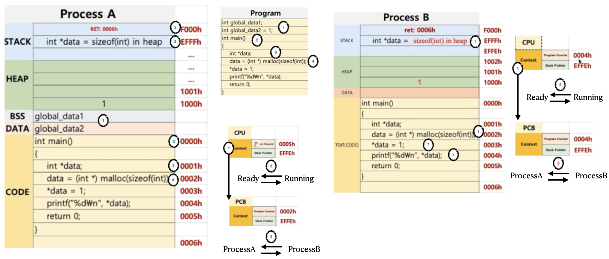

# [Computer Science][제로베이스 ]-운영체제 - 프로세스 구조II - PCB & PC & SP

Category: Computer Science
Chapter: Operating System
강의: Zerobase
블로깅: Yes
유형: LESSON
작성일시: 2021년 12월 24일 오전 8:13

제로베이스 컴퓨터 공학자 따라잡기 온라인 완주반 강의를 듣고 정리한 포스팅

# 프로세스와 컨텍스트 스위칭 - PCB, PC, SP

Process를 다른 Process로 바꾸는 메커니즘을 context switching이라고 하였다. context switching을 위해 PCB라는 registor를 이용하여 process의 정보를 참조한다. 그렇다면 PCB는 정확히 무엇이고 어떻게 생겼을까 ?

### PCB

- PCB는 Process Contril Block의 약자로, 프로세스에 상태를 저장하는 데이터구조로 OS에서 관리하고있다. Process Context Block이라고도 한다.
- 프로세스가 실행중인 상태를 캡쳐하고 구조화하여 저장한다.

PCB는 아래와 같은 구조로 이루어져있다(c 구조체로 이루어져있음) (Linux 예)

[참고영상](https://www.youtube.com/watch?v=4s2MKuVYKV8) 을 보면 설명이 잘 되어있다.


Process ID : 프로세스 고유번호

Process state : 프로세스의 현재 상태(new, ready, running, waiting, terminated)

Program counter : 다음 실행될 Program의 Potinter

Register information : PC, SP등의 registor들의 정보

Scheduling Information : 스케줄링 및 프로세스의 우선순위

Memory related Information : 할당된 자원 정보

Accounting information : CPU에 할당되어 실제 사용된 시간

Status information related ro I/O : 입출력 상태의 정보

### PCB는 어떻게 활용되나?

중요한 Registor인 PCB, PC, SP 에서 Process의 Context Switching이 어떻게 진행되는지 알아보자.

아래의 ProcessA와 ProcessB의 code는 다음과 같다.

```c
// ProcessA
// 전역변수
global_data1;
global_data2=1;

int main()
{
	int *data;
	data=(int *)malloc(sizeof(int))
	*data=1;
	print("%d\n",*data);
	return 0;
}

//ProcessB
int main()
{
	int *data;
	data=(int *)malloc(sizeof(int))
	*data=1;
	print("%d\n",*data);
	return 0;
}
```

두 Program의 차이는 전여변수의 유,무이다.

그림으로 그리면 아래와 같다.



먼저 ProcessA부터 실행된다고 가정한다면 그 과정은 아래와 같이 나타낼 수 있다.

1. 전역변수를 data영역에 저장한다.
   global_data1은 초기화 되지 않았기 때문에 BSS영역에, global_data2 는 DATA 영역에 저장된다.
2. PC = 000h , SP = F000h -> EFFFh (SP는 원래 현재 stack에 저장된 다음 공간을 가리킨다(빈 공간))
   main 함수의 return address인 0006h가 sp가 가리키는 Foooh 위치에 저장되고 SP는 그 다음 공간의 주소를 가리킨다 (EFFFh)
3. pc=0001h , sp = EFFFh->EFFEh int형 pointer data변수가 stack에 저장되고 SP는 다음 공간의 주소를 가리킨다.
4. pc=0002h, sp = EFFFh에서 scheduler가 processA에서 processB로 바꾼다.
   1. PCB라는 운영체제가 관리하는 공간에 CPU에 저장되어있는 peocess의 정보인 context를 복사하여 저장한다.
   2. ProcessA는 ready OR blocked 상태로 변경한다.
   3. ProcessB를 실행한다

Precess B 실행과정—

예시로 든 code는 ProcessA와 B가 같기 때문에 (A만 global 변수가 있을 뿐) PC 0000h ~ ooo1h까지 비슷한 과정을 거친다)

1. pc = 0002h sp = EFFEh , heap공간에sizeof(int) 만큼의 공간을 생성하고 data에 주소값을 저장한다.

2. Pc = 0003h sp = EFFEh , data가 가리키는 주소를 통해 heap에 1을 저장한다.

3. Pc = 0004h sp = EFFEh 인 상태에서 scheduler는 ProcessB에서 ProcessA로 바꾼다.

4. 현재 cpu에 있는context를 processB의 PCB에 저장한다
5. CPU의 registor에 PCB1 (processA)의 내용으로 업데이트하다.
6. ProcessA를 다시 실행한다.

그 후 ProcessB를 실행하고 ProcessA로 비슷한 과정으로 다시 변경된 후 종료된다.

### 정리

- PCB에는 Process 상태의 정보가 저장된다.
- 현재 실행되고 있는 process를 변경하기 위해 PCB에 정보(context)를 저장한다.
