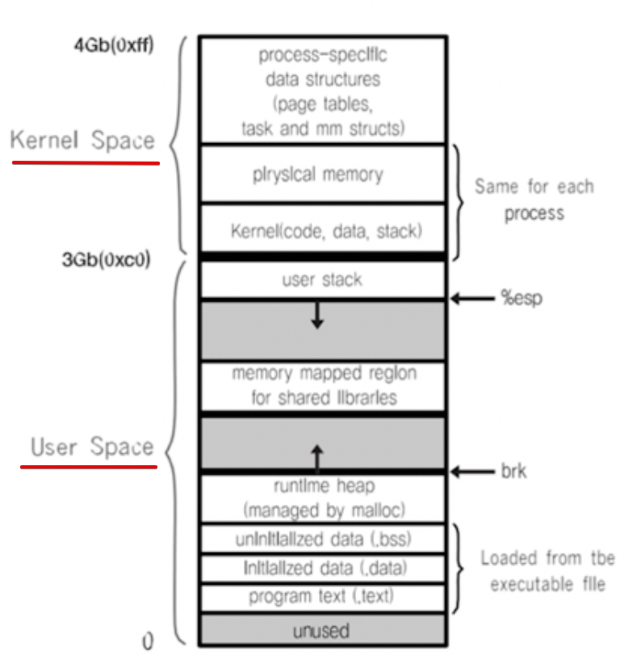
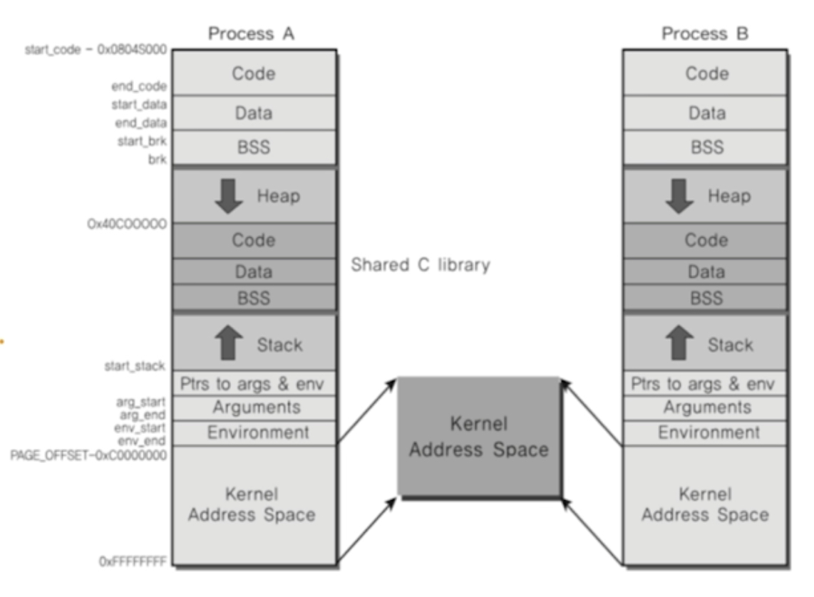

# [Computer Science][제로베이스 ]-운영체제-프로세스간커뮤니케이션

Category: Computer Science
Chapter: Operating System
강의: Zerobase
블로깅: No
유형: LESSON
작성일시: 2021년 12월 31일 오후 6:25

제로베이스 컴퓨터 공학자 따라잡기 온라인 완주반 강의를 듣고 정리한 포스팅

# 프로세스간 커뮤니케이션 - InterProcess Communication (IPC) Overview

- 기본적으로 Process는 다른 Process의 공간을 접근할 수 없다. 만약 서로 공간을 쉽게 접근할 수 있다면 Process의 데이터나 코드가 바뀔 수도 있기 때문에 원칙적으로 프로세스간의 공간 접근은 불가능하다.
- Process간 통신이 필요하기 때문에 IPC(InterProcess Communication) 라는 특별한 방법을 사용한다.

### Process간 통신이 필요한 경우

많은 CPU를 사용하는 경우 ( 대부분 그렇지만) Process간 상태를 확인하고 데이터를 송,수신 할 수 있는 수단이 필요한다.

1.  fork() 시스템콜을 사용하는 경우 :
    fork() 시스템콜은 fork()를 호출한 부모 프로세스를(자신을) 복사해서 새로운 자식 프로세스를 만든다. 멀티 코어가 있는 경우 프로세스를 fork()를 통해 여러 프로세스를 동시에 실행시킬 수 있다. 이를 병렬처리라고 한다.
    예를 들어 1~10000까지 더할 때 fork() 함수로 10개 프로세스를 만들어서 각각 1~1000, 1001~2000... 을 더하고 수집 후 더하면 더욱 빠르게 처리할 수 있다.

        이때 값을 수집하기 위해 프로세스간 통신이 필요하다.

2.  웹서버에서 Client - Server 간 통신

    멀티 core를 사용할 경우, Client의 요청이 올 때마나 fork() 함수로 새로운 process를 만들면 각 사용자의 요청에 즉시 대응할 수 있다. 이 때 각 process를 제어하고 상태,정보를 교환하기 위해 process간의 통신이 필요한다.

### Process 간 communication을 하는 방법 IPC

1. file을 사용한 커뮤니케이션 : 공유 저장매체를 이용한다.

   1~10000까지 더한다고 할 떄 process1과 process2에서 계산한 결과를 공유가 가능한 저장매체에 저장하는 방법을 사용한다. 간단하게, 다른 프로세스에 전달할 내용을 file에 쓰고, 다른 프로세스가 해당 파일을 읽는 방식이다.

   하지만, file을 사용하는 방법은 파일을 읽고 쓰는 실시간 프로세스 간 통신에 어려움이 있다. (System call → file open → 사용자 → kernel→ running→ ready 상태 변경 ...)

2. file을 사용한 방법 외에 Mesage Queue , Shared Memory, Pipe, Signal, Semaphore, Socket...등의 방법들이 있다. 이 방법들의 핵심은 Kernel 공간을 사용하는 것에 있다.

Kernal 공간은 아해와 같이 나타탤 수 있다. (실제 프로세스의 구조)

- 하나의 Process는 0~4Gb까지의 가상주소를 갖는다. ( 내부적으로는 가상주소를 물리주소로 바꾸는 기능이 있다. 이와 관련된 구체적인 내용은 가상메모리 부분에서 더욱 다룬다)
- Kernel Space : 3-4Gb까지가 속한다. 운영체제의 code 등이 들어가는 부분이다.
- User Space : 0-3Bb로 실제 프로그램이 쓰는 공간이다.

- Kernel 공간은 공유가 가능한 물리공간에 들어간다. ( 실제로 kernel 공간 중 물리 메모리에 들어가는 것은 일부이다)

이 Kernel 공간은 물리메모리에 있고 (물리 메모리에 있어서 접근 시간이 짧다) 프로세스가 공유 가능한 공간이기 때문에 대부분의 IPC 기법은 커널 공간을 활요한다.
