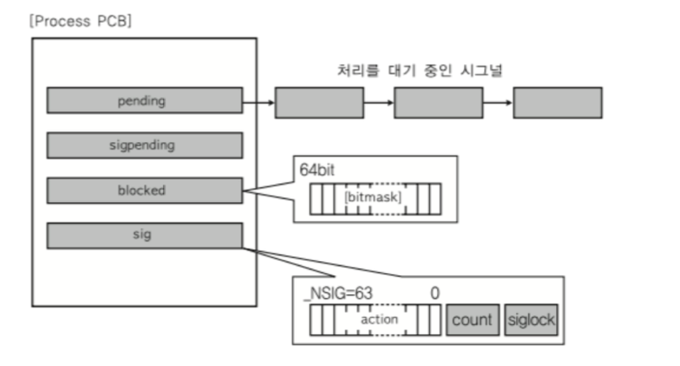
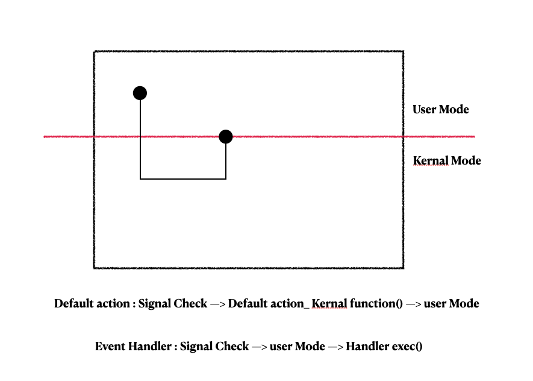
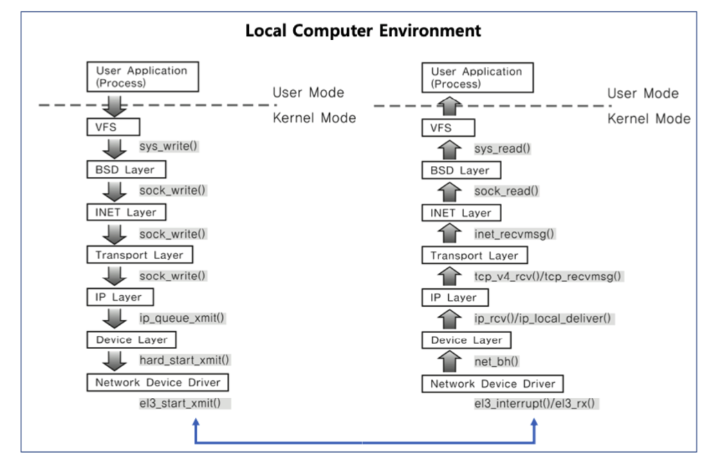

# Computer Science-제로베이스-IPC기법들-Signal&Socket

Category: Computer Science
Chapter: Operating System
강의: Zerobase
블로깅: Yes
유형: LESSON
작성일시: 2022년 1월 13일 오후 10:06

제로베이스 컴퓨터 공학자 따라잡기 온라인 완주반 강의를 듣고 정리한 포스팅

Signal과 Socket을 사용하는 목적은 다르지만 IPC 기법으로도 사용할 수 있다.

간략하게 만 알이보자.

## Signal(시그널)


- Signal은 Event를 알리기 위해 프로세스로 보내지는 매우 짧은 메세지이다.
- Event라고 보면 된다. signal기법은 unix에서 무려 30년 이상 사용됭 전통적인 기법이라고 한다.
- 커널 또는 프로세스에서 다른 프로세스에 비동기적으로 어떤 Evnet가 발생되었는지 알려줄 때 사용하는 기법이다.
- 등록된 Signal Handler로 특정 동작을 수행한다. 만약 없다면 커널에서 기본 동작을 수행한다.

### 주요 시그널

- 기본동작(Default)

  Signal은 미리 정의되이있는 Event가 있으며, Signal의 종류에 따른 기본 동작은 OS에 정의되어있다.

  SIGKILL : 프로세스를 죽여라 (슈퍼관리자가 사용하는 signal이며 process는 어떤 경우에도 종료된다)

  SIGALARM : 알람을 발생한다.

  SIGSTP : 프로세스를 멈춰라(Ctrl + z)

  SIGCONT : 멈춘 Process를 실행

  SIGINT : process에 Interrupt를 보내서 process를 종료 (Ctril + c)

  SIGSEGV : process가 다른 메모리영역을 침범했다.

  Kill -l : Signal들의 목록을 볼 수 있다.

  ```powershell
  kill -l
  HUP INT QUIT ILL TRAP ABRT EMT FPE KILL
  BUS SEGV SYS PIPE ALRM TERM URG STOP TSTP
  CONT CHLD TTIN TTOU IO XCPU XFSZ VTALRM PROF
  WINCH INFO USR1 USR2
  ```

- 사용자 정의 Signal
  - SIGUSR1, SIGUSR2 와 같은 Signal들을 특정 동작을 정의할 수 있다.
  - 기본 동작이 없다.
  - 이런 기능을 사용하여 Program으로 Process를 만들 때 특정 Signal 발생하면 특별 동작을 하도록 정의할 수 있다.
  - Process1과 Process2끼리 통신을 하도록 Handler를 구현할 수 있다.

기본 동작이외에도 각 프로세스에서 Signal 처리에 대하여 아래와 같은 동작 설정이 가능하다.

더욱 공부하려면 [이곳](https://man7.org/linux/man-pages/man7/signal.7.html)

- Signal 무시
- Signal Block( 블록을 푸는 순간 프로세스에 해당 Signal을 전달)
- Signal Handler 등록하여 수행
- 등록된 Signal Handler가 없다면 Kernal에서 기본 동작을 수행한다.

- Handler등록

```c
static void signal_handler(int signo){
		printf("Catch SIGINT!\n");
		exit (ETIT_SUCCESS);
}

int main (void){
		if(signal (SIGINT, signal_handler) == SIG_ERR){
				printf("Can't catch SIGINT! \n");
				exit(EXIT_FAILURE);
		}
		for (;;)
				pause();
		return 0;
}
```

위의 코드에서 SIGINT의 기본동작은 Process에 인터럽트를 보내서 프로세스를 종료시키는 것이지만

인자로 받은 signal_handler 함수를 실행시키게된다.

- Signal Ignore

```c
int main(void){

			if(signal(SIGINT,SIG_IGN) ==SIG_ERR){
					printf("Can't catch SIGING\n");
					exit(EXIT_FAILURE);
			}
			for(;;);
					pause();
			return 0;
}
```

위의 코드에서 SIGINT를 받으면 SIN_IGN(시그널 무시) 무시한다.

### Signal & Process

PCB(Process Control Block)에는 Signal 관련된 자료구조가 있다.

Signal mask는 특별한 Signal이 전달되었는지 여부를 결정한다.

[참고자료](https://cs241.cs.illinois.edu/coursebook/Signals)



- pending은 여러 가지 Signal을 받으면 처리를 기다리는 Signal을 의미한다.
- Sigpending : 받은 Signal이 있다는 것을 알려주는 자료구조이다.
- Blocked : Blocked된 Signal이 있음을 알려준다.
- sig : 각 sig에 대해 어떤 동작을 하는지 (Handler가 있는지) 알려주는 자료구조이다.

Kernal이 신호를 보내는 방법에 대한 전반적인 프로세스는 아래와 같다.

참조자료를 나름대로 번역하였으니 정확한 정보는 이 [링크를](https://cs241.cs.illinois.edu/coursebook/Signals) 확인하자


1. generate state : 신호가 생성된 상태
2. Pending state : 신호가 생성되고 kernal이 mask 규칙을 적용할 수 있는 사이의 시간을 의미한다.
   (signal mask란 현재 프로세스에게 전달되지 못하도록 막아놓은 signal 집합을 의미)
3. blocked : kernal이 signal mask를 확인하고 만약 이 프로세스의 모든 threads가 signal을 차단하고있다면 signal은 차단이 해제될 때까지 blocked됨
4. Delivered : thread가 신호를 받을 수 있다면, kernal은 action을 실행한다 (default 동작인 결루 thread를 일시중지하지 않는다) 만약 default action이 아니라면 kernal은 신로를 전달하는 것을 잠시 일시중지하고 signal handler로 점프한다.

한번 더 설명을 덧붙이자면,


- 기본 동작을 하는 경우 :해당 프로세스의 PCB signal을 확인해서 만약 어떤 처리가 필요하다면, 처리를 담당하는 kernal함수를 호출 후 실행한다. 그 후 사용자모드로 전환한다.
- 만약 기본 동작이 아니라 특정 동작이라면 : 사용자 모드 안에 있는 Code를 실행해야 하므로 사용자 전환과 동시에 특정동작을 실행한다.

→ 즉, Signal은 커널모드 ⇒ 사용자모드 전환 시 자용한다.

## Socket(소켓)

- 소켓은 원래 네트워크 통신을 위한 기술이며, Client와 server등 두 개의 다른 컴퓨터간의 network 기반의 통신을 위한 기법이다.
- Network 기기를 이용할 수 있는 System call이라도고 볼 수 있다.
- 기기간이 아니라 process간에도 통신으로 사용이 가능하다.



기기 내에서 Network data를 받아서 다른 process에 결과를 전달하는 방식으로 진행이 된다.

위의 사진에서 각 명령어는 socket을 사용하기 위핸 kernal 내부의 함수들이다.

이번 포스팅에서는 IPC기법들 중 Signal 과 Socket 기법에 대해 살펴보았다. 실습은 System programming을 다룰 때 진행할 예정이다.
