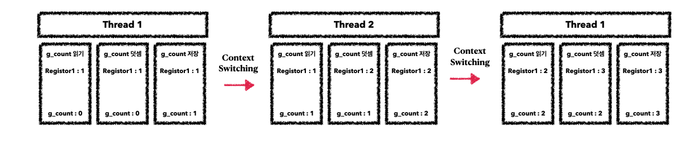

# Computer Science-제로베이스-Thread동기화 이슈

Category: Computer Science
Chapter: Operating System
강의: Zerobase
블로깅: No
유형: LESSON
작성일시: 2022년 2월 9일 오후 10:02

제로베이스 컴퓨터 공학자 따라잡기 온라인 완주반 강의를 듣고 정리한 포스팅

# Thread동기화 이슈

- 동기화란 작업들 사이에 실행 시기를 맞추는 것이다.
- 여러 Thread가 동일한 자원(데이터)접근을 할 때 동기화 이슈가 발생한다. 동일한 자원을 여러 Thred가 공유하고 있을 때, 이 자원을 여러 Thread가 동시에 수정을 한다면 이를 공유하고 있는 각 Thread의 결과에 영향을 끼치게 된다.
- 아래의 파이썬 code로 예를 들어보자

```python
import threading # python의 thread 지원 기본 라이브러리

g_count=0
# 함수
def thread_main():
    global g_count # global 을 써주면 전역변수를 사용하겠다는 의미
    for i in range(100000):
# 이 부분을 임계 자원이라고 하고, 이 부분을 처리하는 코드(여기서는 for)를 임걔 코드라고 한다.
        g_count=g_count+1

threads=[]
# thread 생성
for i in range(50): # 총 thread는 50개가 생긴다
    th=threading.Thread(target=thread_main) # thread를 한 개 만들고 주소값을 th에 할당
    threads.append(th)
# 모든 thread 실행
for th in threads:
    th.start() # thread 실행

# 다른 스레드가 끝날 떄까지 기다림
# 이 코드가 없다면 이미 함수 실행을 하고 main thread로 돌아온
# 서브 thread에 의해 print(g_count)가 실행되 되게 된다.
for th in threads:
    th.join()

# thread는 총 50개 이고 한 개의 thread는 thread_main을 통해 100000을 g_count에 더한다.
# 결과는 50 x 100000 = 5000000이어야 한다.
print('g_count=',g_count)

# 결과
# g_count= 4719904
# g_count= 4827145
```

위의 코드에서 thread_main 함수는 전역변수인 g_count를 100000번 1씩 더하는 코드이다.

함수 선언 이후 첫 번째 for문은 50번의 반복을 통해 약 50개의 thread를 생성한다.

위의 코드에 따르면 결과는 50 x 100000인 5000000이 되어야 하지만 반복적으로 실행을 할 때마다 다르게 출력된다 . 이런 비정상적인 결과는 바로 동기화 이슈로 인해 발생되는 문제이다. 아래의 설명을 통해 이해해보자.

위의 Code를 Thread로 표현하면 아래와 같이 나타낼 수 있다. 각 Thread에서 g_count 값이 증가하는 코드의 실제 내부는 아래와 같다. Context Switching은 g_count에 2씩 더하는 code가 온전히 실행된 후 진행된다고 가정한다.



만약 Thread1에서 g_count를 0에서 1로 더하고 Thread2에서 g_count를 1에서 2로 더하고 다시 Thread1로 전환되는 경우에는 아래와 같은 문제가 발생한다.


Context Switching이 일어나면 registor의 값들은 중당 직전의 값으로 모두 복원된다.

Thread1의 덧셈을 진행하고g_count에 쓰기 전 중단되고 Tread2로 Context Switching이 발생한다. 여기서 g_count는 아직 저장되지 않았기 때문에 Thread2에서 읽는 g_count는 증가된 1이 아니라 0이다. Thread 2도 g_count에 쓰기 전에 실행이 중단되고 Context Switching이 일어나게 되면 다시 Thread1이 실행되고 이전에 중단했던 쓰기 작업을 재실행하고 g_count에 1을 저장한다. 그리고 다시 Contrxt Switching이 일어나서 Thread2의 쓰기 작업을 하면 g_count 에 1을 저장한다.

위의 과정으로 인해 비정상적인 결과인 동시성 문제가 발생하게 된다.

### 동기화 이슈는 어떻게 해결하는가?

- Mutual exlusion(상호 배제)
- 쓰레드는 process의 모든 데이터를 공유하기 때문에 언제든지 접근할 수 있다. 여러 Thread가 변경하는 공유 변수에 대해 Exclusive Access가 필요하다. 즉, 한 Thread가 공유 변수를 갱신하는 동안에는 다른 Thread가 동시에 접근하지 못하도록 막는다.
- 아래의 코드는 위의 파이썬 코드에서 lock을 사용하여 다른 Thread가 갱신하지 못하게 함으로써 동시서어 문제를 해결하였다.

```python
import threading

g_count=0

def thread_main():
    global g_count
# 이 key를 갖고있는 thread가 lock을 release 할 떄까지 context Switching되어도 기다린다.
    lock.acquire()
    for i in range(100000):
        g_count=g_count+1
    lock.release()

lock=threading.Lock()

threads=[]

for i in range(50):
    th=threading.Thread(target=thread_main)
    threads.append(th)

for th in threads:
    th.start()

for th in threads:
    th.join()

print('g_count=',g_count)
```
