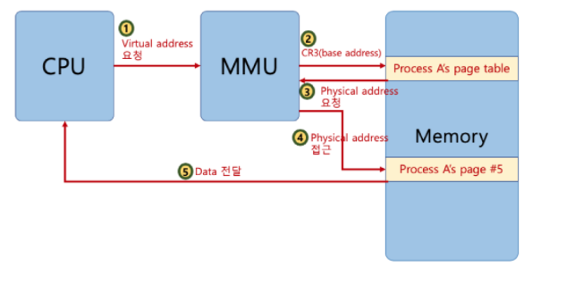

# Computer Science-제로베이스-다중단계PagingSystem

Category: Computer Science
Chapter: Operating System
강의: Zerobase
블로깅: No
유형: LESSON
작성일시: 2022년 3월 3일 오후 1:45

제로베이스 컴퓨터 공학자 따라잡기 온라인 완주반 강의를 듣고 정리한 포스팅

- 공룡책 내용도 참고하며 정리

## 다중 단계 페이징 시스템

[참고문서](http://www.cs.uni.edu/~fienup/cs142f03/lectures/lec16_OS_virtual_memory.htm)

- 4KB 단위로 Page를 만들면 page table도 많은 공간을 차지하게 된다.
  - 예를 들면, 32bit 시스템에서 4KB 페이지를 위한 페이징 시스템은 12bit는 offset , 상위 20bit은 페이징 번호이므로 2^20 개(1048576)개의 페이지 정보가 필요하다 → 메모리가 많이 필요하다
- 공간 절약을 위해 페이징 정보를 단계를 나누어서 생성한다.

  - Page Directory라는 table을 만들어서 2단계 페이징 시스템을 만든다.
  - 실질적으로, process는 사용하지 않는 페이지가 많기 때문에 실제로 사용하는 Page table을 할당함으로써 메로리를 절약할 수 있다.

- 아래의 그림과 같이 페이지 번호를 나타내는 bit를 구분해서 단계를 나눈다.

  - 32 bit 선형 주소를 세 부분의 field로 나눈다
  - 상위 10 bits는 Page Directory에 대한 Index역할을 한다
    - Page Directory의 각 Entity는 Page Table을 가리킨다. (Page Table의 시작 주소)
  - 또한 선형 주소의 다음 10 bits는 page diredctory entity가 가리키는 page table을 가리킨다.
    - Page Table Entity(PTE)는 Page Frame 이라고 불리는 물리 메모리인 4Kbytes의 Page 기본 주소를 제공한다.
  - 마지막 12bits는 page grame에서의 offset을 가리킨다.
  - CR3 (Control Registor) 은 페이지 디렉코리의 시작 주소를 가리킨다.
    [그림참조](https://92-lwj.tistory.com/7)

  

## MMU & TLB

- MMU(Memory Management Unit) 는 CPU의 내부 Bus와 메모리 계층구조 사이에 논리적으로 위치한다. MMU는 아래와 같은 기능 하지만 대표적으로 가상 메모리를 물리 메모리로 변환하면 역할을 한다.
  - Address Translation : 가상 메모리 → 물리 메모리로 변환
  - Protection : 권한 검사 , read/write 보호 제공
  - Cache Control
- MMU를 통해 물리주소로 변환하기 위해서는 아래의 과정을 통해 메모리에 접근을 해야한다.
  [그림참조](https://www.fun-coding.org/virtualmemory.html)
  
  1. cpu가 특정 Virture address를 MMU에 요청하면
  2. MMU는 CR3 레지스터에서 base address를 통해 Page Table을 찾고
  3. Memory에서 물리 주소를 확인한다.
  4. 물리주소를 통해 다시 Memory에 접흔하고 CPU로 DATA를 접근한다. 
     결국 MMU는 물리주소를 찾기 위해 메모리를 두 번 다녀오게 된다. 메모리 계층에서 CPU Registor를 처리하는 시간과 메모리에 접근하는 시간을 비교해보면 1 Cycle VS 200 Cycle 이라는 속도 차이를 보이게된다.  이런 문제를 해결하기 위해 TLB 장치를 사용하게 되었다.
- TLB (Translation Lookaside Buffer) : 페이지 정보 캐쉬 (공룡책 참조) 
  TLB는 Translation용 고속 cache memory이다. TLB는 Key와 Value의 구조를 갖고있기 때문에 검색 속도가 빠르다. 
  TLB를 사용하면 이전에 접근했던 page number를 TLB에서 먼저 찾음으로써 Memory에 접근 하는 시간을 단축시킬 수 있다.
  TLB가 추가된 그림은 아래와 같다.
   
  
   
  1. CPU가 특정 Virture address를 MMU에 요청하면
  2. MMU는 먼저 TLB에 page number가 있는지 확인한다.
  3. 만약 TLB에 page가 있다면 Frame no를 바로 사용할 수 있기때문에 memory에 바로 접근이 가능하다.(TLB hit)
  4. 만약 TLB에 page가 없다면 (TLB miss) MMU는 위의 과정을 거쳐서 address translation을 진행한다. Frame No가 얻어지고 물리메모리에 접근하면, page number와 frame no가 TLB에 추가된다.

## Shared pages

- Paging의 이점은 프로세스간 동일한 물리 주소를 가리킬 수 있다는 것.
- 공강 절약, 메모리 할당시간 절약 가능
- 특히 다중 프로세스 환경에서 코드를 공유할 수 있다는 이점이 있다.
- 예를들어 아래의 그림과 같이 각 프로세스가 C library libc를 필요로 할 때, 물리 메모리에 단지 한 개의 표준 C library만 있으면 된다. 이를 필요로 하는 프로세스의 Page table은 (물리메모리 공유가 가능하기 때문에 )이 물리 메모리 주소를 참조만 하면 된다.
  그림참조 : 공룡책 10th edition
  
- 또한 프로세스를 Fork할 때에도 공간을 복사하지 않고 Process A가 들어있는 물리메모리의 공간을 Process B가 가리키게 함으로써 공간, 메모리 할당시간 절약이 가능하다.  그리고 물리주소 데이터에 변경이 일어나면 물리주소 또한 주소를 복사할 수 있다.  이 때에는 단순이 Page Table에 해당 Page의 물리 주소만 업데이트 시키면 된다.
  
