# ElasticSearch의 기본 동작과 구조에 대해 정리

- 해당 내용은 위키북스 "엘라스틱서치 바이블" 책을 참고하여 작성된 글

- 주요 내용

  - ElasticSearch가 검색어를 분석하는 방법
  - 역색인을 만드는 방법
  - match 쿼리를 포함한 주요 쿼리의 동작 방법

- ElasticSearch는 문서를 분석하여 역색인을 만들어두고 검색어를 분석해서 유사도가 높은 문서를 찾는다.

## 1. ElasticSearch 구조 개괄

- ElasticSearch의 클러스터
  

  - [공식문서-클러스터 구성](https://esbook.kimjmin.net/03-cluster/3.1-cluster-settings)

  - ElasticSearch는 여러 노드로 구성된 클러스터로 구성된다.

  - ElasticSearch process 하나가 Node 하나를 구성한다.

  - node는 여러 개의 샤드를 갖는다.

  - 고가용성을 제공하기 위해 같은 종류의 샤드를 같은 노드에 배치하지 않는다. 가령 1번 주샤드와 1번 복제본 샤드는 같은 노드에 배치되지 않는다.

  - 일반적으로 샤드보다 더 많은 노드를 사용하는 것이 좋음

    - 고가용성: 한 노드에 장애가 발생해도 다른 노드에서 샤드를 호스팅하여 데이터 손실 없이 서비스를 지속할 수 있다.
    - 로드 밸런싱: 여러 노드에 샤드를 분산 배포하여 검색 및 색인 작업을 분산 처리하여 성능을 향상시킬 수 있다.
    - 데이터 복제: 샤드를 여러 노드에 복제하여 데이터 손실 위험을 줄일 수 있다.

  - 노드의 역할
    

    - [Node 공식문서](https://www.elastic.co/guide/en/elasticsearch/reference/current/modules-node.html)

    - [마스터 노드와 데이터 노드 - Master & Data Nodes](https://esbook.kimjmin.net/03-cluster/3.3-master-and-data-nodes)

    - 데이터 노드 : 샤드를 보유하고 샤드에 실제 읽기와 쓰기 작업을 수행하는 노드
    - 마스터 노드 : 클러스터 관리. 후보노드 중 1대가 선출된다.
    - 조정 노드 : client의 요청을 받아서 데이터 node에 요청을 분배하고 Client에게 응답을 함

- ElasticSearch의 논리적 구조
  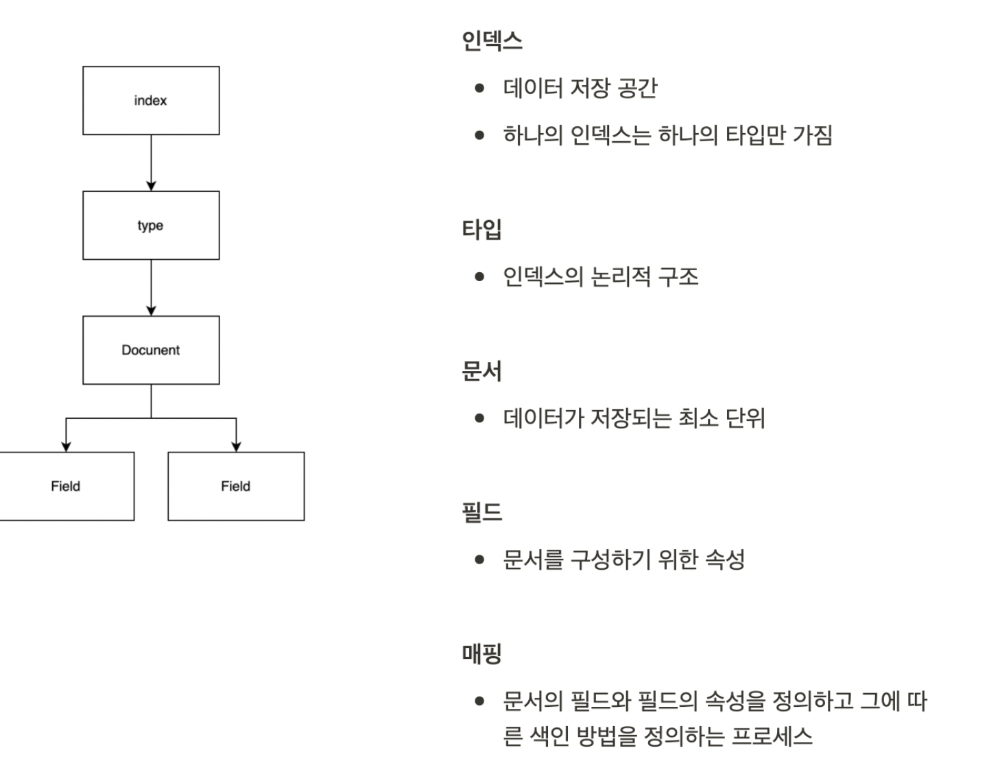

  - [공식문서-인덱스와 샤드 - Index & Shards](https://esbook.kimjmin.net/03-cluster/3.2-index-and-shards)

  - Document

    - ElasticSearch의 단일 데이터 단위를 Document라고 한다.
    - ElasticSearch가 저장하고 index를 생성하는 JSON문서이다.

  - index(indices)

    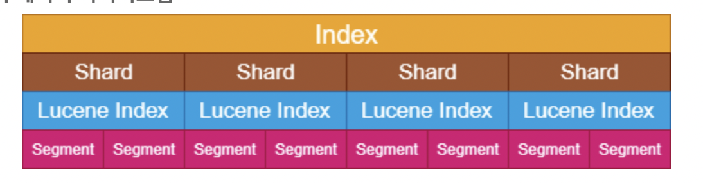

    - document를 모아 놓은 단위. client는 이 index 단위로 ElasticSearch에 검색을 요청하게 된다.
    - ElasticSearch Index는 1개 이상의 shard로 이루어져 있다.
    - Index는 여러 개의 shard 단위로 분리되고 Node에 분산 저장된다.

  - shard(샤드) :

    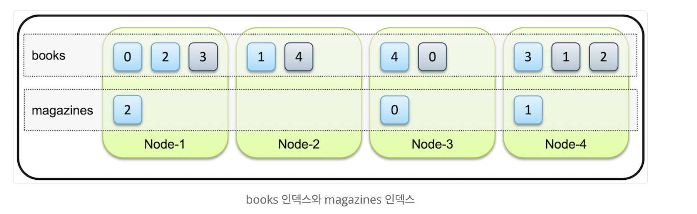

    - 샤드는 루씬의 단일 검색 인스턴스인다.(루씬에 관해서는 아래에 추가 정리)

    - index의 내용을 여러 샤드로 분리하여 분산 저장한다.

    - 고가용성을 위해 샤드를 복제한다. 원본 역할을 하는 주 샤드(primary shard), 복제본을 복제본 샤드(replication shard)라고 한다.(그런데 샤드로 나누는 기준은 뭘까?)

    - 샤드와 복제본은 동일한 데이터를 담고 있으며 반드시 서로 다른 노드에 저장이 된다.

    - 프라이머리 샤드가 유실된 경우에는 새로 프라이머리 샤드가 생성되는 것이 아니라, 남아있던 복제본이 먼저 프라이머리 샤드로 승격이 되고 다른 노드에 새로 복제본을 생성한다.

    - Elasticsearch 는 아무리 작은 클러스터라도 데이터 가용성과 무결성을 위해 최소 3개의 노드로 구성 할 것을 권장한다.

    - 인덱스를 한 개의 샤드로 구성할 수도 있지만, 인덱스 사이즈가 증가할 경우 여러개의 물리서버에 나누어 보관하기 위해 보통은 여러개의 샤드로 구성

    - 각 샤드는 다수의 세그먼트를 가지고 있다.

    - 샤드에서 검색 시, 먼저 각 세그먼트를 검색하여 결과를 조합한 최종 결과를 해당 샤드의 결과로 리턴하게 된다.

  - type : type이라는 개념은 폐기됨. 워래는 하나의 index안에 여러 document를 묶어서 type이라는 논리단위로 나눴다. 폐기된 이후부터는 논리적으로 나누고 싶다면 별도의 index로 독립시켜야 한다. 타입 이름이 들어가야 할 부분에 \_doc이 들어간 api를 사용해야 한다.

  - \_id : index 내 문서에 부여되는 고유한 구분자.index 이름과 \_id는 ElasticSearch cluster 내에서 고유하다

## 2. ElasticSearch 내부 구조와 루씬(Lucene)

- ElasticSearch는 아파치 루씬을 코어 라이브러리로 사용하고 있다

  - inverted indexing(역색인), qury 처리, 검색 결과 반환 등 Lucene의 기능을 사용한다.

- ElasticSearch의 각 샤드는 루씬의 인스턴스이다. 즉, ElasticSearch의 각 샤드는 독립된 Lucene 검색 엔진을 갖고있다. 루씬에 대해 알아보자

  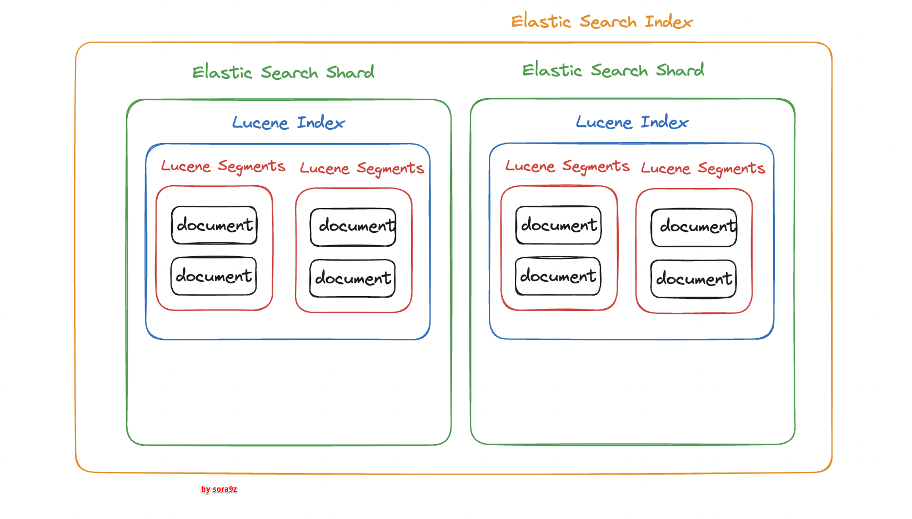

### 2-1 About Lucene(간략하게)

- 루씬이란 문서를 색인하고 검색하는 **라이브러리** 이다. (애플리케이션이 아니다)
- 루씬은 색인과 검색 기능을 제공한다.
- 검색 대상에 대한 수집에 대한 기능은 제공하지 않는다.
- 루씬의 검색 애플리케이션 구조는 아래와 같이 1. 검색 대상 분석, 2. 검색 과정으로 나뉜다.([자세한 내용은 참고 블로그를 통해 확인](https://jackjeong.tistory.com/78))
  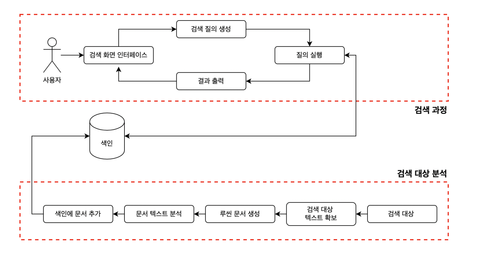

  1. 검색 대상 분석

     (1) 검색 대상 텍스트 확보 : 수집에 대한 기능은 제공하지 않으므로 검색 대상을 제공해야한다(원본 확보)

     (2) 루씬 문서 생성 : 문서(docuemnt)란 루씬에서 사용하는 개별 단위이며 이 문서 단위로 변환한다.

     (3) 문서 텍스트 분석 : 텍스트 분석기를 사용하여 토큰 이라는 단위로 분리한다. 루씬에는 여러 개릐 분석기가 있으며 필요에 따라 직접 만들 수도 있다.

     (4) 색인에 문서 추가 : 색인이 끝나면 문서가 색인에 추가된다.

  2. 검색 과정

  - 색인에 들어있는 토큰을 기준으로 해당 토큰이 들어있는 문서를 찾아내는 과정이다.

    (1) 검색 화면 인터페이스 : 검색어를 전달받는다

    (2) 검색 질의 생성 : QueryParser를 사용하여 검색엔진이 인식하는 query 객체로 변환

    (3) 질의 실행 : qeury 객체에 해당하는 결과를 받아온다.

    (4) 검색 결과 출력

  ### 2.2 루씬의 Flush & Commit

  - 데이터를 색인하고 검색할 때 루씬은 Flush와 commit이라는 개념을 사용한다.

  - 참고로 lucene에서 말하는 flush가 elasticsearch의 API로는 refresh다. 그리고 조금 헷갈리지만 elasticsearch의 flush는 lucene의 commit을 호출한다.

    - refresh_interval 을 -1로 설정하면 refresh를 하지 않도록 설정하는 것 이라고 한다 [참고블로그](https://www.myanglog.com/elasticsearch%20index%20%EB%82%B4%EB%B6%80%EB%A5%BC%20%EC%95%8C%EC%95%84%EB%B3%B4%EC%9E%90)

    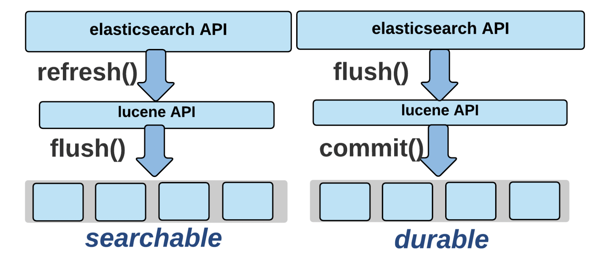

    - [그림출처](https://www.elastic.co/kr/blog/nuxeo-search-and-lucene-oh-my)

  - 루씬 Flush란 메모리에 있는 색인 세그먼트를 디스크에 기록하는 작업

    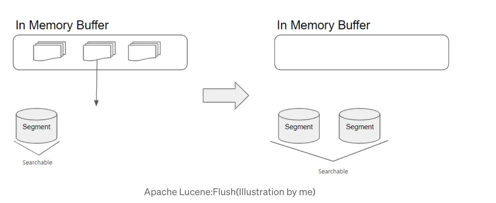

    - [참고 블로그](https://medium.com/@digle117/what-is-the-internal-structure-of-elasticsearch-when-it-is-clustered-d7c000c3e380)
    - 문서 색인 요청이 들어오면 루씬은 역색인을 생성하는데, 최초 생성 자체는 메모리 버퍼에 들어간다.
    - 문서 색인,업데이트,삭제 등의 작업이 수행되면 루씬은 메모리에 들고있다가 주기적으로 디스크에 flush한다.
      - 그런데 위의 글에서는 flush를 하면 search 성능이 좋아진다고 한다. 보통 메모리로 접근하는 것이 디스크로 접근하는 것보다 빠르지 않나? 왜 성능이 좋아지는 걸까?
        - 하지만 루씬에서 색인 세그먼트를 검색할 때에는 다를 수 있다
        - 메모리 상의 세그먼트는 검색어와 일치하는 문서가 포함된 여러 개의 작은 불록으로 구성된다고 한다. 이 세그먼트가 검색에 사용될 때에는 검색어와 일치하는 블록을 찾아야 하는데 메모리의 여러 위치에 랜덤하게 접근하는 작업을 해야하기 때문에 , 디스크의 순차적 접근에 비해 느리다고 한다.
        - 또한 disk에 flush를 하면 내부적으로 세그먼트를 병합한다.
    - 루씬의 flush는 시스템의 페이지 캐시에 데이터를 넘겨주는 것까지만 보장하고 디스크에 파일이 실제로 안전하게 기록되는 것까지 보장하지 않는다.
    - Flush가 되어야 검색에 사용할 수 있다.
    - 실시간 검색에 가깝게 하기 위해서 default로 1초에 한번씩 flush가 된다

  - 루씬 Commit
    - 루씬은 fsync 시스템 콜을 통해 주기적으로 커널 시스템의 페이지 캐시의 내용과 실제로 디스크에 기록된 내용을 동기화한다. 이를 루씬 commit이라고 한다.
      - 시스템의 페이지 캐시란?
        - 페이지 캐시는 처리한 데이터를 메인 메모리 영역(RAM)에 저장해서 가지고 있다가, 다시 이 데이터에 대한 접근이 발생하면 disk에서 IO 처리를 하지 않고 메인 메모리 영역의 데이터를 반환하여 처리할 수 있도록 하는 컴포넌트다.
        - 페이지는 가상 메모리 시스템에서 사용되는 메모리 할당 단위이다.
      - fsync란?
        - fsync는 리눅스 시스템 콜 중 하나로, 특정 파일에 대한 모든 변경 사항을 디스크에 즉시 기록하도록 지시하는 데 사용된다.
        - 시스템 페이지 캐시에서 디스크로 데이터를 복사하여 데이터를 기록 후 데이터 헤더(파일 크기, 내용, 형식 , 생성일 등)을 업데이트 한다. 이를 통해 루씬은 디스크에 영구적인 저장 뿐 아니라 페이지 케시에도 데이터를 저장함으로써 데이터의 손실을 방지한다.
          - fsync 동작 방식
            - 데이터 버퍼링: 리눅스는 일반적으로 파일에 쓰여지는 데이터를 즉시 디스크에 기록하지 않고, 메모리 상의 버퍼에 저장한다. 이렇게 하면 데이터 쓰기 작업의 속도를 향상시킬 수 있다.
            - fsync 호출: 사용자가 fsync 시스템 콜을 호출하면, 해당 시스템 콜은 지정된 파일의 모든 변경 사항을 메모리 버퍼에서 디스크로 즉시 기록하도록 한다.
            - 디스크 동기화: fsync는 디스크에 대한 모든 쓰기 작업이 완료될 때까지 기다힌다. 즉, fsync가 반환되기 전에 데이터가 디스크에 안전하게 저장된 것을 보장한다.
  - elasticSearch에서도 flush라는 개념이 있는데, 루씬의 flussh와는 다른 개념이다.

### 2.3 Segment

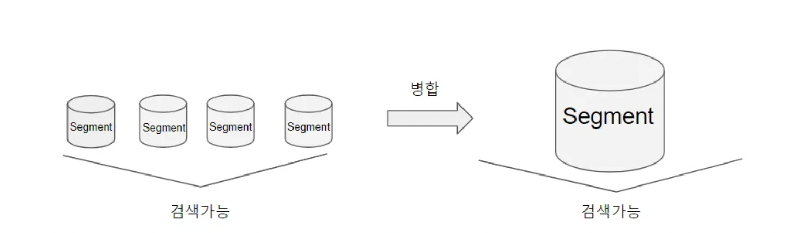

- Flush, Commit의 작업을 거쳐 디스크에 기록된 파일들이 모이면 세그먼트라는 단위가 된다.

- Segment는 불변이다.

- 새로운 세그먼트가 들어오면 새 세그먼트가 생성된다.

- 기존 문서를 삭제하는 경우 삭제 플래그만 표시된다.

- 기존 문서 업데이트의 경우 삭제 플래그를 표시하고 새 세그먼트를 생성한다.(불변이기때문에 변경되지 않는다.)

- 세그멘트는 계속 늘려갈 수 없으므로 루씬은 중간 중간 세그멘트의 병합을 수행한다.

- 이 떄 삭제 플래그가 표시된 데이터는 제거된다.

- 병합 후에는 검색 성능이 향상된다.

- forceMerge API를 사용하여 명시적으로 세그먼트를 병합할 수 있다.

### 2.4 Lucene index & elasticSearch index

- 루씬 인덱스는 여러 루씬 세그먼트로 구성된다.(아래 그림 참고)

  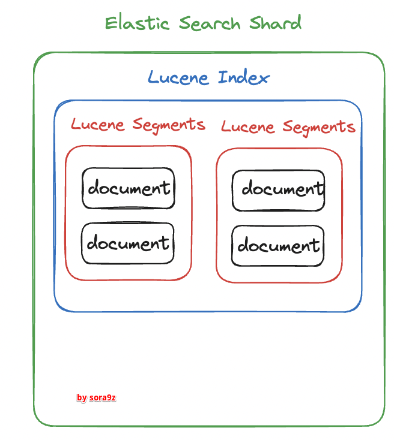

- 그리고 ElasticSearch Index는 ElasticSearch 여러 shard로 구성된다.

- 루씬은 이 루씬 인덱스 내에서만 검색이 가능하다

- ElsticSearch index 레벨에서는 여러 샤드에 있는 문서를 모두 검색할 수 있다.

  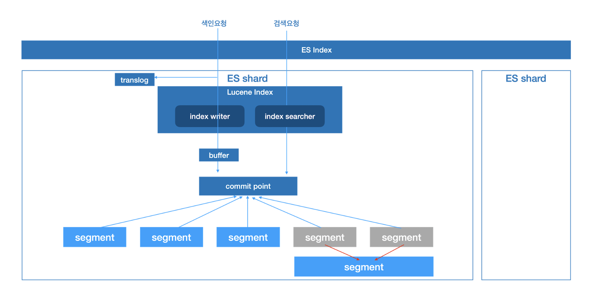

  - 색인 요청 : 새 문서가 들어오면 해당 내용을 라우팅하여 여러 샤드에 분산 저장 및 색인을 한다.

  - 검색 요청 : 클라이언트가 검색 요청을 보내면 해당하는 각 샤드를 대상으로 검색을 한 뒤 그 결과를 모아 병합하여 최종 응답을 만든다. (인덱스에 해당하는 샤드는 여러 노드에 분산저장되어있으므로 )

### 2.3 Translog

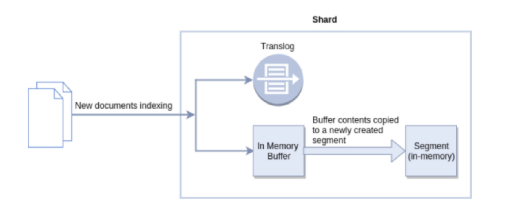

- ElasricSearch shard는 모든 작업마다 Translog라는 이름의 작업 로그를 남긴다.

  - 루씬 commit(disk에 저장)은 비용이 많이 드는 작업이기 때문에 변경사항을 모아서 commit하게 된다.

  - 하지만 만약 장애가 발생하면 commit이 되지 않은 데이터가 유실될 수 있다.

- translog는 색인,삭제 작업이 루씬 인덱스에 수행된 직후에 기록된다.

  - 이 translog 기록까지 끝난 후에야 작업이 성공적으로 승인 된다.

- ElasticSearch는 장애가 발생한 경우 샤드 복구 단계에서 translog를 읽는다.

  - 만약 루씬 commit 단계에서 포함되지 못한 작업은 translog를 통해 복구된다.

- ElasticSearch flush는 루씬 커밋을 호출하고 새로운 translog를 만드는 작업이다.
  - translog의 크기를 적절한 수준으로 유지한다.
  - 백그라운드에서 주기적으로 수행

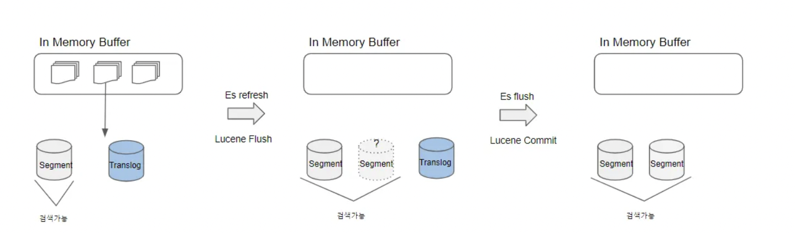

## 요약

1. Elasric Search는 한 개 이상의 Node로 구성된 클러스터로 구성된다.
   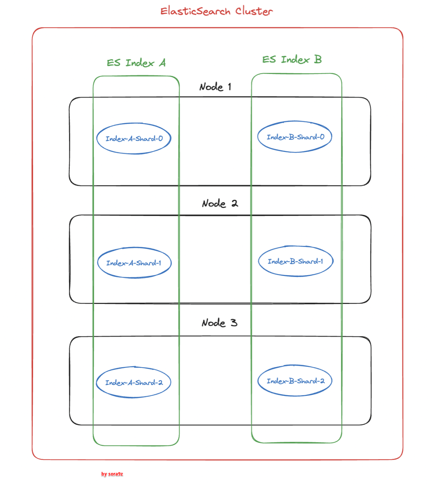

2. Document란 ElasticSearch의 단일 데이터 단위이며 Document를 모아놓은 단위를 Index라고 한다.

3. Index indices라고도 불리며 익숙하게 사용하는 관계형 데이터베이스에서의 테이블과 비슷한 개념이다.

4. Index 여러 개의 shard로 분산되어 저장된다.

- 주 샤드와(primary shard) 복제본 샤드(replica shard)로 구성함으로써 고가용성을 제공한다.

5. ElasticSearch는 Lucene을 코어 라이브러리로 사용하고있으며 ElasticSearch의 shard는 lucene의 Instance이다.

6. Lucene은 데이터를 색인하고 검색할 때 flush와 commit이라는 개념을 사용한다.

- flush는 메모리에 있는 색인 세그먼트를 디스크에 기록하는 작업이다.
- commit은 실제로 디스크에 저장하는 작업이다.
