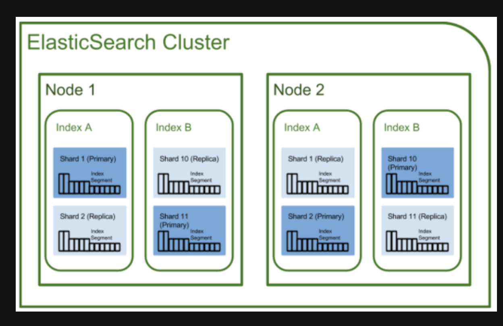
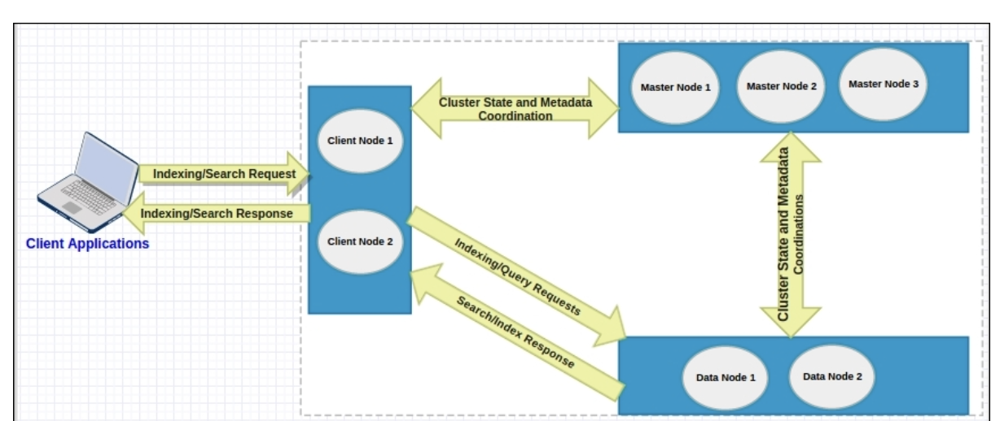

## ElasticSearch의 기본 동작과 구조에 대해 정리

- 주요 내용

  - ElasticSearch가 검색어를 분석하는 방법
  - 역색인을 만드는 방법
  - match 쿼리를 포함한 주요 쿼리의 동작 방법

- ElasticSearch는 문서를 분석하여 역색인을 만들어두고 검색어를 분석해서 유사도가 높은 문서를 찾는다.

### 1. ElasticSearch 구조 개괄

- document(문서) : ElasticSearch가 저장하고 index를 생성하는 JSON문서
- index(색인) : document를 모아 놓은 단위. client는 이 index 단위로 ElasticSearch에 검색을 요청하게 된다.
- shard(샤드) : index의 내용을 여르 샤드로 분리하여 분산 저장. 또한 고가용성을 위해 샤드를 복제한다. 원본 역할을 하는 주 샤드(primary shard), 복제본을 복제본 샤드(replication shard)라고 한다.
- \_id : index 내 문서에 부여되는 고유한 구분자.index 이름과 \_id는 ElasticSearch cluster 내에서 고유하다
- type : type이라는 개념은 폐기됨. 워래는 하나의 index안에 여러 document를 묶어서 type이라는 논리단위로 나눴다. 폐기된 이후부터는 논리적으로 나누고 싶다면 별도의 index로 독립시켜야 한다. 타입 이름이 들어가야 할 부분에 \_doc이 들어간 api를 사용해야 한다.
- Node : ElasticSearch process 하나가 Node 하나를 구성한다. node는 여러 개의 샤드를 갖는다.또한 고가용성을 제공하기 위해 같은 종류의 샤드를 같은 노드에 배치하지 않는다. 가령 1번 주샤드와 1번 복제본 샤드는 같은 노드에 배치되지 않는다.
  - 일반적으로 샤드보다 더 많은 노드를 사용하는 것이 좋음
    - 고가용성: 한 노드에 장애가 발생해도 다른 노드에서 샤드를 호스팅하여 데이터 손실 없이 서비스를 지속할 수 있다.
    - 로드 밸런싱: 여러 노드에 샤드를 분산 배포하여 검색 및 색인 작업을 분산 처리하여 성능을 향상시킬 수 있다.
    - 데이터 복제: 샤드를 여러 노드에 복제하여 데이터 손실 위험을 줄일 수 있다.
  - 노드의 역할
    
    - 데이터 노드 : 샤드를 보유하고 샤드에 실제 읽기와 쓰기 작업을 수행하는 노드
    - 마스터 노드 : 클러스터 관리. 후보노드 중 1대가 선출된다.
    - 조정 노드 : client의 요청을 받아서 데이터 node에 요청을 분배하고 Client에게 응답을 함

### 2. ElasticSearch 내부 구조와 루씬

- ElasticSearch는 아파치 루씬을 코어 라이브러리로 사용하고 있다
  - 루씬 : 문서를 색인하고
