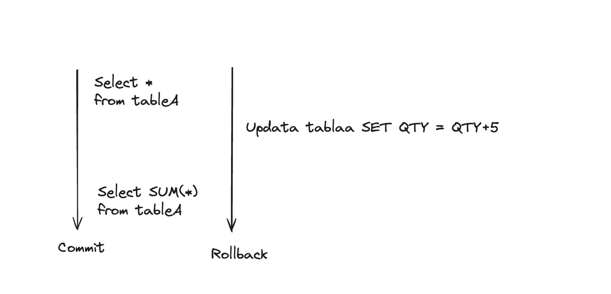
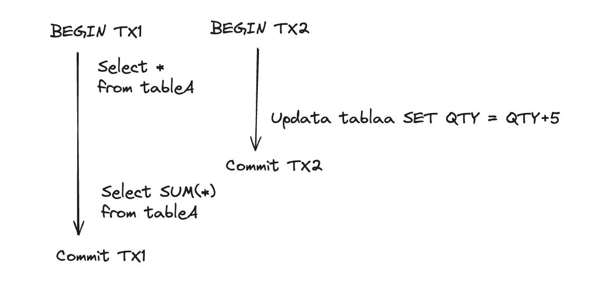
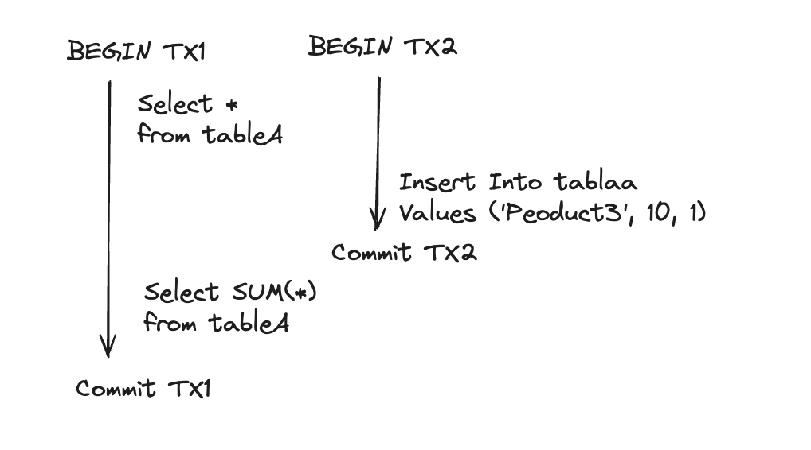
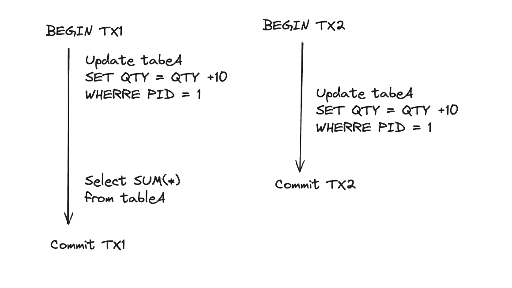

# 개요

- Udemy 강의 중 데이터베이스 엔지니어링 마스터 강의를 듣고 정리한 내용
- [데이터베이스 엔지니어링](https://barogo.udemy.com/course/database-engineering-korean/learn/lecture/40778704#overview)
- Section2 ACID

# 강의 정리

1. Isolation (고립성)

- 고립성의 필요성
  - 다수의 사용자에 의해 Database에 많은 TCP connection이 있고 각 connectoin이 transcation을 실행되어 동시에 동일한 데이터를 쓰거나 읽으려고 경합하는 동시성이 발생할 수 있다. 이럴 때 고립성이 필요하다.
  - 진행중이 transaction이 commit 전에 다른 transaction에 의해 변경된 내용을 볼 수 있어야 할까? - 이 물음에 대한 답은 사실상 상황에 따라 다르긴 하다.
- Read Phenomena(읽기 현상) 고립성 결여와 같은 문제로 발생하는 문제이다
- Isolation Levels (고립성 레벨)
  - 위와같은 읽기 현상을 해결하기 위해 고립 수준을 설정할 수 있다.

[1] Read phenomena

1. Dirty Reads

- 현재 실행중인 transaction에서 발생하는 읽기 현상
- 다른 transaction이 commit되지 않은 데이터를 읽는 현상
- rollback되면 읽은 데이터는 무의미해진다.
- not fully flushed or nott fully commited
- [예시]
  

  - transaction2에서 rollback된 데이터를 transaction1 에서는 dirty reads를 함

2. Non-Repeatable-Read(중복되지 않는 읽기)

- Transaction중에 값을 읽은 후 다시 읽었을 때 값이 달라지는 현상
- (예시) 값을 읽고나서 다음 쿼리에서 sum을 하는 경우 -> 다른 쿼리지만 동일한 항목에 접근한다는 점에서 같다.
- 다시 값을 읽으려고 할 때 다른 transaction에 의해 변동된 데이터를 읽는 현상이다.
- [예시]
  

  - TX2가 commit되었으므로 dirty reads는 아니다 하지만 TX1에서 두 번째로 동일한 데이터를 읽었을 떄 값이 다르다. 그렇다고 이 문제를 항상 피해야만 하는 것은 아니다.
  - 이 문제를 해결하는데 비용이 많이 든다고한다. -> 데이터에 대한 이력을 관리해야함을 의미하기때문
  - postgres는 업데이트시 항상 새 버전을 생성하고 동일한 값은 변경하지 않는다.
  - 반면 Mysql, Oravcle, SQO Servier는 값은 변경이 되지만 undo라는 다른 테이블을 유지한다. 여기에 디스크에 쓰여진 모든 이전의 값이 저장된다. undo 를 열어서 읽어야 하는데 이는 비용이 많이 든다.

3. Phantom-reads(유령 읽기)

- phantom reads는 아직 존재하지 않아서 실제로 읽을 수 없는 것들
- (ex) 특정 날짜 범위의 데이터를 읽는 쿼리를 실행하는데, 이 쿼리에서 새로운 행을 삽입하고 쿼리를 한다고 해을 때 추가된 phantom new row를 얻게 되고 그것으로 인해 문제가 생길 수 있다. 첫 번째 상황에서는 새로운 행이 없었지만 두 번째 상황에서는 새로운 행이 생기는 것.

- [예시]
  - 
- 범위 쿼리의 경우 발생가능성이 높다
- 실제로 commit 되었기 때문에 dirty reads는 아니다
- 처음부터 product3을 읽지 않았기 때문에 중복되지 않은 읽기는 아니다
- 이렇게 구분을 하는 이유는 구현하는 것이 다르기 때문이다.
  - 잠금과 반복되지 않는 읽기와 연관이 있다. 무언가를 할 때 반복된 읽기를 보장받아야 한다. 트랜젝션이 읽는 모든 것에 공유 잠금을 거져야 한다. 이 읽기가 트랙젠션동안 변경되지 않아야 한다는 것을 보장받아야 한다.
    하지만 한 번도 읽지 않는 새로운 행의 경우 잠그는 것으로 변경을 방지할 수 없다 -> 이것이 유령읽기

4. Lost Update (읽어버린 업데이트)

- transaction중에 update를 했는데 다른 transaction이 내가 업데이트 한 것을 변경하는 경우

- [예시]
  
- TX1, TX2는 동일한 시점에 실행이 되었고 TX1이 먼저 업데이트 그 후 TX2에서 업데이트를 하고 TX2는 commit이 되었다.
- TX1의 변경사항이 TX2의 값으로 overwrite되었다.
- 그 후 TX1에서 sum을 하였고 TX1에서 의도한 업데이트 값은 손실된 채 쿼리가 된다.
- 이 것은 행을 잠그는 것으로 해결할 수 있긴하다.
  - 행을 잠근다는 것은 TX1이 업데이트를 하면 행을 잠그고 커밋이 되었을 때 잠금을 해제하는 것을 의미한다.

[2] Isolation Levels
