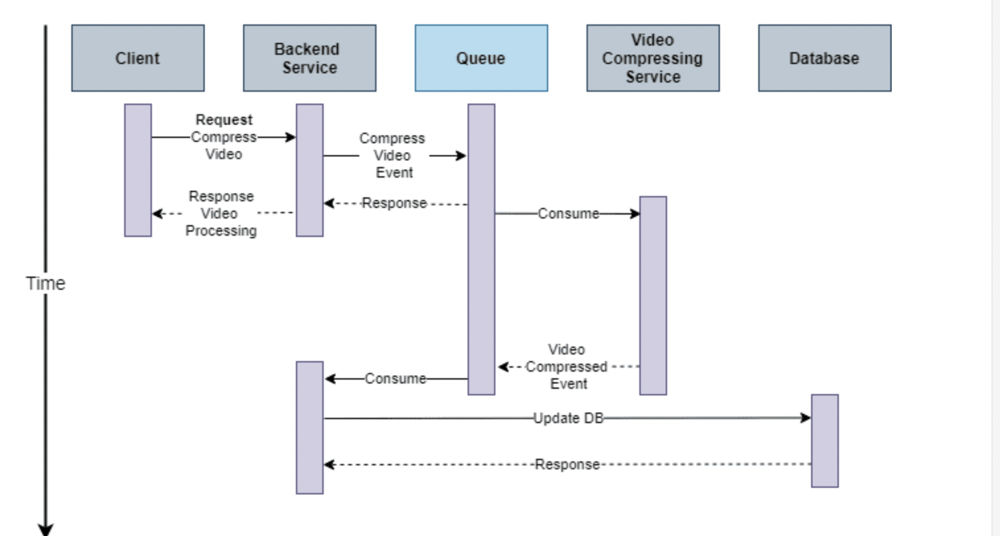

# 개요

- Udemy 백엔드 엔지니어링 (Backend Engineering) 마스터하기! (중/고급자 과정) - Hussein Nasser 강의를 듣고 정리한 내용.

- Synctnous vs Asyncronous 방식에 대한 정리

# 정리

## 동기와 비동기

1. 동기(Synchronous) 방식은 요청을 보내고 응답을 받을 때까지 기다리는 방식이다. 요청을 보내고 응답을 받을 때까지 다른 작업을 수행하지 않는다.

- 호출자는 요청을 보내고 응답을 받을 때까지 기다려야 한다.
  - 이때 프로세스가 디스크에 I/O를 요청하면 프로세스는 그동안 아무런 작업을 하지 않기 때문에 CPU에 의해 해당 프로세스는 컨텍스트스위칭이 발생하고 해당 프로세스는 block 상태가 된다.
- 수신자가 응답을 하면 호출자는 block이 해제 된다.
- 예시

  - 프로그램은 OS에게 Disk read를 요청한다.
  - 프로그램의 main thread는 CPU에서 제외시킨다.
  - 읽기가 끝나면 프로그램은 실행을 다시 재개할 수 있고 다시 한 번 컨텍스트 스위칭이 발생한다. -> 이런 비용이 발생하는 것이다.

  - 참고로 파일을 읽는다는 것은
    - 프로그램에서 커널로 요청이 이동하고
    - 커널 -> 드라이버 -> 디스크 컨트롤러 (ssd or hdd) 로 요청을 보낸다. 커널은 이 요청의 응답을 기다린다.
    - 사실상 app 또는 커널은 일을 하지 않고 기다리기만 한다.

2. 비동기(Asynchronous) 방식은 요청을 보내고 응답을 기다리지 않고 다른 작업을 수행할 수 있다. 요청을 보내고 응답을 받을 때까지 다른 작업을 수행할 수 있다.

- 호출자는 요청을 보내고 응답을 받을 떄까지 작업을 수행할 수 있다.
- 서버가 응답을 받았는지 아닌지 확인하는 방법

  1. epol : 리눅스에서 사용하는 방법이며 response가 준비되었는지 계속 확인
  2. io_uring : 수신자는 작업이 완료되면 call back을 보낸다. windows, iocp or 리눅스의 IOUreq 에서 발생. 작업이 완료되면 CQ(COMPLETION QUEUE)에 작업이 완료되었다는 메시지를 보낸다.

  3. Node.js에서 epoll을 사용할 수 없거나 스택을 완료할 수 없는 경우엔 blocked된 새 스레드를 활성화한다.

  - Nodejs의 경우 linux의 경우 epoll을, windows의 경우 iocp를 사용한다.

- 예시

  - 프로그램은 보조 스레드를 활성화한다.
  - 보조 스레드는 disk로부터 읽고 OS는 보조 스레드를 block한다. (단시 보조 스레트만 블록된다.)
  - 쓰레드가 읽기를 완료하면 메인 쓰레드에 call back을 호출한다.

- 참고로 Node.js의 async / await은 코드가 순서대로 작동되게 한다. cpu가 막힌 것이 아니다.

## Asyncronous workload is everywhere

- Asyncronous programming(promise,feature..)
- Asyncronous backend processing
  
  - [참고 사이트](https://dev.to/ragrag/asynchronous-request-response-pattern-2pbj)
- Asyncronous commits in postgres [공식문서](https://www.postgresql.org/docs/current/wal-async-commit.html)
  - 보통 커밋을 할 때 WAL 과 page에 작성된다.(아직 메모리에 페이지가 있다.)
  - 일반적으로 커밋을 할 때 WAL 커밋이면 충분하다. 메모리에 페이지가 있어도 변경사항을 커밋하고 WAL에 담는 것만으로도 충분하다.
  - 충돌이 있었더라도 WAL에서 마지막으로 stable한 상태를 찾아서 복구할 수 있다.(WAL에서 페이지로 모든 변겨사항을 적용한 뒤 저장할 수 있다.)
  - 동기적 커밋 : 커밋을 요청하면 postgres client는 blocked 되고 성공 또는 실패에 따라 block을 해제하고 결과를 반환한다. -> 디스크에 작업을 해야하는 경우 더 오래 걸리고 비용이 발생함
  - 비동기 커밋 : 트랜젝션이 논리적으로 완료되면 모든 구조가 메모리에서 업데이트되고 WAL을 기록한다. 하지만 실제로 성공할 때 까지 기다리지 않고 즉시 커밋을 반환한다. 하지만 쓰기가 실패할 수도 있고 서버가 다운 되는 경우 등이 있을 수 있다
- Asyncrnous IO in Linux(epoll, io_uring)
- Asyncrnous replication [참고문서](https://www.techtarget.com/searchdatabackup/definition/asynchronous-replication#:~:text=Asynchronous%20replication%20is%20a%20store,or%20a%20disk%2Dbased%20journal.)

  - 비동기 복제는 데이터가 먼저 기본 저장소에 기록되고 그 다음 복제본으로 복사된다. 동기 방식과 달리 복제 프로세스는 실시간이 아니라 예약 또는 주기적인 기반으로 발생한다.

  - 동기 복제는 데이터가 기본 저장소와 복제본에 동시에 기록된다. 따라서 데이터 손실 가능성이 없다. 따라서 가장 최신 데이터에 액세스하는 것이 미션 또는 비즈니스에 중요한 경우 더 신뢰할 수 있는 disaster recover를 제공한다.
  - 동기 복제는 네트워크 대역폭을 더 많이 사용하며 거리가 멀어질수록 지연 시간이 증가하며 연결성이 저하되면 성능과 속도에 영향을 미칠 수 있다.

- Asynchronous OS fsync (fs cache)
  - 보통 OS에 파일을 작성할 때 실제로 디스크로 바로 기로고디지 않는다. OS file system cache에 남아있다. (DFS - Disk file system, ext-Extended file system)
  - OS 안에 쓰기 작업이 페이지 형태로 이동하는 캐시가 있다. 비동기적으로 OS는 많은 쓰기 작업을 기다린 다음 모두 함께 플러시 한다.
