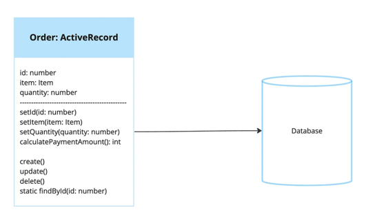

# Orm Pattern, Active Record Pattern
## 개념

- Martin Fowler의 Patterns of Enterprise Application Architecture 에서 소개되었다.
- 비즈니스로직과 데이터 persistence를 하나의 객체에 통합한 것을 의미한다.
- 데이터베이스 테이블의 한 행의 정보를 그대로 Mapping하는 객체이며 객체의 내용은 Table의 정의와 거의 매핑된다.
- CRDU와 같은 간단한 조작 기능들을 제공한다. 객체를 사용하여 데이터베이스의 행에 직접적으로 CRUD를 하게된다.
- Active record pattern 은 django 철학에서 상용하는 방식이다. 또한 2010에 소개된 Ruby on Rails에서도 채택되었다.
## 장점과 단점
- 장점
  - 개발자가 데이터베이스에 대한 CRUD를 간단하고 직관적으로 수행이 가능하다. 비즈니스로직이 복잡하지 않고 간단한 경우 사용할 수 있다.
  - active record implementation은 database와의 상호작용을 간단하게 한다.
- 단점
  - 하지만 객체의 구조가 테이블의 구조와 비슷하여 결합도가 있음. 객체-테이블을 독립적으로 리팩토링 하기 어렵다.
    - 데이터베이스의 리팩토링은 데이터 중복을 제거하기위한 정규화이지만 객체의 경우 가독성와 객체지향 원리에 따른 리팰토링을 하기 때문에 목적이 다르다.
  - 객체의 구조가 테이블의 구조에의해 결정된다. 객체들간의 상속 등의 관계를 표현하기 어렵다.
  - 단일 책임 원칙과 관심사의 분리를 따르지 않는다.
## 활용 예시
- django에서는 Model은 active record와 유사하다. 아래와 같이 models.Model 클래스를 상속하면 미리 정의되어있는 데이터 접근 메서드를 활용할 수 있다.
- https://github.com/django/django/blob/main/django/db/models/base.py#L1385
```python
from django.db import models

class Person(models.Model):
   first_name = models.CharField(max_length=30)
   last_name = models.CharField(max_length=30)

```

- 위의 Person model은 데이터베이스 테이블을 아래와 같이 만든다
```python
CREATE TABLE myapp_person (
    "id" bigint NOT NULL PRIMARY KEY GENERATED BY DEFAULT AS IDENTITY,
    "first_name" varchar(30) NOT NULL,
    "last_name" varchar(30) NOT NULL
);
```
- 그리고 위의 Person 객체는 기본적인 CRUD를 제공한다.
```python
from .models import Person
## get
Person.objects.get(1)
## create
p = Person(...)
p.save()
```

