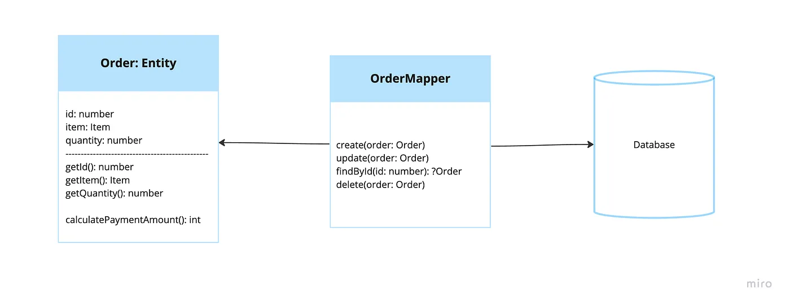

# Orm Pattern, Data-Mapper Pattern

## 개념

- in-memoty object를(도메인 레이어) 데이터베이스의 복잡성(데이터 저장소)으로부터 분리하는 것을 주요 목표로 한다.
- data mapper pattern은 domain object는 비즈니스 룰만 포함하도록 한다.
- database operation은 mapper layer에서 핸들링 된다.(데이터 엑세스 레이어)
- data mapper는 데이터와 그 데이터의 Persistence 로직을 어느정도 분리한다.
- 즉, Table에 정의된 스키마와 객체의 구조가 일지하지 않아도 된다.
  - 객체 입장에서는 DB 존재 유무, 어떤 명령을 갖고있는지 몰라도 된다.
- JPA와 같이 Data Mapper와 같으 패턴을 사용하는 orm은 쿼리 결과를 객체로 변환하고 각 객체의 연결 관계를 관리하며 지연로딩, 상속 관걔 처리 등을 제공한다.
  - 만약 orm이 이런 기능을 제공하지 않는다면 개발자가 직접 구현해야 한다.
- data mapper는 주로 infra계층에 속한다. (DDD 관점에서)
## 장점 및 단점
- 장점
  - 이러한 분리를 통해 한 쪽의 변경사항이 의도하지 않은 영향을 주지 않도록 한다.
  - 모델과 DB사이에 의존성이 적어져서 서로 독립적으로 유지가 가능하다. 관심사 분리가 된다.
- 단점
  - 객체와 데이터베이스의 매핑을 독립된 클래스로 처리하므로 구현 과정이 복잡해질 수 있다
