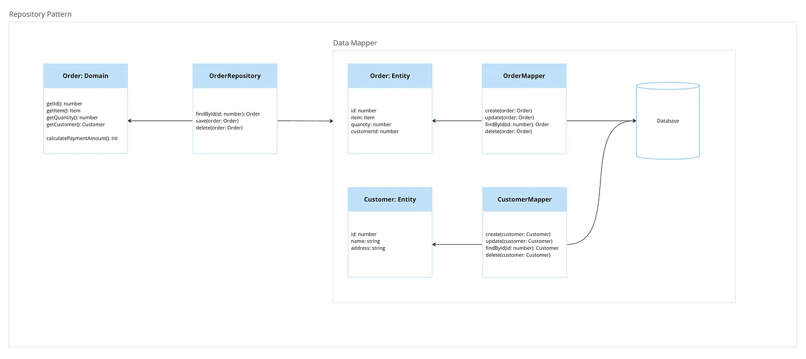

# Orm Pattern, Repository Pattern

## 개념

- 데이터 매퍼 레이어에 추가 레이어를 도입한 것이다.
- 레포지토리레이어의 주된 목적으로는 쿼리 작성 코드를 중앙에서 관리하고 객체 지향적인 방식으로 객체 컬랙션과 상호작용하는 방법을 제공한다.
  - 예를 들면 데이터베이스에서 데이터 읽기, 저장 등의 로직을 repository에서 수행함으로써 객체가 데이터베이스에 직접 접근하지 못하도록 한다.
- 이 패턴은 쿼리가 복잡하거나 domain object가 매우 많은 경우 사용하기 좋다
- Repository의 정의는 Domain계층에서 이루어진다(DDD 관점에서)

## 특징
- 데이터 추가,삭제, 조회 등의 작업이 마치 메모리에 있는 컬렉션과 상호작용 하는 것 같아 작업을 직관적으로 만든다.
- 코드의 가독성, 유지보수성을 높인다
- 모든 쿼리 작성 로직을 respository로 모으는 중앙 집중 방식은 DRY(Don't Repeat Yourself) 원칙을 유지하는데 유리하다
 