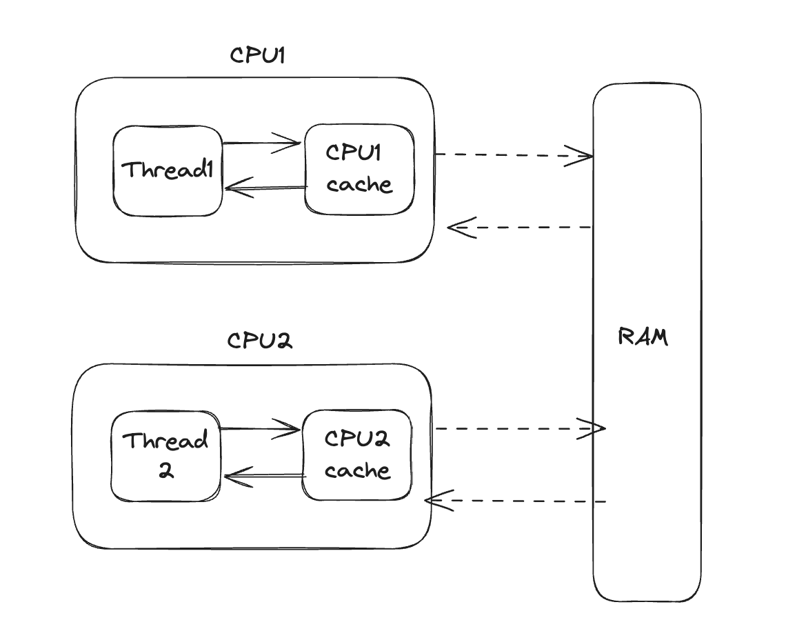

## 개요

- Singletone pattern은 하나의 클래스가 오직 하나의 인스턴스만을 갖도록 하는 디자인 패턴이다.
- 이 패턴은 클래스의 인스턴스가 오직 하나만 존재하도록 하고, 이 인스턴스에 접근할 수 있는 전역적인 접근점을 제공한다.
- 여러 인스턴스에서 이 하나의 인스턴스를 공유하여 사용한다.

### 사용 이유(WHY)

- 클래스의 인스턴스가 오직 하나만 존재해야 하는 경우에 사용한다.
- 특히 인스턴스의 생성 비용이 많이 드는 I/O 바운드 작업에 많이 사용한다.
  - I/O 바운드 작업은 데이터베이스 연결, 소켓 연결, 네트워트 통신,파일 시스템 등이 있다.
  - database 의 경우 쿼리를 할 떄마다 connect를 하면 비용이 많이 든다. 따라서 커넥트를 한 번 하고 그 커넥션을 계속 사용하는 것이 효율적이다.

## 장점 및 단점

- 장점
  - 인스턴스가 단 하나만 존재하기 때문에 메모리 낭비를 방지할 수 있다.
  - 전역 인스턴스이기 때문에 다른 클래스의 인스턴스들이 데이터를 공유하기 쉽다.
  - 쓰레드 세이프하게 구현할 수 있다.
- 단점

  - 의존성이 높아지기 때문에 TDD를 하기 어렵다.

    - 단위 테스트는 테스트가 서로 독립적이여야 하며 테스트를 어떤 순서로든 할 수 있어야 한다. 하지만 싱글톤 패턴은 각 테스트마다 독립적인 인스턴스를 생성하지 않기 때문에 테스트가 서로 의존성이 생긴다.
    - 예를 들면 하나의 테스트가 싱글톤 인스턴스를 변경하면 다른 테스트에 여향을 미칠 수 있다.
    - 아래의 예시를 보면 싱글톤 클래스를 사용하여 테스트하게 되면 테스트가 서로 의존성이 생기게 된다. 즉, 만약 아래의 순서가 바뀌게되면 테스틑 fail이 나게된다.

    ```javascript
    describe("Singleton Pattern test", () => {
      it("should get initialize valut to 0", () => {
        const instance = Singleton.getInstance();
        expect(instance.getValue()).toBe(0);
      });

      it("should set value to 1 and get value 1", () => {
        const instance = Singleton.getInstance();
        instance.setValue(1);
        expect(instance.getValue()).toBe(1);
      });

      it("should maintain the same value acroos tests (This is problematic)", () => {
        const instance = Singleton.getInstance();
        expect(instance.getValue()).toBe(1);
      });
    });
    ```

    - 이런 문제를 해결하기 위해 Depencency Injection을 사용할 수 있다. 이를 사용하면 테스트 중 모의 객체를 주입할 수 있기 때문에 테스트의 독립성을 유지할 수 있다.

## 구현 방법

- JAVA에서 싱글톤 패턴을 구현하는 7가지 방법 (참고:https://www.youtube.com/watch?v=3rfbnQYOCFA&list=PLTC3gIv9IzFLblGSX7yf_4p9VeUqAr_9q&index=2 )

### 1. 단순한 메서드 호출

- 개념 :싱글톤 패턴 생서애 여부를 확인하고 싱글톤이 없으면 생성, 있다면 만들어진 인스턴스를 반환
- 문제점 : 이 방법은 멀티쓰레드 환경에서 동작할 경우 싱글톤 인스턴스를 두 개 이상 만들 수 있다. (원자성이 결여되어있다.)
- 예시

  - 아래의 코드는 Thread 두 개를 실행시킨다. 그리고 sleep을 통해 임의적으로 지연을 시킨다. 하나의 쓰레드가 지연중에 다른 쓰레드가 counter를 변경한다.
  - 결과를 보면 coutner 값이 올발바르게 증가하지 않는다. 중복되거나 순서대로 증가하지 않는다.
  - 즉 thread safe하지 않다.

  ```java
        public class ConterSyncNotGood{
            private static int counter = 0;
            public static void main(String[] args){
                ConterSyncNotGood counterSync = new ConterSyncNotGood();

                // Thread1 : increment the counter
                new Thread(() -> {
                    for (int i = 0; i < 10; i++) {
                        counterSync.increment();
                    }
                }).start();

                // Thread2 : increment  the counter
                new Thread(()->{
                    for(int i = 0; i<10; i++){
                        counterSync.increment();
                    }
                }).start();
            }

            public void increment(){
                int temp = counter;
                try{
                    long sleep = (long)(Math.random()*10);
                    Thread.sleep(sleep);
                } catch(InterruptedException e){
                    e.printStackTrace();
                }
                counter = temp +1;
                System.out.println(Thread.currentThread().getName() + " : " + counter);
            }
        }
        /** 출력 예시
            NotGood
            Thread-0 : 1
            Thread-1 : 1
            Thread-0 : 2
            Thread-1 : 2
            Thread-1 : 3
            Thread-1 : 4
            Thread-0 : 3
            Thread-1 : 5
            Thread-0 : 4
            Thread-1 : 6
            Thread-0 : 5
            Thread-0 : 6
            Thread-1 : 7
            Thread-0 : 7
            Thread-1 : 8
            Thread-0 : 8
            Thread-1 : 9
            Thread-0 : 9
            Thread-1 : 10
            Thread-0 : 10
         */
  ```

### 2. synchronized 메서드 사용

- 위의 경우에 대한 thread safe하지 않는 문제를 해결하기 위해 synchronized 키워드를 사용하여 메서드에 동기화를 걸어준다.
- 문제점 : synchronized 키워드를 사용하면 성능이 저하된다. (동기화를 위해 lock을 걸어주기 때문에 문제가 된다. 락은 운영체제 수준에서 제동되기 때문에 비교적으로 시간이 많이 소요되며 cpu리소스가 소비되는 작업이다.)
- 예시
  - 위와 동일하다. 다른 점은 동기화가 되어야 하는 메서드에 synchronized 키워드를 추가한 것이다.
  ```java
    public synchronized void increment(){...}
  ```

### 3. 정적 맴버 Static member

- 2번 방법의 성능 저하 문제를 해결하기 위함
- 최초로 JVM은 클래스를 로딩한다.
- static 맴버나 블록은 런타임이 아닌 최초 JVM이 클래스 로딩 때 싱글톤 인스턴스를 만들고 모듈들이 이를 필요로할 때 이를 리턴함으로써 사용할 수 있도록 한다.
- getInstance() 메서드를 호출할 때마다 인스턴스를 생성하지 않고, 이미 생성된 인스턴스를 리턴한다.
- 문제점 : 싱글톤 인스턴스가 필요 없음에도 무조건 인스턴스를 만들기 때문에 자원 낭비라는 문제가 있다.
  ```java
    public class Singleton{
        private final static Singleton instance = new Singleton();
    }
  ```

### 4. 정적 블록

- 위와 비슷하지만 블록으로 만든다는 차이가 있다.

```java
    public class Singleton{
        private final static Singleton instance;
        static{
            instance = new Singleton();
        }
    }
```

### 5. LazyHolder

- 위의 문제를 해결하기 위한 방법이다.
- singletonInstanceHolder 라는 중첩 클래스를 내부 클래스로 하나 만들고 Singleton getInstance() 메서드를 호출할 때 내부 클래스를 로딩하고 인스턴스를 정적 맴버로 선언하는 방법이다.
- 이렇게 하면 필요할 때만 정적 맴버로 선언하기 때문에 자원 낭비를 방지할 수 있다.
- 예시 코드
  ```java
      public class Singleton{
          private static class singleInstanceHolder{
            private static final Singleton INSTANCE = new Singleton();
          }
          public static Singleton getInstance(){
              return singleInstanceHolder.INSTANCE;
          }
      }
  ```

### 6. DCL(Double-Checked Locking) 이중 확인 잠금

- 인스턴스 생성 여부를 싱글톤 패턴 잠금 전에 한 번, 객체를 생성하기 전에 한 번 총 2번 체크한다.
- 이렇게 하면 인스턴스가 존재하지 않을 때만 잠금을 걸 수 있기 때문에 락에 의한 성능 저하를 최소화할 수 있다.

- 예시

  ```java
  public class Singleton {
     // volatile 키워드를 사용하여 인스턴스 변수의 가시성을 보장
    private static volatile Singleton instance;

    public static Singleton getInstance() {
        if (instance == null) { // 첫 번째 체크
            synchronized (Singleton.class) {
                if (instance == null) { // 두 번째 체크
                    instance = new Singleton();
                }
            }
        }
        return instance;
    }
    ...
    ...
  }
  ```

  - volatile이란
    - java는 스레드가 2개 열리면 변수를 메인메모리(RAM)이 아닌 CPU 케시메모리에서 각각의 케시메모리를 기반으로 가져온다.(L3,L2,L1 케시메모리)
      
    - 그러므로 변수는 공유가 안된다. 각각의 케시 메모리에서 변수를 가져오기 때문에 변수의 값이 변경되어도 다른 케시메모리에는 적용이 안된다.
    - 이때 변수를 volatile로 선언하면 메인메모리에 변수를 저장하고 각각의 케시메모리에서 변수를 가져올 때 메인메모리에 있는 변수를 가져오게 된다. 즉, 변수를 공유하게 된다.

### 7. ENUM

- enum은 thread safe하게 구현되어 있다.
- enum은 자바 언어 명세에 의해 싱글톤을 보장한다.
- 자바의 컴파일러는 enum인스턴스가 단일 인스턴스임을 보장한다.
- JVM 클래스 로딩시 enum은 클래스 로더에 의해 한 번만 로드되고 초기화 된다. 어떤 쓰레드가 먼저 접근하던지 한 번만 초기화된다.
- 명시적으로 instance를 생성하기 때문에 **초기화 지연**과 관련된 문제를 피할 수 있다.
- 예시
  ```java
  public enum Singleton {
    INSTANCE;
    public void doSomething() {
    // do something
    }
  }
  ```

### 그럼 무엇을 사용해야 할까?

- 일반적으로 5번인 LazyHolder를 많이 사용한다. 이유는 성능적인 측면에서 가장 좋기 때문이다.
  - LazyHolder 방식은 지연 초기화와 성능 면에서 뛰어나며, 복잡한 초기화 로직이 필요한 경우에 적합하다고 한다.
  - 초기화 지연이 필요하면 사용하면 좋겠다.
- 7번 enum 방법은 이펙티브 자바를 쓴 죠수아 블로크가 추천한 방법이라고 한다.
  - enum 방식은 코드의 간결성과 자바 언어 명세에 의한 보장된 안전성을 제공하고 직렬화와 리플렉션 공격에 대해 자연스럽게 안전하다고 한다.
