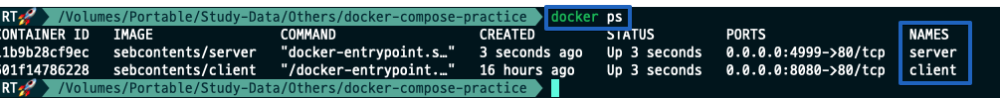

# Docker-Compose로-Server_Client_Communication_mysql연결

Chapter: Docker
강의: codestates
블로깅: No
유형: LESSON
작성일시: 2022년 3월 6일 오후 5:04

# Docker-Compose로-Server_Client_Communication

[참고사이트](https://www.tutorialworks.com/container-networking/)

### 1. Server와 Client가 통신하는 방법

1. Network를 생성하고 Container를 연결하는 방법과 (Manual)
   - 이 경우 아래와 같은 방법들이 있다 (Docker docs 참고, 아직 아래 Network 관련 내용들을 깊게 보지는 않았다)
     - **User-defined bridge networks** are best when you need multiple containers to communicate on the same Docker host.
     - **Host networks** are best when the network stack should not be isolated from the Docker host, but you want other aspects of the container to be isolated.
     - **Overlay networks** are best when you need containers running on different Docker hosts to communicate, or when multiple applications work together using swarm services.
     - **Macvlan networks** are best when you are migrating from a VM setup or need your containers to look like physical hosts on your network, each with a unique MAC address.
     - **Third-party network plugins** allow you to integrate Docker with specialized network stacks.
2. Docker-compose를 사용하는 방법이 있다.

   서로 격리되어있는 container 가 통신을 하기위해 위의 방법과 같이 Network를 구축할 수 있지만 Docker Compose를 사용하면 멀티 컨테이너 상황에서 쉡게 네티워크를 연결해 준다.

### 2. Docker-Compose로 Docker Image를 다뤄보자

[참고사이트](https://devlog-wjdrbs96.tistory.com/312)

- 이 방법은 1번의 방법보다 단순하다. docker-compose.yml 파일을 생서하여 (위치는 상관 없다) service로 연결 할 Container를 설정하고 “ docker-compose up “ 명령어로 쉽게 연결할 수 있다.
- Docker-Compose는 Docker application을 정의하고 실행하기 위한 Tool이다.
- [Docker-compose File](https://docs.docker.com/compose/compose-file/)
  - The Compose file is a [YAML](http://yaml.org/) file defining [version](https://github.com/compose-spec/compose-spec/blob/master/spec.md#version-top-level-element) (DEPRECATED), [services](https://github.com/compose-spec/compose-spec/blob/master/spec.md#services-top-level-element)
     (REQUIRED), [networks](https://github.com/compose-spec/compose-spec/blob/master/spec.md#networks-top-level-element), [volumes](https://github.com/compose-spec/compose-spec/blob/master/spec.md#volumes-top-level-element), [configs](https://github.com/compose-spec/compose-spec/blob/master/spec.md#configs-top-level-element) and [secrets](https://github.com/compose-spec/compose-spec/blob/master/spec.md#secrets-top-level-element)

1. docker-dompose.ylm (yaml) 을 생성한다

   1. Example

      ```bash
      version: '3.8' # 도커 컴포즈의 버전

      services:      # services에 실행하려는 컨테이너들을 정의한다
        nginx:       # container 이름 (원하는 이름 지정)
          image: img name   # 사용할 이미지의 이름
          restart: 'always' # 항상 container를 다시시작 하는 정책
          ports:
            - "8080:80" # Mapping 할 Port local port : container port
          container_name: client

        node:
          image: img name
          restart: 'always'
          ports:
            - "4999:80"
          container_name: server
      ```

      - [restart](https://docs.docker.com/config/containers/start-containers-automatically/#use-a-restart-policy)는 default로 no이다. always 옵션은 container를 항상 다시 시작하지만 수동으로 docker를 stop하는 경우에는 다시 시작하지 않는다.

1. docker-compse up -d 명령어를 통해 yaml 파일 실행하면 아래와 같이 server와 client가 실행되는 것을 볼 수 있다.

   

- 한 개의 docker-compose에서 관리되는 컨테이너끼리는 동일한 docker network에서 구동된다.

### 3. MySQL을 연결해보자-Voume & 환경변수 설정

- docker-compose file의 service로 db를 추가할 수 있다. 아래와 같이 작성 후 docker-compose up 명령어를 실행하면 된다
  ```docker
  services:
    nginx:
      image: sebcontents/client
      restart: 'always'
      ports:
        - "8080:80"
      container_name: client

    node:
      image: sebcontents/server
      restart: 'always'
      ports:
        - "4999:80"
      container_name: server
      volumes:
        - "./volumefolder:/data"

    mysql:
      image: amd64/mysql # M1의 경우의 예시이다. # 이외에는 mysql:latest
      restart: 'always'
      container_name: database
      environment:
        MYSQL_ROOT_PASSWORD: password # root 계정 비밀번호
        MYSQL_DATABASE: test # 초기 생성 데이터베이스
        MYSQL_USER: kangcoding # 생성할 사용자 이름
        MYSQL_PASSWORD: password  # 생성할 사용자 비밀번호
  ```
  - 아래와 같이 DB까지 연결이 되는 것을 볼 수 있다.
    

---

<정리>

- server와 client의 container를 따로 생성하려 통신을 하려면 추가적인 설정이 필요하다.
  \***\*[docker network connect](https://docs.docker.com/engine/reference/commandline/network_connect/)\*\***
- 하지만 docker-compse를 사용하면 두 개의 Container를 연결시켜주어 컨테이너 간의 통신을 쉽게 할 수 있다.
- keyward : [docker network](https://docs.docker.com/network/) , [docker bridge](https://docs.docker.com/network/bridge/) → 추가 공부하여 정리 해보자
