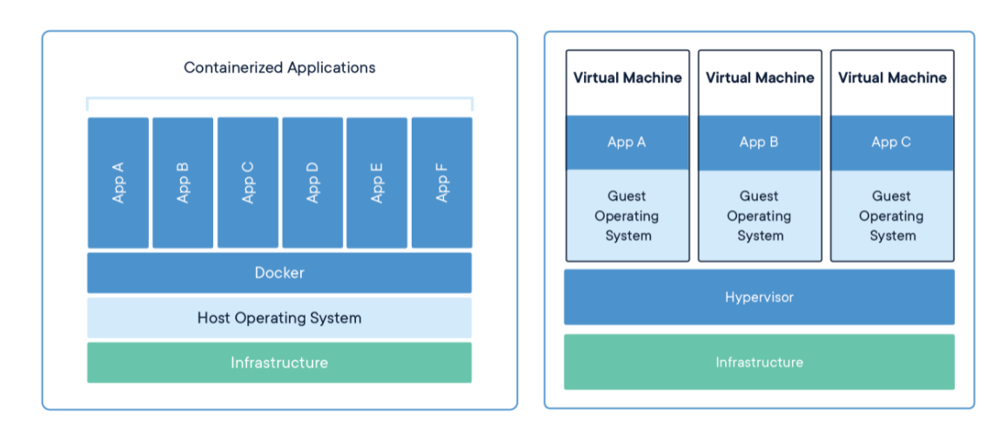

# Docker 기초

Chapter: Docker
강의: codestates
블로깅: No
유형: LESSON
작성일시: 2022년 2월 27일 오후 10:05

# Docker 기본 정리

Docker에 대해 공부한 내용 정리 

## 1.About  Docker

- docker는 application을 빠르게 구축하고, 테스트, 배포까지 할 수 있는 플랫폼이다. 컨테이너라는 표준화된 유닛에 소프트웨어를 실행하기 위한 모든 것이 들어있다. Docker는 이런 Container를 만들고 관리하는 도구이다.
    
    
    - docker는 리눅스 컨테이너 기술이다. 리눅스로 되어있다.
    
    ### [컨테테이너](https://www.docker.com/resources/what-container) 구성
    
    [그림출처](https://www.docker.com/resources/what-container)
    
    
    

- 컨테이너란, 프로세스가 격리된 공간에서 동작하게 하는 기술이다. VM와 같이 OS를 가상화 하는 것이 아니라, 단순히 프로세스를 격리하는 방식을 사용한다.
- application이 네트워크 환경, 파일 시스템 등의 컴퓨팅 환경에 구애받지않고 빠르고 안정적으로 실행될 수 있도록 해준다.
- Docker Container Image는  Application을 실행할 수 있는 모든 것을 포함하는 실행형 sofeware package이다.  이 이  미지를 사용하여 Infrastructure와 무관하게 Container를 빠르고 안정적이게 실행할 수 있다.
- 여러 Container가 동일 시스템이서 실행될 수 있도 OS kernal을 다른 Container와 공유할 수 있다.

### Container 장점

1. VM과 다르게 OS를 포함하지 않기 떄문에 빠르다 → application의 배포를 쉽고 빠르게 가능하게 함
2. 개발과 배포 환경을 일치시킨다. → 수평 확장이 쉽다 , 새로운 내용 배포가 쉽다.
3. Docker Container를 개발 환경과 무관하게 실행가능하게 한다 → 의존성, 충돌 문제 해결

- Container에 의해 격리되어 개별적으로 소유할 수 있는 자원
    - 프로세스 Process :
        - 특정 컨테이너에서 작동하는 프로세스는 그 컨테이너 내에서만 엑세스 할 수 있다.
        - 다른 컨테이너의 프로세스에 영향을 줄 수 없다.
    - 네트워크 Network : 컨테이너당 한 개의 IP주소 할당
    - 파일 시스템

### Docker command

- Pull an image or repository from a registroy
    - registor로부터  이미지 또는 respository를 가져온다.
- 저장된 도커 이미지 삭제
    - docker image rm docker/whalesay
        - image rm : 지정된 docker 이미지 삭제 (docker rmi도 동일)
- [docker container run](https://docs.docker.com/engine/reference/commandline/container_run/)
    
    ```bash
     docker container run [OPTIONS] IMAGE [COMMAND] [ARG...]
    ```
    
    - docker container run --name whalesay docker/whalesay:latest cowsay boo
    - docker container run --name httpdserver --rm -p 818:80 httpd
        - -p 옵션 : 로컬 호스트의 포트 818과  컨테이너의 포트를 연결한다(80)
        - -d : background에서 실행하게 해준다
        
    - -it : -i , -t를 동시에 사용한 옵션이다.  사용자와 컨테이너 간 Interaction이 필요한 경우 사용
        
        ```bash
        docker container run -it --rm danielkraic/asciiquarium:latest
        ```
        
        - -i :  `Keep STDIN open even if not attached`
        - -t : `Allocate a pseudo-tty`
    - 하나의 이미지를 받아옴 → 컨테이너로 실행 → 컨에티너와 관련된 리소스 삭제 한번에 가능
        
        ```bash
        docker container run --name whalesay --rm docker/whalesay cowsay boo
        ```
        
        - run : container를 실행한다. 이미지가 없다면 이미지를 pull하고 실행한다
        - —rm : 컨테이너를 일회성으로 실행한다. 컨테이너가 중지 또는 종료될 때 컨테이너의 관련된 리소스 모두 제거
- Container 내부로 접속
    - `docker exec -it 컨테이너_이름 bash`
     명령어를 통해 컨테이너 내부 터미널로 접속할 수 있다.
    
- docker Compose CLI
    - define and run multi-container applications with Docker(두 개 이상의  docker container를 연결)
    - docker-compose up : docker-compose.yaml에 정의된 이미지를 컨테이너로 실행
    - docker-compose down : docker-compose.yaml에 정의된 이미지를 이용해 실행된 컨테이너를 종료한다.
    - docker-compose up 특정 이미지 : 특정 이미지만 컨테이너로 실행
    
    ---
    

## 2. Docker 조작

### 1. Docker Image를 받아서 Container 생성하기

```bash
docker run --name 컨테이너_이름 -d -p 3000:80 container
```

### 2.  Docker 이미지에 파일을 추가하고 도커이미지를 만들기

- 도커 이미지에 파일을 추가하고 도커 이미지를 만드는 방법을 알아보다.
    1. Docker Container에 파일 복사
        
        docker container에 파일을 복사하는 방법은 두 가지가 있다.
        
        1. CP : 호스트와 컨테이너 사이에 파일을 복사
            - • [docker container cp](https://docs.docker.com/engine/reference/commandline/container_cp/) 명령은 앞 경로의 파일을 뒤 경로에 복사
                
                ```bash
                docker container cp ./ 컨테이너_이름:/usr/local/apache2/htdocs/
                ```
                
                현재 경로가 cp를 할 dir이므로 “./ “ 로 지정
                
        2. Volume : 호스트와 컨테이너 사이에 공간을 Mount : 저장 공간을 다른 장치에서 접근할 수 있도록 경로를 허용하여 마치 하나의 공간을 이용하는 것 처럼 보이게 함
        

### 3. Docker 이미지 만들기

- 이미지로 만들어 놓으면 좋은 점
    - 이전에 작업한 내용을 다시 수정하지 않아도 된다
    - 배포, 관리 유용

1. **구동한 Docker Container를 이미지로**
    1. [**docker container commit](https://docs.docker.com/engine/reference/commandline/container_commit/)  명령을 이용** : Create a new image from a container’s changes
        
        ```bash
        docker container commit 컨테이너_이름 my_pacman:1.0
        ```
        
    
    b. **Docker Image 빌드를 위한 파일인 Dockerfile로 만드는 방법**
    
    [Dockerfile 공식 문서](https://docs.docker.com/engine/reference/builder/)
    
    - DockerFile을 만들고 Dockerfile대로 이미지를 build하는 방법이다.
    - Dockerfile은 이미지  파일의 설명서라고 생각하면 됨
    - DockerFile (공식문서 내용임)
        - Docker can build images automatically by reading the instructions from a `Dockerfile`
            - DockerFile에 적혀있는 안내?에 따라 image를 build할 수 있다.
        - A `Dockerfile`  is a text document that contains all the commands a user could call on the command line to assemble an image.
            - Image를 만들기 위해 user가 command line에서 호출할 수 있는 모든 command를 포함하고있는 text document이다.
        - Using `[docker build](https://docs.docker.com/engine/reference/builder/)` users can create an automated build that executes several command-line instructions in succession.
            - docker build를 사용하여 사용자는 자동화됭 build를 만들 수 있다.
        
    
    **c. Dockerfile로 image build**
    
    ```bash
    docker build --tag my_pacman:2.0 .
    ```
    
    - —tag는 name:tag 형식으로 이미질을 생성할 수 있다
    - 지정한경로에 있는 docke file을 찾아서 빌드한다.
    - 마지막에 “ . “ 필수

### 4. 두 개의 Docker 이미지

- keyward : [docker network](https://docs.docker.com/network/)  , [docker bridge](https://docs.docker.com/network/bridge/)
- docker-compose를 사용한다 (두 개 이상의 docker를 연결)
- [Docker-compose File](https://docs.docker.com/compose/compose-file/)
    - The Compose file is a [YAML](http://yaml.org/) file defining [version](https://github.com/compose-spec/compose-spec/blob/master/spec.md#version-top-level-element) (DEPRECATED), [services](https://github.com/compose-spec/compose-spec/blob/master/spec.md#services-top-level-element)
     (REQUIRED), [networks](https://github.com/compose-spec/compose-spec/blob/master/spec.md#networks-top-level-element), [volumes](https://github.com/compose-spec/compose-spec/blob/master/spec.md#volumes-top-level-element), [configs](https://github.com/compose-spec/compose-spec/blob/master/spec.md#configs-top-level-element) and [secrets](https://github.com/compose-spec/compose-spec/blob/master/spec.md#secrets-top-level-element)
    - Compose is a tool for defining and running multi-container Docker applications. With Compose, you use a YAML file to configure your application’s services.
        - Compose는 다중 컨테이너 Docker application을 정의하고 실행하기 위한 tool이다
        - Compose에서는 YAML file을 사용하여 application의 service를 구성한다.
        
1. docker-dompose.ylm (yaml) 을 생성한다
    1. Example
        
        ```bash
        version: '3.8'
        
        services:
          nginx:
            image: img..
            restart: 'always'
            ports:
              - "8080:80"
            container_name: client
        
          node:
            image: img..
            restart: 'always'
            ports:
              - "4999:80"   # Host port : container port
            container_name: server
        ```
        

1. docker-compse up -d 명령어를 통해 yaml 파일 실행 
    
    한 개의 Container로 생성되는 것을 볼 수 있다.
    
- 한 개의 docker-compose에서 관리되는 컨테이너끼리는 동일한 docker network에서 구동된다.

Q . 컨테이너 기술이 무엇이고 도커가 왜 필요한가

Q. 개 이상의 Docker 이미지를 이용해서 컨테이너를 구축하는 방법인 docker-compose의 장점을 이해하고 있나요?

---

### Volume과 환경변수 설정 —>따로 공부해서 TIL하기

1. Volume
    - [데이터 볼륨](https://ko.wikipedia.org/wiki/%EB%B3%BC%EB%A5%A8_(%EC%BB%B4%ED%93%A8%ED%8C%85))
    - [도커 컨테이너와 데이터 볼륨](https://www.joinc.co.kr/w/man/12/docker/Guide/DataWithContainer)