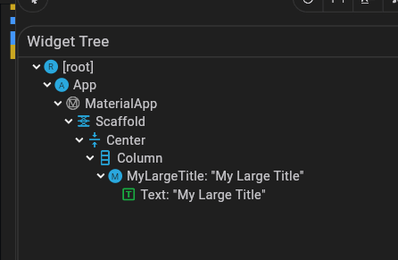
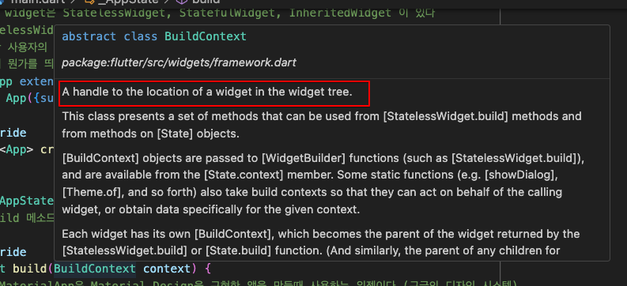

# 개요

- 노마드코더에서 무료로 제공해주는 Flutter로 웹툰 만들기 클린코딩 강의를 통해 정리한 자료4
- stateful widget에 대해 알아보자

# 정리

1. About stateful widget

- stateless widget은 build method를 통해서 단시 ui를 출력한다.
- stateful widget은 state를 가지고 있어서 상태가 변할 때마다 다시 그려준다.
- widget에 데이터를 저장하고 실시간으로 데이터를 보고싶을 때 stateful widget을 사용한다.
- stateful widget은 두 가지를 갖고있는데 하나는 상태가 없는 widget 그 자체이고 두 번째는 widget의 state이다.
- widget의 state는 위젯에 들어갈 데이터와 ui를 넣는 곳임
- stateful widget의 형태

  ```dart
    class App extends StatefulWidget {
    const App({super.key});

    @override
    State<App> createState() => _AppState();
  }
  ```

- State 의 데이터를 변경할 때 ui는 최신 데이터를보여준다.

- setState function을 사용하여 state가 변경되었음을 flutter에게 알릴 수 있다.

  ```dart
  class _AppState extends State<App> {
    int _counter = 0;

    setState(() {
      _counter++;
    });
  }
  ```

  - setState가 호출되면 flutter는 build method를 호출하여 ui를 다시 그린다.
    - 그런데 그럴 때마다 전체 빌드를 하는 것인가?
      - 아니다. flutter는 변경된 부분만 다시 그린다.
  - setState를 사용하지 않아도 되긴 하지만 가독성을 위해 setState를 사용하는 것이 좋다.

    ```dart
    _counter++;
    setState(() {});
    ```

2. About Build Context

```dart
  Widget build(BuildContext context) {}
```

- flutter에는 색상, 굵기 등을 곳에서 관리할 수 있는데 이것을 ThemeData라고 한다.
- widget tree에서는 부모와 자식의 관계가 있기 때문에 부모의 정보를 자식이 알 수 있어야한다.
- widget tree를 보면 아래와 같다.
  

- 위에서 MyLargeTitle widget은 부모의 요소에 접근하여 ThemeData를 가져와야한다.
- 이를 위해 Context를 사용한다.
- Conttext 는 모든 상위 요소들에 대한 정보이다.
- context는 MyLargeTitle Text의 부모 요소들의 모든 정보를 담고있다.
  

- 아래와 같이 context를 사용하여 ThemeData를 가져올 수 있다.

```dart
 @override
  Widget build(BuildContext context) {
    return Text(
      'My Large Title',
      style: TextStyle(
          fontSize: 30, color: Theme.of(context).textTheme.titleLarge!.color), // !는 null이 아니라는 것을 의미
    );
  }
```

3. Widget Lifecycle

- initState :

  - widget이 생성될 때 호출된다. 초기화를 위해 사용된다. 꼭 사용할 필요는 없다. 상태변수를 초기화 하는 것 것은
    별도로 할 수 있기 때문
  - 하지만 종종 부모의 속성을 초기화해야한는 경우가 있는데
  - 할상 build method보다 먼저 호출된다.

- dispose

  - dispose method는 widget이 제거될 때 호출된다.
  - api update나 event listener로부터 unsubscribe하는 등의 작업을 할 때 사용된다.

- widget lifecycle을 정리하면 initState -> build -> dispose 이다. initState에서 초기화를 하고 build에서 ui를 그리고 dispose에서 제거한다.
