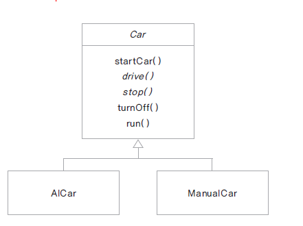

# Java&SpringBoot-다형성*Downcasting*추상클래스

Category: JAVA
Visibility: Public
강의 번호: Java & SpringBoot
블로깅: No
유형: LESSON
작성일시: 2022년 1월 17일 오전 2:30

JAVA 4주차 수업 정리 3.6 ~3.10 TIL - 다형성*Downcasting*추상클래스

### Achievement Goals

- 다형성(Polumorphism)에 대한 이해
- 상속을 사용하는 경우는 언제인지
- 다운케스팅(Downcasting)에 대해 이해해보자
- 추상클래스(Abstract Class)를 이해해보자

## 1. 다형성 (Polymorphism)

- 하나의 코드가 여러 자료형으로 구현되어 실행되는 것을 말한다.
- 같은 코드에서 여러 다른 실행 결과가 나온다.
- 정보은닉, 상속과 더불어 객체지향 프로그래밍의 가장 큰 특징중 하나이다.
- 잘 사용한다면 확장성있고 유지보수가 편리한 프로그램을 만들 수 있다.
- 아래의 예시 코드를 보자

```java
class Animal{
	public void move(){ }
}

class Human extends Animal{
	public void move(){
	@override
	}

class Lion extends Animal{
	public void move(){
	@override
	 }

public static void main(String[] args({
	Animal human=new Humal();
	Anumal lion=new Lion();

```

위의 코드는 animal.move는 한 줄이지만 instance에 따라 move의 구현Implementation)이 다르다. (다형성)

- 다형성의 원리를 전박적으로 보면, 먼저 상속을 하고 하위 class를 상위 class로 형변환을 하면 method overriding을 했던 method를 (다른 하위 클래스들의 mothod와 함께) 부모 클래스 타입으로 호출을 할 수 있다.
- 아래의 코드는 Customer 상위 클래스와 두 개의 하위 클래스 VIPCustomer, GoldCustomer가 있고 상위class의 showCustomerInfo 를 하위 class에서 overriding하였다.

```java
class Customer{
      public void showCustomerInfo(){
				System.out.println("일반고객정보");
	}
}
public class VIPCustomer extends Customer{

		@override
		public void showCustomerInfo(){
			System.out.println("VIP고객 정보");
	}
}
public class GoldCustomer extends Customer{
		@override
		public void showCustomerInfo(_{
	System.out.println("Gold 고객 정보")
	}
}

```

위의 코드를 상위클래스이 Customer로 형변환을 하고 상위클래스 타입으로 핸들링 할 수 있다.

```java
public class CustomerTest{

	public static void main(String[] args){
		// Class를 넣을 ArrayList
		ArrayList<Customer> customerList = new ArrayList<Customer>();

		// 형변환
			Customer customerVip=new VIPCustomer(10040,"kim");
			Customer customerGold=new Goldcustomer(10050,"kang");

			customerList.add(customerVip);
			customerList.add(customerGold);

		// Advanced for문은 먼저 자료형을 선언한다.
		// 형변환으로 인해 상위 클래스 자료형으로 선언할 수 있다
		for(Customer customer:customerList){
				customer.showCustomerInfo()
		}

```

만약 형변환을 하지 않는다면 아래와 같이 각각 하위 클래스에 대하여 함수를 호출해주어야 한다.

```java
			VIPCustomer customerVip=new VIPCustomer(10040,"kim");
			GoldCustomer customerGold=new Goldcustomer(10050,"kang");

			customerVIP.showCustomerInfo();
			customerGold.showCustomerInfo();
```

## 2. 언제 상속을 하는가?

그냥 기능만 가져다 쓴다고 상속을 하는 것은 아니다.

1. IS-A관계 (is a relationship : inheritance)
   1. 일반적인 개녕 VS 구체적인 개념 으로 분류될 떄
   2. 상위 클래스 : 하위 클래스보다 일반적인 개념이며 위의 예시에서 Customer에 속한다.
   3. 하위 클래스 : 상위 클래스보다 구체적인 개념이다. 위의 예시에서 VIPCustomer, GoldVustomer에 속한다.
   4. 상속은 하위 클래스들이 상위 클래스의 변화에 영향을 미치므로 클래스간의 결합도가 높은 설계이다
   5. 계층구조가 복잡하거나 hierarchy가 높으면 좋지 않다.
2. HAS-A 관예(composition)
   1. 클래스가 다른 클래스를 포한하는 관계이다. 변수로 선언하여 사용하는 방법
   2. 코드 재사용의 가장 일반적인 방법이다.
   3. 상속은 하지 않는다.

## 3. Downcasting & instanceof

- 다운케스팅(Downcasting)
  - upcasting된 class를 다시 원래의 타입으로 형 변환 한다.
  - 하위 클래스로의 형 변환은 명시적으로 해야한다.
  ```java
  Customer vc=new VIPCustomer() // 이 방법은 묵시적(implicity)방법
  VIPCustomer vCustomer=(VIPCustomer)vc; // 이 방법이 명시적(explicity) 방법
  ```
- Instanceof를 사용하여 인스턴스의 형을 체크한다.

\*상속된 관계인지 확인하는 작업을 해주어야 한다.

```java
// instancof는 class의 instance인지 확인해줌
//이렇게 확인을 해주는 것이 좋다

	if(customerK instanceof VIPCustmoer) {

		VIPCustmoer vc=(VIPCustmoer)customerK; // Gold인데 VIP로는 할 수 없다는 오류가 있음
	}
```

## 4. 추상클래스(abstract class) 구현하기

1. 추상클래스란?

   - 추상클래스란 구현 코드 없이 선언만 있는 추상 메서드를 포함한 클래스를 말한다.
   - 메서드의 구현(implementation) 즉, body는 없고 메서드의 선언(declaration) (반환타입, 메서드이름, 매개변수) 만 있다.
     - int add(int x,int y)
   - abstract라는 예약어를 사용한다.
   - 추상클래스는 body가 없어서 new할 수 없다 (instance화 할 수 없다)

1. 추상클래스란?

   - 메서드에 구현 코드가 없으면 abstract로 선언한다. (추상메서드임을 의미)
   - abstract로 선언된 메서드를 가진 class는 abstract로 선언하여 추상클래스로 만들어야한다.
   - 모든 메서드라 구현된 class라고해도 new를 통해 instance를 만들 수 없다.

   ```java
   public abstract class Computer{
   	// 공통으로 사용 할 메서드는 구현을 한다.
   	// 이 클래스에서 구현하지 못 할 메서드는 추상메서드로 선언하고
   	// 하위 클래스에 책임을 위임한다.
   	public abstract void display(); // compuer마다 화면 출력이 다를 수 있음
   	public abstract void typing(); // computer마다 typing이 다를 수 있음

   	public void turnOn(){
   	System.out.println("Power on")
   	}
   }
   ```

   - 추상 클래스의 추상 메서드는 하위 클래스가 상속하여 구현한다 (책임을 위임한다)
   - 아래 class diagram에서 기울어진 글자는 추상클래스를 의미한다.

   

   ```java
   // 하위 클래스에서 구현
   public class DeskTop extends Computer{

   @Override
   void display(){
   	System.out.println("DeskTop display")
   } // 추상클래스를 구현한 것

   @Override
   public void turnOff(){
   	System.out.println("Desktor Turnoff")
   } // 재정의 한 메서드
   ```

   만약 상위 클래스에서 abstract 메서드가 두 개가 있는데 하위 클래스에서 한 개만 구현했다면 하위 클래스에서도 abstract를 선언해야한다.

   추상클래스를 쓰는 이유는 하위 클래스에 상속하기 위함이다.

   ## 5. 추상클래스 응용 - 템플릿 메서드 patten

   ### Framework?

   템플릿 메서드 패턴에 알기 전에 framework가 무엇인지 알아보자.

   - framework는 library와는 다르다. JDK는 Java Development Kit이지만 framework와는 다르다.
   - Library는 프로그래머가 가져다 쓰고 flow의 제어권은 프로그래머가 갖고있다. Framework의 경우 이미 짜야하는 “틀”이 이미 짜여있다.
   - 예를 들어 class를 넣으면 어떻게 연동이 되고, 메세지를 넣으면 어떻게 전달이 되는지 등이 정해져있다. framework에서 프로그래머가 하는 일은 place hole이라고 하며 구멍들을 매꾸는 일이다.
   - 안드로이드를 예로 들어보면, 안드로이드의 화면은 엑티비티라고하는데 화면이 어떨게 close가 되고 어떻게 display가 되는지는 다 틀이 구축되어있다.
   - templet method는 framework에서 많이 쓰는 pattern이다. (시나리오는 만드는)
   - templet method는 시나리오를 정의를 해놓고 시나리오에 따라 흐름이 흘러가는데, 그 안에 추상메서드들이 있다. 이 메서드를 메서드 패턴을 가진 클래스를 상속받은 class 쪽에서 구현을 한다.

   ### Templet method

   templet mehod는 추상메서드나 구현된 메서드를 활용하여 코드의 흐름(시나리오)를 정의하는 메서드이다.

   Templet method dirgram은 아래와 같다.

   

   시나리오란 아래와 같이 구현될 수 있다.

   ```java
   final public void run(){
   	startCar();
   	drive();
   	stop();
   	turnOff();
   }
   ```

   - 위와 같이 final로 선언하여 하위 클래스에서 재정의할 수 없게 한다.
   - 중요한 흐름을 갖고있는 method이므로 재정의 할 수 없게한다.
   - classa에 final이 들어가면 상속을 받을 수 없다.
   - final은 변수에 쓰이면 상수로, 메서드에 쓰이면 재정의 못 하는 method, 클래스에 쓰이면 상속을 못 하는 클래스이다.
   - 정리를 하자면, 추상클래스로 선언된 상위클래스에서 템플릿 메서드를 활용하여 전체적인 흐름을 정의하고 하위 클래스에서 다르게 구현되어야 하는 부분은 추상 메서드로 선언하여 하위 클래스에서 구현하도록 한다.

   ### 상수 값 정의 방법들

   ```java
   public class Define{
   	public static final int MIN=1;
   	public static final double=PI=3.14;
   	public static final STring GREETING="Good Morning!";
   ```
