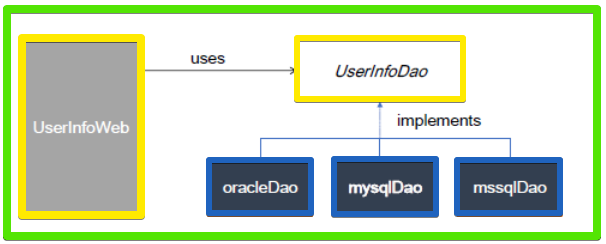

# Java&SpringBoot-인터페이스*다형성*상속

Category: JAVA
Visibility: Public
강의 번호: Java & SpringBoot
블로깅: No
유형: LESSON
작성일시: 2022년 1월 21일 오후 7:32

JAVA 4주차 수업 정리 3.11 ~3.15 TIL - Interface_Interface와 상속

### Achievement Goals

- Interface와 Class를 같이 구현하고 상속하는 경우에 대해 알아보자.
- 인터페이스와 다형선에 대해 알아본다.

# 1. 인터페이스와 다형성 , Streatage pattern

한 개의 Interface를 여러 객체가 구현하게 되면 Client 프로그램은 인터페이스의 메서드를 활용하여 여러 객체의 구현을 사용할 수 있다.

여러 정책을 바꿔가면서 하는 pattern을 Streatage pattern이라고 한다. 똑같은 Interface를 활용해서 method를 사용하지만 상황에 따라 다른 인스턴스를 돌게할 수 있다.

예시 코드를 통해 조금 더 알아보자.



위의 다이어그램과 같이 UserInfoDao라는 Interface가 있고 세 개의 DB가 (여러 개의 Class가) 한 개의 Interface 타입을 상속받고 있다. UserInfoDao라는 dao를 여러 DB제품이 지원될 수 있어야 한다.

즉, DB type에 따라 (상황에 따라) 적절한 Interfac가 호출되도록 해야한다.

### 다형성 예시 코드

- [UserInfo.java](http://UserInfo.java) : 사용자 정보 클래스

```java
public class UserInfo {

	private String userId;
	private String passwd;
	private String userName;

	// getter , setter method add

}
```

- [UserInfoDao.java](http://UserInfoDao.java) : Interface

```java
public interface UserInfoDao{
	void insertUserInfo(UserInfo userInfo);
	void updateUserInfo(UserInfo userInfo);
	void deleteUserInfo(UserInfo userInfo);
}
```

- UserInfoMySqlQao : UserInfoDao를 구현한 mySql Dao)

```java
public class UserInfoMysqlDao implements UserInfoDao{

	@Override
	public void insertUserInfo(UerInfo userInfo){
		System.out.println("Insert into mysql db");
	}
	@Overridepublic
	void updateUserInfo(UserInfo userInfo) {
		System.out.println("update into MYSQL DB userId = " + userInfo.getUserId());
	}

	@Override
	public void deleteUserInf(UserInfo userInfo) {
		System.out.println("delete from MYSQL DB userId = " + userInfo.getUserId());

	}
}
```

- UserInfoOracle : UserInfoDao를 구현한 Oracle Dao)

```java
public class UserInfoOracleDao implements UserInfoDao{

	public void insertUserInfo(UserInfo userInfo){
		System.out.println("insert into ORACLE DB userId =" + userInfo.getUserId() );
	}
	// 각 메서드 동일하게 구현
	...
	...
}
```

만약 들어오는 User의 Database type이 Oracle이면

```java
// 변수 선언을 Interface로 한다.
// mysql dao일지 oracle dao인지에 따라 다르므로 null
UerInfoDao uerInfoDao=null

if(dbType.equals("ORACLE")
	userInfoDao=new UserInfoOracleDao();
else
	userInfoMySql=new UserInfoMysql();

```

위와 같이 상황에 따라 인스턴스를 다르게 사용할 수 있다.

# 2. 여러 인터페이스 구현 , 인터페이스 상속

## 1. 여러 인터페이스 구현 (다중 인터페이스 구현)

아래와 같이 구현할 수 있다.

```java
public class ClassName implements interface1, interface2{
	// 추상 메서드 구현
}
```

- 인터페이스와 클래스를 같이 상속받는 경우가 있다. 예를 들어 framework에서 클래스를 상속받고 Interface를 implementation하는 경우가 종종 있다고 한다.
- 또한 Class는 불가능 하지만 Interface는 구현코드가 없기 때문에 여러 개의 Interface를 한 개의 클래스에서 구현할 수 있다.
  - Class가 불가능한 이유는? 다이아몬드 Problem 때문이다. 하나의 자식이 부모가 같은 두 개의 상위 클래스에게 상속을 받았고 두 개의 상위 클래스는 부모의 동일한 힘수를 재정의 하였다고 할 때 자식이 사용해야 할 재정의 함수는 무엇인지 모호해진다. 이런 문제를 다이아몬드 Problem이라고 한다.
- Java8이후 등장하는 default method가 중복되는 경우는 구현하는 클래스에서 재정의를 해서 사용한다.
- 여러 인터페이스를 구현한 Class는 Interface 타입으로 형 변환 되는 경우 해당 Interface에서 선언된 메서드만 사용이 가능하다.
- 다중 interface를 구현한 클래스하고 해서 전부 오픈하는 것이 아니라 일부의 interface만 오픈하여 그 기능만 client에서 사용이 가능하게 한다.
- 오픈을 해주는 Interface에 따라서 Client는 해당되는 interface만 사용할 수 있다.
  - 예를 들어 자율주행 자동차 Interface는 자동으로 시동을 거는 메서드가 있고 일반 자동차 Interface 는 수동으로 시동을 건다고 했을 때 , Car라는 class는 두 개으 인터페이스를 모두 구현하고 객체를 생성 시 자율주행 Car는 자율주행 Interface로, 일반 Car는 일반 Interface 형으로 선언하면 각각 다른 메서드를 사용하게 된다.

### 다중 인터페이스 예시 코드

- 다이어그램
  

위의 다이어그램에서 Customer Class는 Buy와 Sell 두 개의 인터페이스를 구현한다.

```java
// Buy Interface
public interface Buy{
	void buy(); // 추상 메서드
// Sell과 동일한 default method
	default void order(){
		System.out.println("Buy Order");
	}
}

// Sell Interface
public interface Sell{
	void sell();// 추상 메서드
	default void order(){
	System.out.println("Sell Order");
	}
}

// Customer class
public class Customer implements Buy,Sell{

	@Override
	public void sell(){
		System.out.println("customer sell");
	}
	@Override
	public void buy(){
		System.out.println("customer buy");
	}
	public void sayHello() {
		System.out.println("Hello");
	}

	// Order의 경우 두 인터페이스에서 동시에 갖고 있으므로 무엇을 사용해야할지 모호하다.
	// 구현하는 클래스에서 재정의한다.
	@Override
	public void order() {
		System.out.println("customer order");
	}
}
```

위의 코드에서 마지막 코드는 두 인터페이스에서 동시에 갖고있는 default method이다. 이런 경우에는 구현 클래스에서 재정의한다.

## 2. 인터페이스의 상속

인터페이스끼리 상속이 가능하며 class와 비슷하에 extendes 키워드를 사용한다.

인터페이스는 구현 코드의 상속이 아니므로 타입 상속이라고 한다.

```java
public interface longName extends name{
 ...
 ...
}
```

### 인터페이스 상속 예시코드

- 다이어그램
  

위의 다이어그램을 보면 X와 Y 두 개의 Interface가 있고MyInterface가 두 개의 Interface를 타입상속 하고있다. MyClass는 MyInterface를 구현한 구현클래스이다.

```java
// X Interface
public interface X{
	void X();
}

// Y Interface
public interface Y{
	void Y
}

// MyInterface
public interface  MyInterface extends X,Y{

	void MyInterface();

}

// 구현 클래스

public class MyClass implemrnts MyInterface{

	// X method 재정의
	@Override
	void X(){
		System.out.println("X()");
	}

	// Y method 재정의
	@Override
	void Y(){
		System.out.println("Y()");
	}

	@Override
	public void myMethod() {
		System.out.println("myMethod()");
	}
}
```

두 개의 인터페이스를 타입 상속받은 인터페이스 MyInterface를 상속받은 MyClass가 어떻게 사용되는지 코드로 확인해보자.

```java
MyClass myClass=new MyClass();

X xClass = myClass;  // X로 선언되면 X의 메서드만 사용 가능하다.

Y yClass = myClass; // Y로 선언된면 Y메서드만 사용 가능하다.

MyClass iClass = myClass // X, Y 메서드 모두 사용이 가능하다.
```

즉, 어떤 인터페이스로 선언되느냐에 따라 사요잉 가능한 메서드는 한정된다.

# 3. 클래스 상속과 인터페이스 구현 함께 사용

실무에서는 Framework나 오픈 소스와 함께 연동되는 구현을 하게 될 경우에는 클래스 상속과 인터페이스 구현을 같이 사용하는 경우가 많고한다.

상속받는 클래스의 경우 보다 일반적인 Class를 상속받고, 기능이 구현되어있는 Interface를 구현하는 방식으로 진행한다. 클래스 extends를 먼서 하고 implements를 뒤에 쓴다.

### 클래스 상속과 인터페이스 구현 예시 코드

- 다이어그램
  

다이어그램을 보면, Shelf는 클래스이고 Queue는 Interface이다. BookShelf보다 Shelf가 더욱 넓은 범위를 갖는 개념인 일반적인 경우이며 Queue는 FIFO방식의 무언가를 꺼내는 기능이 명세되어있는 Interface이다.

BookShef는 책이 순서대로 대여가 되는 도서관을 구현한 Class이다. Self는 책을 보관하는 자료구조가 되는 것이고 순서대로 대여가 되는 것은 Queue를 구현하여 전체 코드를 구성한다.

- Shelf Class

```java
// Shelf Class
public class Shelf{
	public ArrayList<String> shelf;

	// Constructor
	public Shelf(){
		shelf = new ArrayList<String>();
	}

	public ArrayList<String> getShelf(){
		return shelf;
	}

	// 책의 수량을 출력
	public int getCount(){
		return shelf.size();
	}
}

```

- Queue Interface

```java
public interface Queue{
	void enQueue(String title); // 제일 마지막에 삽입
	void deQueue(); // 먼저 들어온 것을 삭제
	int getSize();

	}
```

- BookShelf

```java
public class BookShelf extends Shelf implements Queue{
	@Override
	public void enQueue(String title) {
		shelf.add(title);
	}

	@Override
	public String deQueue() {
		return shelf.remove(0);
	}

	@Override
	public int getSize() {
		return getCount();
	}
```

---

결론

인터페이스를 배운지 얼마 되지 않았지만, Interface는 정말 강력한 도구라고 생각한다. 아마 다형성이라는 개념과 추상 클래스, 인터페이스의 개념이 없다면 코드 관리, 유지보수를 하는데 정말 힘들 것이다. 예를 들어 맨 위의 mysql과 oracle 등 DB에 따른 인스턴스를 사용하는 경우 인터페이스란 개념이 없다면 각자 DB마다의 소스코드를 작성해야한다. 이런 경우 비슷한 코드들의 어마어마한 양을 관리하고 유지보수 한다는 것은 매우 비요율적인 일이 될 것이라 생각한다.
