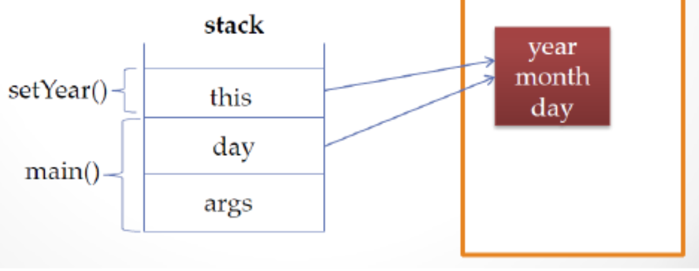
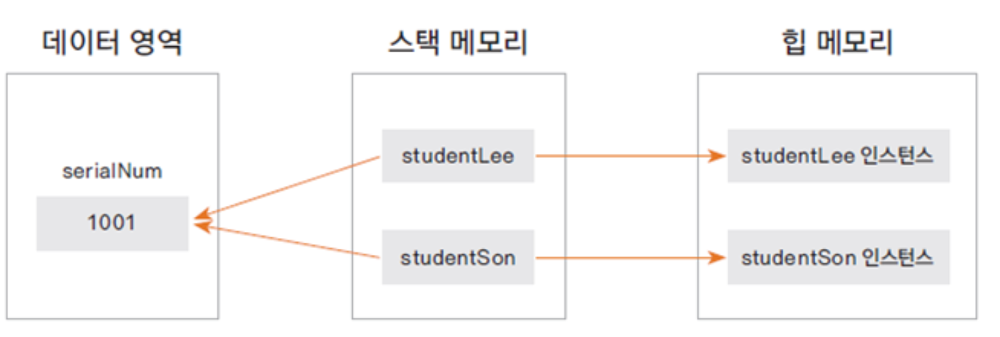
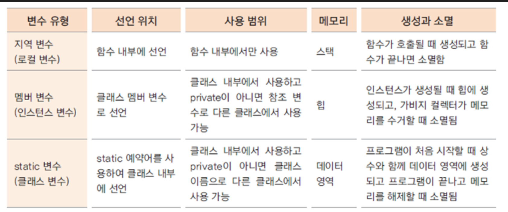

# Java&SpringBoot-정보은닉화\_캡슐화\_this_static

Category: JAVA
Visibility: Public
강의 번호: Java & SpringBoot
블로깅: No
유형: LESSON
작성일시: 2022년 1월 6일 오후 5:16

JAVA 3주차 수업 정리 TIL

## 1. 참조자료형과 접근제어지시자

참조 자료형은 사용하는 메모리의 크기가 정해져있지만 참조자료형은 클래스에 따라 다르다.

### 접근 제어 지시자(access modifier)

외부 class에서 클래스의 맴버변수, 매서드, 생성자를 사용할 수 있는지 여부를 지정하는 키워드이다.

- private :
  - 같은 클래스 내부에서만 접근이 가능하다. 외부클래스, 상속관계여도 접근이 불가능하다 .
  - private으로 선언된 맴버변수 (필드)에 대해 접근을 하거나 수정할 수 있는 메서드를 public으로 제공하는데 get() , set() 함수가 있다. get()만 있는 경우는 read-only 필드이다.
  - read-only의 경우 값을 수정해 줄 필요가 없는 경우에는 set 메서드를 굳이 만들지 않는다.
- default : 아무것도 붙이지 않는 경우이다. 같은 package 내부에서만 접근이 가능하다. 아무리 상속관계라고해도 package가 다르면 접근이 불가능하다.
- protected : 같은 pckage , 상속관계에서만 접근이 가능하다.
- public : 외부 어디서든 접근이 가능하다.

## 2. 정보은닉 , 캡슐화

정보은닉, 캡슐화에 대해서는 이전에 포스팅을 한 적이 있다. [참고해보자](https://sora9z.tistory.com/62)

### 정보은닉(Information Hiding)

- OOP에서 정보은닉은 외부에서 접근 가능한 최소한의 정보만을 오픈하여 객체의 오류를 방지할 수 있다.
- private으 선언하면 public get,se 메서드로 접근이 가능하기는 하지만 private일 때 각 변수에 대한 제한을 public 메서드에서 제어할 수 있다.
- private은 오용되지 말아햐 하는 변수에만 붙여주는 것이 좋다

### 캡슐화(Encapsulation)

- 캡슐화는 꼭 필요한 정보와 기능만을 외부에 오픈한다.
- 대부분의 맴버 변수와 method를 감추고 외부에 통합된 interface를 제공하여 일관된 기능을 구현한게 한다.
- 이를 통해 외부에서 맴버변수 ,메서드에 접근하여 발생할 수 있는 오류를 최소화시킬 수 있다.
- 예를 들어 일관된 한 두개의 메서드만을 만들고 클라이언트에 제공하면, 클라이언트 쪽에서 이 메서드만 보고 사용할 수 있게 할 수 있다.

## 3. this에 대하여

### 1. Instance 자신의 메모리를 가리킨다.

아래킈 코드를 메모리 할당과 함께 생각해보자.

```java
public static void main(String[] args){
	BirthDay day = new BirthDay();
	day.setYear(2000);
.....
.....
}

// Class BirthDay 내부 중..
public void setYear(int year)
{
    this.year = year;
}
```



- BirthDay day = new BirthDat();
  - new가 호출되면 day month year가 heap 메모리에 할당이 된다.
  - day라는 변수는 생성된 birthDay를 가리키는 참조변수이다.
  - main 함수에는 변수 day와 args가 있으며 각각 stack에 저장된다.
  - day가 가리키는 값은 heap 메모리의 instance이다. 즉, day에는 주소값이 들어있다.
- day.setYear(2000)

  - setYear에 해당되는 stack 메모리가 잡힌다.
  - setYear내부에 있는 this라는 키워즈는 생성된 instance의 주소값을 갖는다.

  ### 2. 생성자에서 다른 생성자를 호출하는 this

  class에서 여러 개의 생성자가 있는 경우에는 this를 사용하여 다른 생성자를 호출 할 수 있다.

  ```java
  public class Person {

  	String name;
  	int age;

  	public Person() {
  		this("이름없음", 1);
  // String과 int 타입와 매핑되는 생성자를 호출한다.
  	}

  ..
  ..
  }
  ```

  위의 생성자에서는 this를 사용하여 다른 생성자를 호출한다.
  두 개의 매개변수가 들어가고 String과 int와 매핑되는 생성자를 호출한다.

  ### 자신의 주소를 반환하는 this

  ```java
  public class Person {

  	String name;
  	int age;

  	public Person(String name, int age) {
  		this.name = name;
  		this.age = age;
  	}
  ```

  this.name, this.age와 같이 자신의 주소를 반환하는 this를 사용하여 맴버변수에 접근한다.

  ## 4. Static 변수

  [https://t1.daumcdn.net/cfile/tistory/99AAAC405CEC82C032](https://t1.daumcdn.net/cfile/tistory/99AAAC405CEC82C032)

  - static 키워드를 사용하면 static 변수와 static 메소드를 만들 수 있다. 정적 변수와 정적 메소드는 정적 필드, 정적 메소드라고 한다. (둘을 합쳐 정적 맴버라고도 한다)
  - instance가 생성될 때 만들어지는 변수가 아닌 처음 프로그램이 메모리에 로딩될 때 메모리를 할당한다.
  - Class변수, static변수 라고도 한다.
  - Instance 생성과 상관 없이 사용이 가능하며 Class이름으로 직접 참조한다.
  - Class는 static 영역에 생성되고 new 연산을 통한 객체는 heap 영역에 생성된다.
  - Process가 될 떄 code영역과 data영역이 있는데, data영역을 static 영역 이라고 부르낟. 프로그램이 끝나서 unload될 때 삭제된다.
    

  ### static 변수 구현과 활용

  ```java
  private static int serialNum = 1000;

   ...
  public static int getSerialNum() {
  	return serialNum;
  }

  public static void setSerialNum(int serialNum) {
  	Employee.serialNum = serialNum;
  }
  ```

  static 메서드는 instance와는 무관하기 때문에 클래스 이름으로 호출이 가능하다. 하지만 static 메서드는 인스턴스 생성 전에 호출이 될 수도 있으므로 static 메서드 내부에서는 인스턴스 변수를 사용할 수 없다.

  ### 변수의 유효범위 & 메모리

  
  static 변수의 경우 프로그램이 메모리에 있는 동안 계속 메모리를 차지하고 있으므로 배열과 같은 너무 큰 메모리를 할당하는 것은 그닥 좋지않다.
