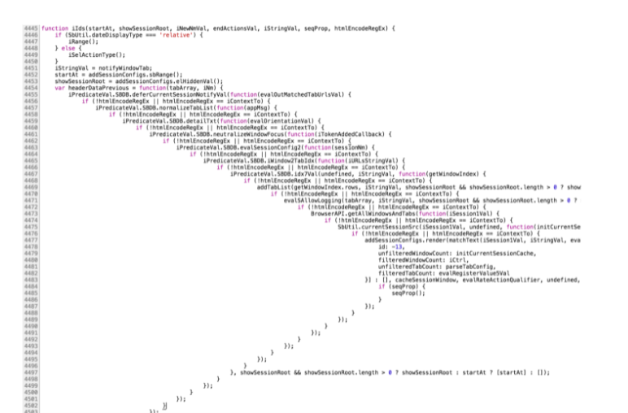

# [JS/Node] 비동기 - Callback

Category: JavaScript
Visibility: Public
강의: CodeStates
블로깅: No
유형: LESSON
작성일시: 2021년 10월 1일 오후 3:55

# Asynchronous

이번 포스팅 에서는 JavaScrit에서 Asynchronous 흐름을 구현하는 방법들에 대해 정리해 보겠다.

JavaScript의 비동기 흐름은 callback, promise, async/await 중 하나의 문법으로 구현이 가능하다.

- 비동기 함수 전달 패턴 1: callback 패턴
- 비동기 함수 전달 패턴 2 : 이벤트 등록 패턴

1. 비동기 함수 전달 패턴 1 : callback 패턴

callback 함수를 동기적으로 사용하는 경우와 비동기 적으로 사용하는 경우에 대해 비교해보자.

- 동기적으로 사용하는 경우

```jsx
console.log("1"); // 동기
setTimeout(() => console.log("2"), 1000); // 비동기
console.log("3"); // 동기

// Synchronous callback
// callback을 받아서 바로 실행
// 함수의 선언은 hoisting이 되므로 실질적으로 함수의 선언이 제일 위로 올라간다.
// 순서대로 1,3,hello(바로 실행 되므로),2(1초 뒤 실행되므로)
function printImmediately(print) {
  print();
}
printImmediately(() => console.log("hello")); // 동기

/* 함수를 실행시킨 결과
1
3
hello
2

Dream coding의 callback 함수 강의의 코드를 활용하였습니다.
*/
```

함수 printImmediately(print)는 인자로 callback 함수를 받아 바로 실행한다. 바로 실행하므로 synchronous로 실행이 된다.

- 비동기적으로 사용하는 경우

```jsx
// Asynchrnous callback
// hoisiting 되므로 두 함수의 선언문들은 모두 맨 위로 올라가게 된다.
// 순서는 1. 1이 출력되고 (동기) 2. 브라우저로 요청 (브라우저) 3. 3 출력 4. 콜백함수가 바로 출력 되므로 (동기) hello 출력 4. 두 번째 함수를 브라우저에 요청 5. 1초 뒤 2가 출력 6. 2초 뒤 async callback 출력
function printWithDelay(print, timeout) {
  setTimeout(print, timeout);
}
printWithDelay(() => console.log("async callback"), 2000);

/*
1
3
hello
2
async callback

Dream coding의 callback 함수 강의의 코드를 활용하였습니다.
*/
```

함수 printWithDelay()는 callback 함수와 원하는 딜레이 시간을 입력하면 setTimeout 함수를 통해 전달된 2초 후에 callback 함수를 실행하게 된다. 위의 코드에서 보듯이, 비동기적으로 callback을 사용하게 되면 비동기의 흐름을 제어할 수 있다.

**Callback error handlin Design [참고문서](https://1sherlynn.medium.com/how-to-handle-errors-in-asynchronous-javascript-code-when-working-with-callbacks-dcd32bca4b6b#:~:text=Traditionally%20for%20such%20cases%2C%20errors,specifies%20what%20error%20has%20happened.)**

비동기 자바스크립 코드에서 콜백함수를 사용할 때에는 callback 함수 첫 번째 인자 name을 error로 넣는다.

만약 어떠한 요인에 의해 비동기 함수에서 error가 발생했다면, 첫 번째 인자와 함께 callback이 실행되고 callback 함수 내의 error code가 실행된다. 만약 error없이 진행 된다면 인자 error에는 null이 할당된다.

이러한 pattern을 error-first callback 이라고 하고 일반적으로 Node Js JavaScript에서 많이 사용한다고 한다.

```jsx
// Callback error handling Design
const sthgonnaHappen=calback=>{
	...
	if(isSomethingBad) callbac(something,null)
	if(isSomethingGood) callback(null,something)
}

// 참고문서의 예제

function calculateSquare(number, callback) {
  setTimeout(() => {
    if (typeof number !== "number") {
      callback(new Error("Argument of type number is expected."));
      return;
  }
  const result = number * number;
  callback(null, result);
  }, 1000);
}
let callback = (error, result) => {
  if (error !== null) {
  console.log("Caught error: " + String(error));
  return;
  }
  console.log(result);
};

```

위의 예제와 같이 callback 함수를 사용할 때 error 처리에 유념하자.

### callback은 최고지만,,잘못하면 Callback HELL에 빠지게 된다...

callback 을 너무 남발하면 가독성이 상당히 떨어지고 비지니스 로직을 한 눈에 이해하는 것도 어렵다.

error가 발생하거나 디버깅을 할 때, 유지.보수를 할 때에도 매우 어렵다.



- **Advanced**

브라우저의 비동기 함수 작동 원리 알기 —> 추가로 공부하여 블로깅을 하

- Event Loop

[동시성 모델과 이벤트 루프 - JavaScript | MDN](https://developer.mozilla.org/ko/docs/Web/JavaScript/EventLoop)

- Phillip Roberts:Help, I'm stuck in an event-loop

[Philip Roberts: Help, I'm stuck in an event-loop.](https://vimeo.com/96425312)

callback 개념을 사용하여 비동기 제어를 연출할 수 있다. 하지만 콜백을 너무 사용하게 되면 위에서 봤듯이 Callback hell에 빠지게 된다. 이를 해결하기 위해 Promise 라는 개념을 사용한다. 이는 다음 포스팅에서 추가로 알아보기로 하자.

**참고 사이트**

[JavaScript for Beginners: Async](https://rowanmanning.com/posts/javascript-for-beginners-async/)

코드스테이츠 강의 자료 중 일부의일부부

드림코딩 - 엘리쌤 강의참고
