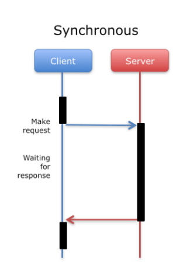
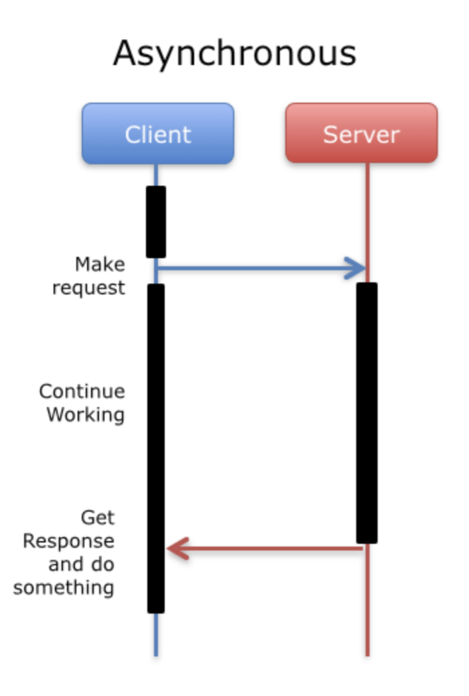

# [JS/Node] 비동기 (Asynchronous)

Category: JavaScript
Visibility: Public
강의: CodeStates
블로깅: Yes
유형: LESSON
작성일시: 2021년 10월 1일 오전 9:29

# Asynchronous

### Achievement Goals

- Synchronous의 개념에 대해 이해한다.
- Asynchronous의 개염에 대해 이해한다.
- Asynchronous를 왜 사용하는지 이해한다.

## 1. 비동기 호출이란?

### **1. 동기(Synchronous)**

비동기를 이해하기 위해 동기(Synchronous)를 먼저 알아보자.

- 실행 완료 시점과 실행 시작 시점이 같은 것을 동기적(Synchronous)이다 라고 한다.
- 요청에 대한 결과가 동시에 일어난다. 요청에 blocking이 있다.
  - blocking이란, "A process that is blocked is one that is waiting for some event" 앞의 실행이 끝날 때까지 다른 작업을 하지 못함을 의미한다.
  - 상당리 long-running JS function이 있을 경우, 서버 또는 UI에서 이 함수가 끝날 때까지 어떠한 작업도 하지 못하게 된다.
- Hoisting이 된 뒤로에 작성된 코드에 맞춰서 차례대로 동기적으로 실행하는 것을 말한다.

```jsx
console.log("one");
console.log("two");
console.log("three");
```

위의 코드는 순서대로 one,two,three가 실행될 것이고 이런 실행을 동기적 실행이라고 한다.

- Web Server를 예로 들면 , website에서 무엇인가를 하고있을 때, 클릭,입력 등을 하고나서 server에서 응답이 오고나서 다른 행동을 할 수 있다. server에서 응답이 올 때까지 기다려야하는데, legacy wdb application에서 사용하던 동기적인 방법이다.
  

  [그림출처](https://medium.com/i-learn-esp32-and-you-should-too/9-the-esp32-real-time-chart-591c0cbb03f)

### 2. **비동기 (Asynchronous)**

- 비동기란, 요청에 대한 결과가 동시게 일어나지 않는 것을 말한다.
- 언제 code가 실행될지 예측할 수 없는 것을 말한다.
- Web Server로 예를 들면, Synchronous와는 다르게 클라이언트에서 요청을 해도 서버의 응답을 받을 때까지 기다리지 않고 다른 작업들을 진행하다가 응답을 받으면 계속 진행한다.
  

```jsx
console.log("one");
setTimeout(() => console.log("two"), 1000);
console.log("three");

/*
one
three
two
*/
```

위의 코드의 실행은 다음과 같다

1. console.log("one")이 실행이 된다
2. setTimeout()은 브라우저 API이기 때문에 브라우저에 요청을 보낸다.
3. console.log("three")는 응답을 기다리지 않고 바로 실행이 된다.
4. 1초 뒤에 브라우저에서 callback 함수를 실행하라는 응답이 오고 console.log("tow")를 실행하게 된다.

   - **setTimeout에 대하여..**

   [mdn](https://developer.mozilla.org/en-US/docs/Web/API/setTimeout) 에 따르면, callback 으로 받은 함수를 두 번째 인자로 받은 시간이 지나고 실행하게 하는 함수.

   "The global setTimeout() method sets a timer which executes a function or specified piece of code once the timer expires."

### **3. 그렇다면, 왜 Asynchronous를 사용하는게 더 효율적일까 ??**

1. Javascript가 Synchronously하게 실행이 된다면 그 함수가 끝날 때까지 다음 코드들은 막혀있을 것이다 (blocking).
2. 위에서 언급 했듯이, 서버의 경우 서버에서 응답이 올 떄까지 유저들은 로딩을 기다려야 할 것이다.

참고한 사이트에서 퍼온 예시를 들어보면,

만약 내가 친구 한 명에세 카톡을 보내고 다른 친구에게 카톡을 보내려는데, 동기적으로 처리를 한다면 카톡이 다 보내지기 전까지 카톡방을 나가지도, 어떠한 클릭도 하지 못할 것이다.

이를 간단한 수도코드로 확인해보자

```jsx
katalk = loadKatalkSync();
// ..... Wait
// ..... Do something with the katalk
doSomeotherImportantThings();
```

```jsx
katalk = loadKatalkAsync(function () {
  // .... Wait
  // Do something with the katalk
});
doSomeotherImportantThings();
```

첫 번째 코드에서는 doSomeotherImportantThings(); 을 하기위해 앞의 코드가 끝날 때까지 기다려야 하지만, 두 번째 코드는 katalk이 다 보내질 때까지 기다릴 필요가 없다.

Node/JS는 non-blocking하고 asynchronous 적으로 작동하는 런타임으로 개발되었다고 한다. 특히, 아래와 같은 작업들은 비동기적으로 작동되어야 효율적이다

- 백그라운드 실행 , 로딩 창 등의 작업
- 인터넷에 → 서버 요청 , 응답을 대기하는 작업
- 큰 용량의 파일을 로딩하는 작업

**비동기가 쓰이는 주요 사례**

- DOM ELEMENT의 이벤트 핸들러
  - 마우스,키보드 입력 (click, keyboard)
  - 페이지 로드(COMContentLoaded)
- 타이머
  - 타이머 API (setTimeout등)
  - 애니메이션 API (requestAnimationFrame)
- 서버에 지원 요청 및 응답
  - fetch API
  - AJAX (XHR)

이번 포스팅은 Asynchronous에 대해 정리를 해보았다. 다음 포스팅으로는 Asynchronous 적으로 프로그래밍을 하는 방법에 대해 알아보겠다.

**참고한 사이트**

[JavaScript for Beginners: Async](https://rowanmanning.com/posts/javascript-for-beginners-async/)

코드스테이츠 강의 자료 중 일부의일부부
