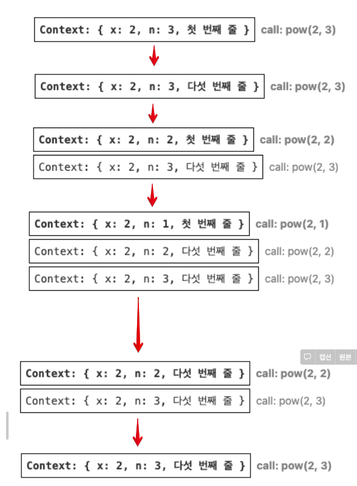
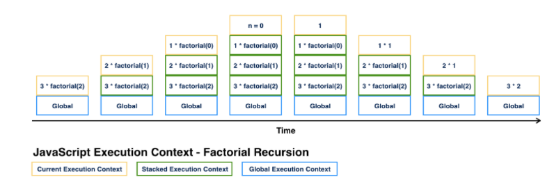
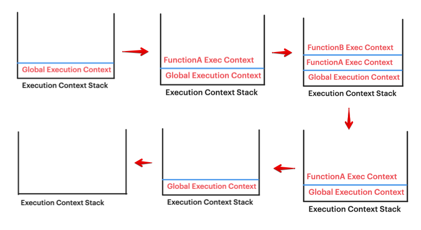

# [JS/Node] 재귀 함수와 메모리 사용량

Category: JavaScript
Visibility: Public
강의: Self Study
블로깅: Yes
유형: Self Study
작성일시: 2021년 9월 14일 오후 11:34

# 재귀 함수와 메모리 사용량 간의 관계

문제를 풀다보면, 재귀함수가 참 편리할 때가 있다. 반복문 보다는 재귀를 쓸 때가 더 편할 때도 있지만, 아무래도 함수를 한번 더 콜 하기 때문에 부담스러운 부분이 있는 것 같다. 프로그래머라면 사용하는 함수 또는 메서드, 알고리즘의 시간복잡도나 메모리 사용량에 대해서 알아야 한다. 앞으로도 많이 사용할 재귀의 메모리 사용량에 대해서 알아보자!

### 1. 재귀란?

간단하게, 재귀에 대해서 먼저 알아보자!

재귀는 간단한 동작 하나를 반복적으로 처리해야 할 때 , 간단한 동작을 재귀를 사용하여 반복함으로써 작업을 단순화 시킬 수 있는 자료구조 이다. 재귀는 1. 주어진 문제를 비슷한 구조의 더 작은 문제로 나룰 수 있는 경우 2. 중첩된 반복문이 많거나 반볻문의 중첩 횟수(number fo loops)를 예측하기 어려운 경우 사용하기 매우 적합하다.

DOM에서 tag들은 트리 구조를 이루고있는데, 우리는 트리구조의 깊이를 미리 정해두지 않는다. 데이터가 많아지면 트리구조는 더욱 깊어지게 된다. 이런 경우, 재귀를 사용할 수 있다. 또한, JSON또한 트리구조이며 재귀를 사용할 수 있다.

자바스크립트 엔진은 재귀의 최대 깊이를 제한이 있다. 만개 정도는 허용하고 대다수 엔진에서도 십만 까지는 다루지 못한다고 한다.

### 2. 자바스크립트 실행컨텍스트

실제 재귀의 호출을 알아보기 위해 먼저 함수의 내부 동작에 대해 알아야 한다. 실행중인 함수의 실행 절차에 대한 정보는 실핸 컨텍스트 (Execution context)에 저장된다.

아래의 내용은 [9.4 Execution Contexts](https://tc39.es/ecma262/#sec-execution-contexts) 와 [코어 자바스크립트](https://ko.javascript.info/recursion) , [Execution context, Scope chain and JavaScript internals](https://medium.com/@happymishra66/execution-context-in-javascript-319dd72e8e2c) 를 참고하여 정리하였다.

---

---

**[그럼..실행 컨텍스트란??]**

**실행 컨텍스트의 정의**

[Execution context, Scope chain and JavaScript internals](https://medium.com/@happymishra66/execution-context-in-javascript-319dd72e8e2c)

> Execution context (EC) is defined as the environment in which the JavaScript code is executed. By environment, I mean the value of this, variables, objects, and functions JavaScript code has access to at a particular time

위의 문서에 따르면, EC (Execution context)는 자바스크립트가 실행되는 환경으로, JS 코드가 특정 시간에 엑세스 할 수 있는 변수, 함수, 객체 등을 의미한다고 한다.

(위의 문서는 더 읽어보고 따로 더 정리해 보자.)

실행 컨텍스트는 **함수 실행에 대한 세부 정보를 담고있는 내부 데이터 구조**이다. ECMAScript에 따르면, Code의 runtime 평가를 추적하는데 사용되는 도구라고 한다. 함수의 실행 과정을 제어 흐름의 현재 위치, 변수의 현재 값, this의 값 등 세부적인 정보가 실행 컨텍스트에 저장된다. 함수 한 번 호출당 하나의 컨텍스트가 생성된다.

**실행 컨텍스트의 생성**

실행 컨텍스트 stack은 실행 컨텍스트를 추적하기 위해 사용된다. 실행중인 실행 컨텍스트(running execution contexts)는 실행 컨텍스트의 Top Element이다. 새로운 실행 컨텍스트는 현재 실행중인 실행컨텍스트와 연관된 코드로부터 연관되지 않은 코드로 제어위치가 바뀔 때 생성된다. 새롭게 생성된 컨텍스트는 stack에 push 되고 실행중인 실행컨텍스트가 된다.

실행 컨텍스트는 관련된 코드의 실행 진행 상황을 추적하기 위해 필요한 세부 정보를 담고있다.

**JavaScript 실핼 컨텍스트듸 세 가지 타입**

1. Global execution context(GEC)

   GEC는 브라우저에서 파일을 처음 로드할 때 JS 코드가 실행하는 기본 실행 컨텍스트 이다. 모든 Global Code는 GEC에서 실행된다 (global code는 함수 내부나 객체 내부에 없는 코드를 말한다. ) GEC는 한 개만 존재한다. JS 엔진은 단일 스레드 이므로 한 개의 글로벌 환경만이 가능하다고 한다.

2. Function execution context(FEC)

   함수의 호출이 있다면 함수 실행 컨텍스트가 JS Engin에 의해 정의된다. 각 함수는 그 함수만의 실행 컨텍스트가 있으며 1개 이상일 수 있다. 함수 실행 컨 GEC의 모든 code에 접근이 가능하다( 역으로 GEC에서 FEC로는 안된다) GEC code가 실행중일 때 JS Engine이 함수의 호출을 발견하면, 그 함수를 위한 새로운 FEC를 생성한다. 브라우저에서 만약 코드가 stric 모드에서 실행중이면 this는 정의되지 않고, 아니라면 함수 실행 컨텍스트에서 this는 윈도우 객체이다.

3. Eval : Execution context inside eval function

이하부터, Global execution context 는 GEC로 , Function execution context는 FEC로 부르겠다.

**Execution context stack (ECS)**

Execution context stack은 script가 실댕되는동안 생성되는 모든 실행 스택을 저장하기 위한 stack 자료구조 이다. 마지막에 실행된 컨텍스트가 먼저 나가는 구조이다. GEC는 default로 실행 컨텍스트 stack에 존재하며 제일 아래에 있다 (botton)

---

---

### 3. 함수의 실행 컨텍스트와 스택

함수를 실행할 때의 스택 상태는 아래의 과정과 같다.

GEC는 default 이기 때문에 항상 먼저 실행된다.

- GEC를 실행중에 JS 엔진이 함수 호출을 발견하면 FEC를 생성하고 ECS의 top에 push를 한다.
- 제일 top에 있는 실행 컨텍스트를 실행한다.
- 함수의 실행이 다 끝나면 JS 엔진은 그 함수의 실행 컨텍스트를 pop() 하고 그 아래에 있던 (GEC)를 실행한다.

함수 내부에 중첩된 호출이 있을 시 아래와 같이 절차가 이루어진다.

- 현재 함수의 실행이 일시 중지된다.
- 중지된 함수와 연관된 실행 컨텍스트는 실행 컨텍스트 스택(execution context stack) 이라는 특별한 자료 구조에 저장된다.
- 중첩 호출이 실행된다.
- 중첩 호출 실행이 끝난 후 실행 컨텍스트 스택에서 일시 중단한 함수의 실핸 컨텍스트를 꺼내오고, 중단한 함수의 실행을 다시 이어간다.

아래의 코드의 실행과 실핼컨텍스트를 보면서 이해해보자

( [Execution context, Scope chain and JavaScript internals](https://medium.com/@happymishra66/execution-context-in-javascript-319dd72e8e2c) 의 예시를 인용하였다. )

```jsx
let a = 10; // ----- (1)

function functionA() {
  console.log("Start function A");

  function functionB() {
    console.log("In function B");
  } // ----- (4)

  functionB(); // ----- (3)
} // -----(5)

functionA(); // ----- (2)

// Start function A
// In function B

console.log("Global Context"); // ----- (6)

// Global Context
```

(1) 브라우저가 코드를 실행하기 전에 JS Engine은 ECS에 GEC를 push 한다.

(2) functionA가 GEC에서 호출되면 JS Engine은 ECS에 FEC를 push 하고 functionA를 실행한다.

(3) functionB가 functionA 의 FEC에서 호출이 되면 JS Engine은 새로운 FEC를 생성하고 ECS에 push한 후 실행한다.

(4) functionB의 모든 코드가 실행이 되면 JS Engine은 functionB의 FEC를 ECS에서 pop 한다 (삭제한다)

그러면, functionA의 FEC가 ECS에서 Top에 있게 되고 JS Engine은 남아있는 코드를 실행한다.

(5) functionA의 모든 코드가 실행이 되면 JS Engine은 functionA의 FEC를 ECS에서 pop 하고 Top에 있는 GEC를 실행한다.

(6) 모든 코드가 실행이 되면 JS Engine은 GEC를 pop 하고 JS 실행을 끝낸다.

아래는 (1)~ (6) 의 과정의 ECS 을 보여준다.



### 4. 재귀의 실행 컨텍스트와 스택

이제 재귀의 실행 컨텍스트를 살펴보자

아래의 코드는 [코어 자바스크립트](https://ko.javascript.info/recursion) 를 참고하였다.

```jsx
function pow(x, n) {
  if (n == 1) {
    return x;
  } else {
    return x * pow(x, n - 1);
  }
}

pow(2, 3);
```

(1) pow(2,3)이 실행된다. 실핸 컨텍스트엔 변수 x=2, n=3이 저장된다.

n===1을 만족하지 못하므로 else 문을 실행하고 pow(2,2)를 서브호출(subcall) 한다.

(2) pow(x, n-1) 이 호출되므로 새로운 함수 실행 컨텍스트가 생성되고, ECS의 top에 push 된 후 실행된다.

     이 실행 컨텍스트 에는  x=2, n=2가 들어가게 된다.

(3) n===1을 만족하지 못하므로 위와 같은 동일한 과정이 반복된다. 모든 함수에 대해 아래의 프로세스가 똑같이 적용된다

- 스택 최상단에 현재 컨텍스트가 **기록** 된다.
- 서브 호출을 위한 새로운 컨텍스트가 만들어진다
- 서브 호출이 완료되면, 기존 컨텍스트를 스택에서 꺼내 (Pop) 실행을 이어나간다.
-

(4) pow(2,1)이 실행되면 n===1을 만족하여 if문의 첫 번째 분기가 실행된다. 실행해야 할 중첩 호출문이 없으므로 함수는 종료되고 2가 반환된 후 실행 컨텍스트는 메모리에서 삭제된다.

(5) pow(2,2)의 실행이 다시 시작된다. pow(2,1)의 결과를 알고있으므로 pow(2,2)는 계산이 되고 4를 반환한다.

(6) pow(2,3)이 다시 실행이 되고 pow(2,2)의 결과를 알고있으므로 최종적으로 8을 리턴하고 종료된다.



**Factoria**l 을 재귀로 실행할 경우 Execution Context 를 보자. factorial(3)을 실행할 때의 변화이다.



factorial함수를 한 번 실행할 때마다 실행 컨텍스트가 생성되고, 이전 실행 컨텍스트를 다 끝내지 못하고 계속 쌓이게 된다.

위의 두 예에서 볼 수 있득이 재귀의 깊이는 스택에 들어가는 실행 컨텍스트 수의 최댓값과 같다. 실행 컨텍스트는 깊이와 비례한 메모리를 차지하기 때문에 재귀를 사용할 때 메모리 요구사항에 위의해야한다.

재귀와 비슷하게 반복을 하지만 메모리를 절약하고 싶다면 반복문을 사용하는 것이 메모리 절약에 좋다. 반복문을 사용하여 만든 함수는 1개의 pow 컨텍스트만 필요하기 때문이다.

그렇다면 재귀를 사용하는 이유는 뭔가 고민하게 된다. 위의 글에서는 이렇게 말한다.

> 재귀를 사용하면 코드가 짧아지고 코드 이해도가 높아지며 유지보수에도 이점이 있습니다. 모든 곳에서 메모리 최적화를 신경 써서 코드를 작성해야 하는 것은 아닙니다. 우리가 필요한 것은 좋은 코드입니다. 이런 이유 때문에 재귀를 사용합니다.
