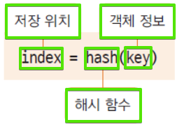

# Java&SpringBoot-자바의유용한클래스들

Category: JAVA
Visibility: Public
강의 번호: Java & SpringBoot
블로깅: Yes
유형: LESSON
작성일시: 2022년 1월 25일 오후 4:02

JAVA 5주차 수업 정리 자바의 유용한 클래스들

### Achievement Goals

- JAVA의 유용한 클래스들에 대해서 알아본다.
- Object Class
- String Class
- StringBuilder Class
- StringBuffer Class
- text block Class
- Class Class

# 1. Object Class

### 1. Object Class란?

[Object Class 공식문서](https://docs.oracle.com/javase/7/docs/api/java/lang/Object.html)

- 위의 문서에서도 설명 하듯이 Object class는 java의 모든 class들의 최상위 class이다. 즉, 모든 Class는 Object Class를 상속 받는다.


- 컴파일러에 의해 extendes Object가 추가된다.
- 부모 class의 참조변수는 자식 class 객체를 참조할 수 있으므로, Object Class를 사용하면 어떤 타입인지 모르는 Object를 참조할 수 있다 (upcasting)
- Object Class의 메서드 중 일부는 Overriding 할 수 있다. 재정의 할 수 없는 method는 final로 선언되어있다.
- toString() method를 예로 들어보자.

  - toString은 객체의 정보를 String으로 바꾸어서 사용할 때 쓰인다.
  - String 또는 Integer의 경우 이미 Class에 toString리 overriding 되어있다.
  - Overriding을 하지 않는 경우

  ```java
  class Book{

  	private String title;
  	private String author;

  	public Book(String title, String author) {
  		this.title=title;
  		this.author=author;
  	}
  }

  // test

  public static void main(String[] args) {

  		Book book=new Book("programming","sora");
  		System.out.println(book);


  		String str=new String("String Objec");
  		System.out.println(str);

  	}
  /* 출력

  ch01.Book@251a69d7  class의 full name  --> 251a69d7  :JVM이 준 가상 메모리 16진수
  String Objec  문장열이 나온다.이 경우 str.toString 이 자동으로 재정의 되어있기 때문이다.

  */
  ```

  Book Object의 경우 JVM이 준 가상 메모리 주소가 출력이 되는데, String 객체는 이미 toString()이 재정의 되어있기 때문에 문자열로 출력이 된다.

  - Overriding을 해보자.
    Book에 toString을 Overriding하는 코드를 아래와 같이 추가하고 실행하면 String으로 출력되는 것을 볼 수 있다.

  ```java
  class Book{

  	private String title;
  	private String author;

  	public Book(String title, String author) {
  		this.title=title;
  		this.author=author;
  	}

  		// 추가 코드
  		@Override
  			public String toString() {
  				return title + ',' + author;

  	}
  }

  // test

  public static void main(String[] args) {

  		Book book=new Book("programming","sora");
  		System.out.println(book);


  		String str=new String("String Objec");
  		System.out.println(str);

  	}
  /* 출력

  programming,sora
  String Objec

  */
  ```

### 2. Object Class Methods

Object Class의 Method들을 [공식문서](https://docs.oracle.com/javase/7/docs/api/java/lang/Object.html) 에서 퍼왔다. 아래와 같다.

[제목 없음](https://www.notion.so/f73f3270f5744777a776941dc7a2112b)

이 중 많이 쓰이는 세 가지 메서드를 대한 예시 코드를 통해 알아보자.

### 1. equals() Method

- equals는 두 인스턴스의 주소값을 비교하여 true false를 반환한다. 이 때 주소값을 heap memory의 주소값이다. (== 연산과 동일하다. 그리고 이 주소값을 hashCode라고 한다)
- 종종 인스턴스가 달라도 논리적으로 동일한 경우에는 true를 반환해야 하는 경우가 있다. 예를 들어 학번이 같은 instance는 같은 instance라고 할 수 있으므로 물리적으로는 다르지만 논리적으로는 같다.
- equals를 재적의하여 논리적으로 동일함 여부를 구현할 수 있다. 아래 코드로 확인해보자.

```java
public class Student implements Cloneable{

	private int studentNum;
	private String studentName;

// Constructor
	public Student(int studentNum ,String studentName) {
		this.studentNum=studentNum;
		this.studentName=studentName;
	}
	public void setName(String name) {
		this.studentName=name;
	}

// equals Overriding

	@Override
	public boolean equals(Object obj) {
		if(obj instanceof Student) {
			Student std=(Student)obj; // down casting
			if(this.studentNum==std.studentNum)
				return true;
			else return false;
		}
		return false;

	}
```

test code

```java
public static void main(String[] args) {

		Student std1=new Student(100,"sora");
		Student std2=new Student(100,"sora");
		Student std3=std1;


		System.out.println(std1==std2); // false 다른 객체이므로
		System.out.println(std1.equals(std2)); // 재정의 했으므로 true
		System.out.println(std1==std3); // 주소가 같으므로 같음
}

/* 출력

false
true
true

*/
```

std1와 std2는 물리적으로 다른 instance이다 (==비교) 하지만 재정의한 equals를 사용하여 논리적으로 같음을 구현할 수 있다.

### 2. hashCode() Method

- hash란 정보를 저장, 검색할 때 사용하는 자료구조로, 특정 키에 hash 함수를 적용하여 값을 반환한다.



- JAVA 에서 JVM은 hash방식으로 관리한다. hachCode는 Instance가 저장되어있는 heap 메모리의주소값을 반환하는 메서드이다.
- hashing 알고리즘에 의해 만들어지는 Integer 값을 return 한다.
- 두 개의 Instance가 같다는 것은 두 instance에 대한 equals()의 반환 값이 true로 동일한 hashCode()값을 반환한다.
- equsl()를 재정의 하여 논리적으로 동일한 인스턴스의 경우에도 hashCode()메서드도 재정의 하여 동일한 hashCode값이 반환되도록 해야한다.즉, 재정의를 할 때 equals()와 hachCode()는 pair이다.
- 위의 코드에서 hashCode를 Override 하고 결과를 확인해보자.

  논리적으로 동일한 객체이므로 기준이 되는 한 개의 객체의 hash값만 return하면 된다.

  ```java
  @Override
  	public int hashCode() {
  		return studentNum;
  	}

  ```

  test code

  ```java
  Student std1=new Student(100,"sora");
  		Student std2=new Student(100,"sora");
  		Student std3=std1;


  		System.out.println(std1==std2); // false 다른 객체이므로
  		System.out.println(std1.equals(std2)); // 재정의 했으므로 true
  		System.out.println(std1==std3); // 주소가 같으므로 같음

  		System.out.println(std1.hashCode()); // 재정의 해서 같다.
  		System.out.println(std2.hashCode());

  /* 출력

  false
  true
  true
  100
  100
  */

  ```

- 이미 재정의가 되어있는 String과 Integer를 확인해보자

  ```java
  String str1=new String("abc");
  		String str2=new String("abc");

  		System.out.println(str1.equals(str2)); // true
  		System.out.println(str1.hashCode()); // 96354
  		System.out.println(str2.hashCode()); // 96354

  		Integer i=100; // new X
  		System.out.println(i.hashCode()); //  정수값 100 이 나옴.

  /* 출력
  true
  96354
  96354
  100
  */

  ```

- 진짜 헤시를 찾아보자.
  재정의한 방법은 진자 해시가 아닐 수 있다. 진짜 헤시는 아래와 같은 방법으로 찾느다.

  ```java
  // 진짜 해시는?
  		System.out.println(System.identityHashCode(std1));
  		System.out.println(System.identityHashCode(std2));

  /* 출력
  622488023
  1933863327
  */
  ```

### 3. clone() Method

- clone() method는 객체의 원본을 복제하는데 사용하는 메서드이다. 생성과정의 복잡한 과정을 반복하지 않고도 복제할 수 있다. (생성자를 생성하는 등..)
- clone() 메서드는 객체의 맴버변수, 메서드 등의 객체의 정보가 동일한 또 다른 인스턴스가 생성되는 것이므로 객체지향 프로그래밍의 정보은닉, 캡슐화 등의 객페 보호 관점에서 위배될 수 있다.
- 그렇기 때문에 이 메서드의 사용을 허용해 준다는 의미로 cloneable interface를 명시해준다.(아래와 같이)

  ```java
  public class ClassName implements Cloneable{
  	...
  	...
  }
  ```

- 코드로 확인해보자.

```java
// clone
		std1.setName("kkkk"); // 생성이아니라 인스턴스의 상태를 그대로 복제.
		Student copyStudent=(Student)std1.clone(); // clone의 리턴은 Object이므로 donwncasting
		System.out.println(copyStudent);

/*출력
100:kkkk
*/
```

# 2. String , StringBuilder, StringBuffer Class & text block

### 1. String Class

[String 공식문서](https://docs.oracle.com/javase/7/docs/api/java/lang/String.html)

- Striing Class를 생성하는 방법으로는 heap memory에 Insctance로 생성되는 경우와 상수 풀(Constant pool)에 있는 주소를 참조하는 두 가지 방법이 있다.
- heap memory는 생성될 때마다 다른 주소를 갖지만, 상수 풀의 문자열은 모두 같은 주소를 갖는다.
- 한 번 생성된 String은 불변이다. 내부적으로는 char []에 들어가있는데 final로 선언되어있다.
  `public final class **String**`
- String을 + 연산으로 연결하면 기존의 String에 연결되는 것이 아닌 새로운 문자열이 생성된다. 아래의 코드로 환인해보자

  ```java
  public static void main(String[] args) {

  		String java=new String("java");
  		String android=new String("android");

  		System.out.println(System.identityHashCode(java));
  		// hash는 같게 나오므로 indentfyHashCode로


  		java=java.concat(android);

  		System.out.println(java);
  		System.out.println(System.identityHashCode(java));
  		// 메모리 주소가 바뀌는 것을알 수 있다.

  	}

  /*출력
  2060468723
  javaandroid
  622488023
  */
  ```

  여기서 concat은 아래와 같이 String을 합친다.

  ```java
  concat(String str)
  // Concatenates the specified string to the end of this string.
  ```

  concat을 하면 새로운 메모리에 저장이 된다. 하지만 이런 방법은 메모리 낭비가 될 수 있는 방법이다.

### 2. StringBuilder & StringBuffer

[StringBuilder 공식문서](https://docs.oracle.com/javase/7/docs/api/java/lang/StringBuilder.html) StringBuffer 공식문서

- 내부적으로 가변의 char를 맴버변수로 갖는다.
- 문자열을 여러 번 연결하거나 변경할 때 사용하면 유용하다.
- String처럼 새로운 메모리를 생성하지 않고 char[]를 변경한다.
- StringBuffer는 멀티 쓰레드 프로그래밍을 할 경우 동기화(Synchronization) 보장한다.
- 단일 쓰레드인 경우 StringBuilder 사용을 권장한다.
- 마지막에 toString() 메서드로 String으로 변환이 필요하다.

```java
public static void main(String[] args) {

		String java=new String("java");
		String android=new String("android");

		StringBuilder buffer=new StringBuilder(java);  // 매개변수로 str 가능
		System.out.println(System.identityHashCode(buffer)); // 동일
		buffer.append(android);


		System.out.println(System.identityHashCode(buffer)); // 동일
		String test=buffer.toString();
		System.out.println(test);

	}

/*출력
2060468723
2060468723
javaandroid
*/
```

### 3. text block

java 13부터 사용이 가능하가 (아직 잘 쓰지 않는다)

html, json 문자열을 만드는데 유용하게 사용할 수 있다.

```java
public static void main(String[] args) {
		String textBlocks="""
				This is a example
						of

				textBlock
				""";
		System.out.println(textBlocks);
	}

/* 출력
This is a example
		of

textBlock
/*
```

# 3. Class Class

[Class class 공식문서](https://docs.oracle.com/javase/8/docs/api/java/lang/Class.html)

공식문서에 따르면 Class class는 실행중인 자바 애플리케이션의 Class와 Interface를 나타낸다고 한다.

생성자가 없으며 객체가 로드될 때 JVM에 의해 자동으로 생성되고 호출된다.

- JAVA의 모든 클래스와 Interface는 컴파일 후에 class파일이 생성된다. Class 클래스는 이 class파일을 로드하여 객체를 동적으로 로드하고 정보를 가져오는 메서드가 제공된다.

잘 이해가 되지 않으므로 메서드를 코드와 함께 보면서 이해해보자.

<Person Class>

```java
public class Person {

	private String name;
	private int age;

	public Person() {}

	public Person(String name,int age) {
		this.name=name;
		this.age=age;
	}
	public String getName() {
		return name;
	}
	public void setName(String name) {
		this.name = name;
	}
	public int getAge() {
		return age;
	}
	public void setAge(int age) {
		this.age = age;
	}
	@Override
	public String toString() {
		return name;
	}


}
```

만약 , p1이라는 obj가 어떤 타입인지 모를 때 Class object의 method를 사용할 수 있다.

```java

// p1이라는 instance가 있을 때 type은 아래와 같이 알아낼 수 있다.

public static void getClassName(Object obj) {
		System.out.println("The class of "+obj+" is "+obj.getClass().getName());
	}

Person p1=new Person("sora",26);

		getClassName(p1);

/*출력
The class of sora is ch04.Person
*/

```

이로써 p1은 Person 이라는 클래스타입이고 ch04 package에 있음을 알 수 있다.

- Class를 가져오는 방법은 아래와 같이 다양하다
  - forName은 Class class의 method이다.

````java
```java
Class c = Class.forName("java.lang.String");
````

// - 클래스 이름으로 직접 Class 클래스 가져오기

```java
Class c = String.class;
```

// - 생성된 인스턴스에서 Class 클래스 가져오기

```java
String s = new String();
Class c = s.getClass();  //Object 메서드
```

````

### 동적 로딩 , 동적 바인딩

- 컴파일 시에 데이터 타입이 binding되는 것이 아니고, running 중 데이터타입을 동적으로binding하는 것을 동적 로딩, 동적 바인딩 이락고 한다.
- 프로그램을 만들 때에는 다른 타입의 변수로 처리를 했다가 runtime시에 원하는 class를 loading하여 binding할 수 있는 장점이 있다.
- Compile 시에는 타임이 정해지지 않기 때문에 동적 로딩 시에 오류가 발생하면 프로그램에 심각한 장애를 일으킬 수 있다.

### Reflection programming

[Package java.lang.reflrect 공식문서](https://docs.oracle.com/javase/7/docs/api/java/lang/reflect/package-summary.html)

- Reflection programming이란 객체를 통해서 Class의 정보를 분석해내는 프로그래밍 기법이다.
- 구체적인 Class의 정보를 알지 못해도 컴파일된 코드를 통해 역으로 정보를 알아낸다.
- 동적으로 객체를 생성하지 못하는 JAVA는 이 Reflection으로 그역할을 대신한다.
- 만약, 로컬 메모리에 객체가 없는 경우에 사용한다 (원격 프로그래밍)
- 일반적으로 서로 다른 process인 경우 local이 아니다.
- java.lang.refllect package에 있는 class를 활용한다.
- 일반적으로 자료형을 알고있는 경우에는 사용하지 않는다.

코드를 통해 알아보자

```java

import java.lang.reflect.Constructor;

public static void main(String[] args) throws ClassNotFoundException {

		// 이런 경우는  reflaction programing이라고 한다.
		Class c = Class.forName("java.lang.String");


		Constructor[] cons=c.getConstructors();

		for(Constructor co:cons) {
			System.out.println(co);  // String의생성자들을 볼 수 있다.
		}

		Method[] m = c.getMethods();

		for(Method mth:m) {
			System.out.println(mth);	// String의 메서드들을 볼 수 있다.
		}


	}
/*
출력
public java.lang.String(java.lang.StringBuffer)
public java.lang.String(java.lang.StringBuilder)
public java.lang.String(byte[],int,int,java.nio.charset.Charset)
public java.lang.String(byte[],java.lang.String) throws java.io.UnsupportedEncodingException
public java.lang.String(byte[],java.nio.charset.Charset)
public java.lang.String(byte[],int,int)
public java.lang.String(byte[])
public java.lang.String(char[],int,int)
public java.lang.String(char[])
public java.lang.String(java.lang.String)
....
...
...
*/

````
