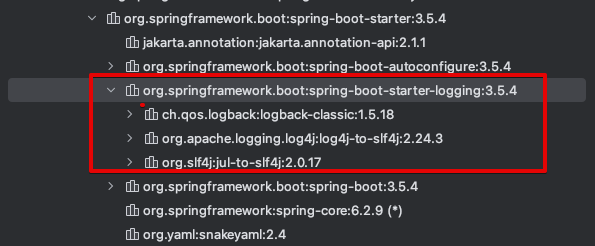
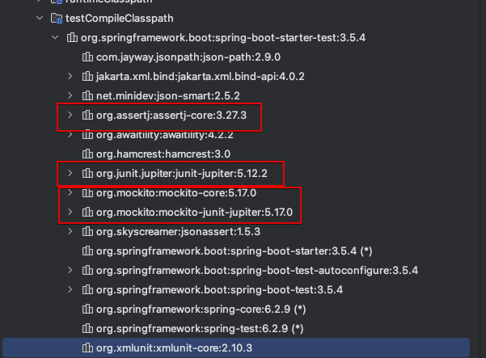
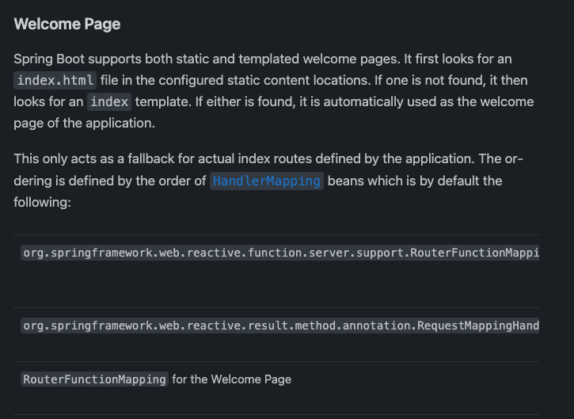
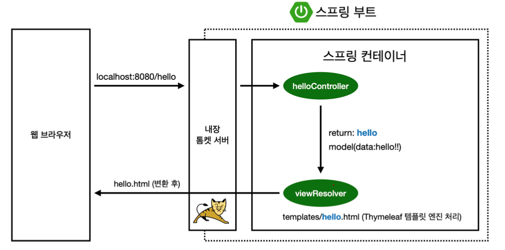
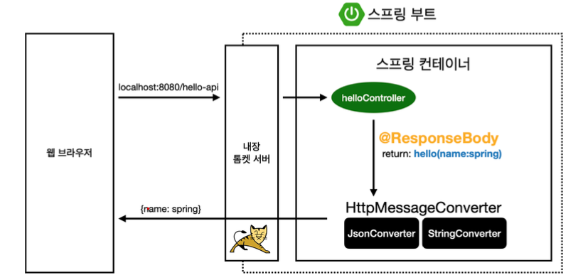
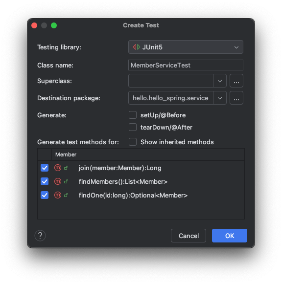
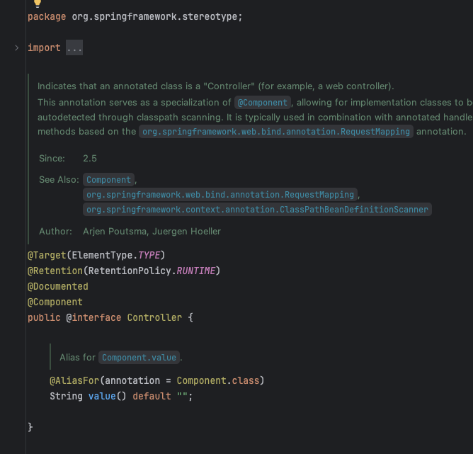
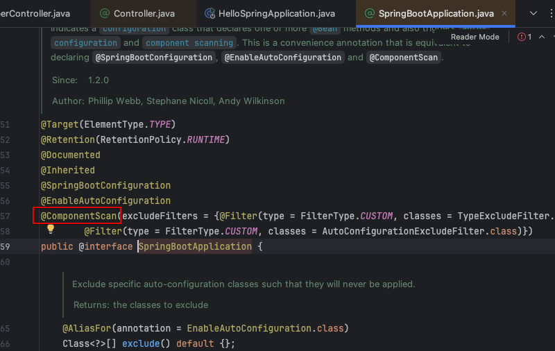

# 단축키

- shift f6 = rename
- cmd + p = 파라미터 보기
- option + enter = implementation등?
- cmd + option + v : return 을 만들어준다
- option shift cmd L 코드 정리
- crtl + t 는 리팩토링 관련
  - option + cmd M 하면 extract method
- shft + cmd + t 를 하면 테스트코드를 생성할 수 있다 껍데기를 자동으로 만들어준다
- option cmd / 별 주석으로 만든다
- cmd + e : 파일 탐색기?

# SECTION2 프로젝트 환경 생성

## 프로젝트 생성

- https://start.spring.io 에서 초기 프로젝트를 만든다
  - 위에의 starter에서 프로젝트,springBoot, language, packaging 등을 선택해준다
  - project meradata를 설정해준다 - project name 이런 것들을 설정한다
  - dependencies는 사용 할 의존성들을 찾아서 선택한다
- maven , gradle 이란? 라이브러리, 빌드 라이프사이클까지 관해주는 퉁

  - 과거에는 maven많이 씀 요즘은 gradle로 넘어오는 추세이다.

- 자바를 실행할 때 intelliJ 최신 버전은 Gradle을 통해서 실행하는 것이 기본이다.
- preferences -> build,execution,deployment->build tools -> gradle

  - build and run using : gradle -> intelliJ IDE
  - Run tests using : gradle -> intelliJ IDE
  - intellij IDE에서 바로 실행하도록 하면 더 빠르다 최적화를 해주나?

- Gradle은 의존관계가 있는 라이브러리를 함께 다운로드한다.

- Q. 스프링 부트는 프로젝트 생성을 보통 어떻게 하나? 모든 스타트를 위의 사이트에서 하나?
  - Intellij 내장된 프로젝트 생성 방법
  - 템플릿 복사
  - spring cli등 있음.
  - start.spring.io는 개인 프로젝트에서 많이 쓴다고 함

## 라이브러리

### 스프링부트 라이브러리

- 위에 initialize에서 선택한 두 개의 라이브러리를 확인해보자

- spring-boot-starter-web

  - sprinf-boot-starter-tomcat
    - 톰켓 웹서버이다. 아주 예전에는 이 톰켓을 따로 설치하고 자바 코드를 여기에 밀어넣어야 했는데 요즘은 starter-web에 내장되어있다.
  - sprint-webmvc
    - 스프링 웹 MVC
    - MVC 패턴응로 웹 애플리케이션이 동작하도록 하는 라이브러리임
    - 웹 요청을 HTTP -> Controller -> Service(Model) -> 응답 이라는 흐름을 자동화함
    - @Controller, @RequestMapping과 같은 어노테이션으로 쉡게 웹 개발이 가능하다
  - spring-boot-starter-thymeleaf
    - 타임라프 템플릿 엔진(view)
    - HTML에 동적 데이터를 넣어서 완성된 HTML을 만들어주는 라이브러리이다.
  - spring-boot-starter(공통)
    - 스프링부트 + 스프링 코어 + 로킹
    - spring-boot
      - spring-core
    - spring-boot-starter-logging
      - 스프링부트 spring-boot startter에 logging 라이브러리가 있다.
        
      - slf4는 인터페이스이다. 로깅 어댑터 같은 역할이다
      - logback은 실제 로깅 구현체이다. slf4를 실제로 구현한 라이브러리이다.
      - 성능도 빠르고 여러 지원이 있다. 사람들이 많이 쓰니까 스프링에서도 기본으로 사용하도록 만든것임

### 테스트 라이브러리

- spring-boot-starter-test
  - java에서 test 라이브러리로는 Junit을 많이 쓴다
    
  - 핵심은 junit이고 assertj, mockito같은 것은 테스트를 편리하게 해주기 위한 도와주는 도구
  - junit: JAVA에서 주로 사용하는 테스트 프레임워크이다. 최근에 4->5로 넘어갔다
  - mpockito : 목 라이브러리
  - assertj : 테스트코드를 돔 더 편하게 작성하게 도와주는 라이브러리이다.
  - spring-test : 스프링 통합 테스트 지원

## View 환경 설정

- resource/static/index.html

  - 스프링부트가 제공하는 welcome page기능이다.
  - 여기에 넣어놓으면 welcome page가 된다.
  - https://docs.spring.io/spring-boot/reference/web/reactive.html#web.reactive.webflux.welcome-page
    

- spring boot에 기능이 많아서 다 기억 못함. 찾아보는 능력이 중요함
- spring.io > project > springBoot > learn 에서 검색을 통해 찾아볼 수 있음

### thymeleaf 템플릿 엔진

    - html을 브라우저에 띄워주는 엔진

    - thymeleaf 공싱 사이트 https://www.thymeleaf.org/
    - 스프링 공식 튜토리얼  https://spring.io/guides/gs/serving-web-content
        - GetMapping annotation을 사용한 예제를 볼 수 있다
        - server side rendering 도구s Thmeleaf를 사용함을 볼 수 있다.
    - 스프링부트 Template Engine 메뉴얼
        - https://docs.spring.io/spring-boot/reference/web/servlet.html#web.servlet.spring-mvc.template-engines
        - Thymeleaf 뿐 아니라 FreeMarker, Mustache등 다른 렌덜이 엔진?을 사용하는 메뉴얼도 있다.
    - template engine을 사용하고 default configuration을 사용하면 src/main/recources/templates 에서 자동으로 template을 선택한다. 아래의 코드에서와 같이 return "hello"를 하면 src/main/recources/templates/hello.html을 찾는다
    ```java
        @Controller
        public class HelloController {
            @GetMapping("hello")
            public String hello(Model model){
                model.addAttribute("data","hello");
                return "hello";   // 이 hello는 hello template을 넘겨준다

            }
    }
    ```
    - 동작은 아래와 같다
    
    - 컨트롤러에서 리턴 값으로 문자를 반환하면, 뷰 리졸버(viewResolver)가 화면을 찾아서 처리한다
    - 스프링부트 기본 viewName 매핑
    - resources:templates/ +{ViewName}+ .html

- 참고로 spring-boot-devtools 라이브러리를 추가하면 Html 파일을 컴파일만 해주면 서버 재시작 없이 view 파일 변경 가능함
  - build -> recompile
  - spring-boot-devtools란?
    - https://docs.spring.io/spring-boot/reference/using/devtools.html
    - 개발에 유용한 tools 모음인 것 같다
    - Automatic Restart, Logging Changes in Condition Evaluation 등등

## Build, 실행

- terminal로 이동
- ./gradlew build
- build/libs 의 jar파일 실행 -> 배포할 때는 이것만 넣음 된다
- java -jar hello-sprint-0.0.1-SNAPSHOT.jar
- 옛날에는 war를 만들어서 집어넣고 했어야 했다 지금은 굉장이 편리해짐
- ./gradlew clean build 하면 지우고 다시 빌드해줌

# SECTION3

## Static contents

- 기본설정으로 spring boot에서는 static 폴더 에서 정적 content를 찾아서 제공한다
  https://docs.spring.io/spring-boot/reference/web/servlet.html#web.servlet.spring-mvc.static-content
- static 에 hello-static.html(아무 파일명이나) 만들고 서버 실행 후 localhost://8080/hello-static.html 이라고 하면 바로 찾아 들어간다

- controller가 우선순위를 갖기 때문에 controller 에서 먼저 찾는다.
- controller에 없다면 resources/static/에서 찾는다

## MVC와 템플릿 엔진

- Mocel은 화면을 그리는 것에 집중
- controller는 비즈니스, 내부적인 것 처리에 집중

- intellij에서 parameter 정보를 볼 때는 cmd + p

- helloController -> return hello-template -> viewResolver가 thymeleaf 템플릿 엔진에 처리 요청 -> 변환 후 웹브라우저는 반환

## API

cmd + shift + enter 치면 뒤에 ; 까지 완성을 해준다

- 기본은 JSON으로 setting을 해준다
  - spring-boot-starter-web에 jackson 이라는 라이브러리 포함되어있음
  - 기본으로 jackson을 쓴다 스프링은
  - 이 라이브러리가 JSON으로 변환한다.

### @ResponseBody 데코레이터



- http의 body에 문자 내용을 직접 반환한다
- viewResolver 대신 HttpMessageConverter가 동작한다
- 기본 문자 처리는 StringHeepMessaveConverter 인 string converter가 작동한다
- 기본 객체 처리는 MappingJackson2HttpMessegeConverter인 JsonConverter가 작동한다
- byte 처리 등등 기다 여허 HttpMessageConverter가 기본으로 등록되어있다.
- 참고로, client의 Accept 헤더와 서버의 컨트롤러 반환 타입 정보 둘을 조합해서 HttpMessageConverter가 선택된다.

- NestJs도 내장되어있지만, 순수 NodeJs의 koa나 express의 경우 미들웨어를 직접 등록해주어야 했는데 spring은 꾀나 많은 부분이 편리하게 구축되어 있는 것 같다.

# SECTION4

- 간단한 회원 기능 만들기
- controller -> service -> repository -> db
- controller -> domain
- service -> domain
- repository -> domain

- class 의존 관계
  MemberService -> MemberRepository <---- Memory

```java
public class MemoryMemberRepository implements MemberRepository {

    // 공유되는 변수인 경우 동시성 문제로 ConcurrentHashMap 써야하는데 예제이므로 그냥 HashMap사용
    // static을 쓰는 이유는 클래스 레벨에서 모든 객체가 공유하기 위함
    private static Map<Long,Member> store = new HashMap<>();

    // 실무에서는 동시성 문제를 고려해서 AtomicLong 써야하는데 예제니까 일단 단순하게 사용
    private static long sequence = 0L; // // L을 붙이면 long 타입 이렇게 하면 처음부터 long 타입으로 생성


    @Override
    public Optional<Member> findById(Long id) {
        // 없으면 null을 반환하기보다 요즘은 Optional.ofNullable로 감싸서 반환 해준다
        return Optional.ofNullable(store.get(id));
    }
...
...

```

## 회원 레포지토리 테스트케이스 작성

- 자가는 JUnit 프레임워크로 테스트를 실행해서 문제를 해결한다.
- main method를 돌려서 테스트한다는 것은 오래 걸리고 반복 실행하기 어렵고 여러 테스트를 란 번에 실행하기 어렵다느 단점이 있음
- Test code example

```java
package hello.hello_spring.repository;

import hello.hello_spring.domain.Member;
import org.junit.jupiter.api.AfterEach;
import org.junit.jupiter.api.Test;

import java.util.List;

import static org.assertj.core.api.Assertions.*;

class MemoryMemberRepositoryTest {
    MemoryMemberRepository repository = new MemoryMemberRepository();

    // 테스트가 종료될 때마다 기능 실행
    @AfterEach
    public void afterEach(){
        repository.clearStore();
    }

    @Test
    public void save(){
        Member member = new Member();
        member.setName("sora");

        repository.save(member);

        Member result = repository.findById(member.getId()).get();

        assertThat(member).isEqualTo(result);
    }

    @Test
    public void findByName(){

        Member member1 = new Member();
        member1.setName("sora");
        repository.save(member1);

        Member member2 = new Member();
        member2.setName("sora2");
        repository.save(member2);

        // get()은 Optional에서 실제 값을 꺼내는 메서드임
        // Optional을 한 번 까서 꺼낼 수 있다
        // get()의 경우 실제 값이 있다면 정상동작을 하지만 없다면 NoSuchElementException이 발생한다
        // 별로 좋은 방법은 아니다. 테스트니까 사용
        // 실제로는 isPresent()과 같이 혼용하 사용함으 권장한다.
        Member result = repository.findByName("sora").get();

        assertThat(result).isEqualTo(member1);
    }

    @Test
    public void findAll(){
        Member member1 = new Member();
        member1.setName("sora");
        repository.save(member1);

        Member member2 = new Member();
        member2.setName("sora2");
        repository.save(member2);

        List<Member> result = repository.findAll();

        assertThat(result.size()).isEqualTo(2);

    }
}

```

## 회원 서비스 개발

- 이름 부여 방싱
  - 서비스는 비즈니스와 가까운 용어로 써야한다
- 회원가입이면 join 등
- 서비스는 비즈니스에 의존적이게 한다

```java

package hello.hello_spring.service;

import hello.hello_spring.domain.Member;
import hello.hello_spring.repository.MemberRepository;
import hello.hello_spring.repository.MemoryMemberRepository;

import java.util.List;
import java.util.Optional;

public class MemberService {
    private final MemberRepository memberRepository = new MemoryMemberRepository();

    /**
     * 회원 가입
     */
    public Long join(Member member) {
        // 같은 이름이 있는 중복 회원은 안된다
//        Optional<Member> result = memberRepository.findByName(member.getName());
        // Optional로 감싸면 If null 이런 방식으로 안써도 된다. 내장된 것을 사용하며 ㄴ된다
        // result.orElseGet(Member::new); -> 이런거 많이 쓴다
        // Optional은 바로 쓰는 것은 권장하지 않는다
        //
//        result.ifPresent((m->{
//            throw new IllegalStateException(("이미 존재하는 회원입니다"));
//        }));


        // 위 방법보다 아래와 같이 하는 것이 권장된다.
        // Optional 이므로 가능함
        validateDuplicateMember(member); // 중복회원 검즘
        // 위와 같은 로직?이 나오는 경우엔 메서드로 뽑는 것이 좋다
        memberRepository.save(member);
        return member.getId();

    }

    private void validateDuplicateMember(Member member) {
        memberRepository.findByName(member.getName()).ifPresent((m -> {
            throw new IllegalStateException(("이미 존재하는 회원입니다"));
        }));
    }

    /**
     * 전체 회원 조회
     */
    public List<Member> findMembers(){
        return memberRepository.findAll();
    }

    public Optional<Member> findOne(long id){
        return memberRepository.findById(id);
    }
}

```

## 회원 서비스 테스트코드

- shft + cmd + t 를 하면 테스트코드를 생성할 수 있다 껍데기를 자동으로 만들어준다
  

- 테스트코드는 한글로 적어도 된다 직관적으로 볼 수 있다
- given when then 패턴을 사용하는 연습을 하자

```java
@Test
    void 회원가입() {
        // given
        Member member = new Member();
        member.setName("sora");

        // when
        Long saveId = memberService.join(member);

        // then
        Member findMember = memberService.findOne(saveId).get();
        assertThat(member.getName()).isEqualTo(findMember.getName());

    }
```

### 예외 케이스 테스트

- try-catch로도 할 수 있지만

```java
    try{
        memberService.join(member2);
    }catch (IllegalStateException e){
        assertThat(e.getMessage()).isEqualTo("이미 존재하는 회원입니다");
    }

```

- assertThrows 라는 방법도 있다

```java
    // test는 예외 플로우가 더욱 중요하다!
    // join은 중복회원 예외 잘 터트려지는지도 봐야한다
    @Test
    public void 중복_회원_예외(){
        // given
        Member member1 = new Member();
        member1.setName("sora");


        Member member2 = new Member();
        member2.setName("sora");

        // when
        memberService.join(member1);
            IllegalStateException e = assertThrows(IllegalStateException.class, () -> memberService.join(member2));

        // message 확인
        assertThat(e.getMessage()).isEqualTo(("이미 존재하는 회원입니다"));
    }

```

- memberService과 memberServiceTest에서 new 한 MemoryMemberRepository는 서로 다른 instance이다.
- 현재는 Repository에 static으로 store를 선언했지만 만약 아니었다면 서로 다른 데이터를 바라보고 있을 것임
- 같은 것으로 테스트해야하는데 다른 레포를 이용하고 있는 것이나 다음없다

- DI 가능하게 변경 해보자

```java

public class MemberService {
    private final MemberRepository memberRepository;

    // 외부에서 넣어주도록 한다
    public MemberService(MemberRepository memberRepository) {
        this.memberRepository = memberRepository;
    }
    ...
    ...
}

// TEST 코드 변경은 아래와 같음

    MemberService memberService;
    MemoryMemberRepository memberRepository;

    @BeforeEach
    public void beforeEach(){
        memberRepository = new MemoryMemberRepository();
        memberService = new MemberService(memberRepository);
    }

```

# SECTION5 스프링 빈과 의존 관계

- 스프링 컨테이너가 있음. 여기에 @Controller같은 어노테이션이 있으면 컨트롤러에 등록을 하고 관리를 한다
- 이를 Spring `Container에서 스프링 bean이 관리된다 라고` 한다.
- 스프링은 컨테이너에 스프링 빈을 등록할 때 기본으로 싱글콘으로 등록한다.

  - 설정으로 하니게 할 수도 있지만 특별한 경우를 제외하면 대부분 싱글톤을 사용한다.

- 스프링 빈을 등록하는 두 가지 방법이 있다
  1. 컴포텉트 스캔과 자동 의존관계 설정
  2. 자바 코드로 직접 스프링 빈 등록하기

## 컴포넌트 스캔과 자동 의존 관계 설정

- 컴포넌트 스캔 방식은 `@Component `를 사용한 방식이다.
  - 이 어노테이션이 있으면 스프링 빈으로 자동 등록 된다.
  - Compoment Scan때문에 @Controller 등이 자동으로 빈으로 등록된다.
- @Controller, @Service, @Repository 에는 각각 Compoment 어노테이션이 있다
  
- Compoment로 등록, AutoWired로 연결 해준다
- 아무곳에나 @Compoment 써도 되나?
  - 안된다.
  - SprintBoot의 시작인 SpringBootApplication 하위로 있어야 한다. 안그러면 컴포넌트 대사잉 안된다
  - 사실 SpringBootApplication에 CompomentSacn이라는 annotatio이 있다. 이걸로 찾아서 들어오는 것임
    

### @Autowired

- 스프일리 연관된 객체를 스프링 컨테이너에서 찾아서 넣어준다. 이렇게 객체 의존관계를 외부에서 넣어주는 것을 DI(Dependency Injection)이라고한다
- 객체 생성 시점에 스프링 컨테이너에서 해당 스프링 빈을 찾아서 주입한다
- 생성자가 한 개만 있으면 @Autowired 생략 가능하다

## 자바 코드로 직접 스프링빈 등록하기

- 아래오 같이 @Configuration 어노테이션와 @Bean 어노테이션을 사용해서 스프링빈을 직접 등록할 수 있다

```java
package hello.hello_spring;

import hello.hello_spring.repository.MemberRepository;
import hello.hello_spring.repository.MemoryMemberRepository;
import hello.hello_spring.service.MemberService;
import org.springframework.context.annotation.Bean;
import org.springframework.context.annotation.Configuration;

@Configuration
public class SpringConfig {
    @Bean
    public MemberService memberService(){
        return new MemberService(memberRepository());
    }

    @Bean
    public MemberRepository memberRepository(){
        return new MemoryMemberRepository();
    }
}

```

- setter 주입방식의 경우 public으로 열려있어야 한다
  - 한 번만 주입하면 되는데 public이라서 변경될 수 있는 위험도 있다.
  - 옛날에 많이 썼는데. 아무한테나 열려있기 때문에 위험이 존재함
  - 실행중에 런타임에 의존관걔가 동적으로 변경하는 경우는 거의 없다
- 생성자 방식으로 생성 시 한 번만 생성하도록 하는 것이 좋다
- 실무에서는 컨트롤러, 서비스, 리포지토리간은 정형화된 코드를 컴포넌트 스캔을 사용한다.
- 정형화 되지 않거나 상황에따라 구현 클래스를 변경해야한다면 설정을 통해 스프린빈으로 등록한다.
  - 예를 들면 여기에서는 메모리 리포지토리를 다른 리포지토리로 변경 할 예정이므로 컴포넌트 스캔 대신에 자바 코드로 스프링빈을 설정

# SECTION6

- spring controller가 있의면 찾고 없으면 static을 찾는다. 그래서 index.html은 무시된다
