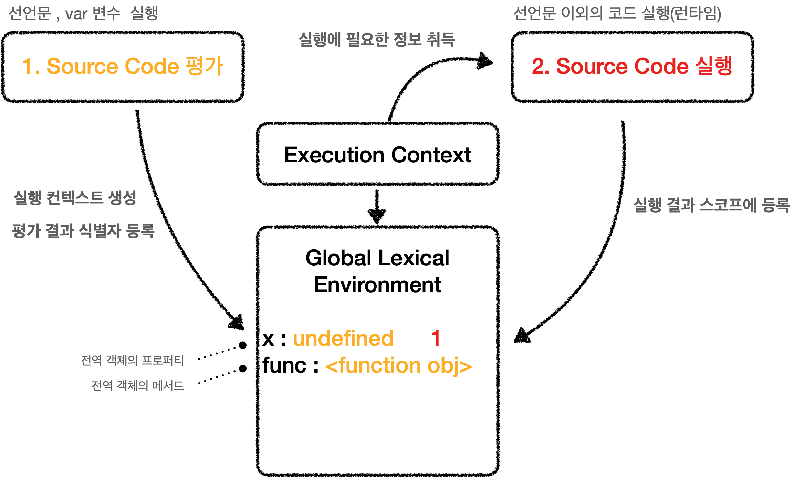

# JAVASCRIPT-실행컨텍스트

Category: JavaScript
Visibility: Public
강의: Book
블로깅: No
유형: Self Study
작성일시: 2022년 2월 13일 오전 1:02

모던 자바스크립트 Deep Dive를 읽고 정리한 포스팅

# 23장-실행컨텍스트-Execution-Context

언어를 공부한다는 것은 단지 언어의 문법만 공부하는 것이 아니라 자바스크립트가 실행되는 환경에 대한 이해, 이 환경에서 자바스크립트가 어떻게 코드를 관리하는지, 그리고 툭 하면 언급되었던 호이스팅에 한 이해.. 그리고 싱글스레드 기반인 자바스크립트의 Event loope등 그 언어의 동작 원리를 알아야 삽질을 덜 하고 더 효율적인 코드를 작성할 수 있다.

그리고 실행 컨텍스트는 자바스크립트의 동작 원리를 담고있는 아주 핵심적인 개념이다. 이 책에는 실행컨텍스트에 대해 정말 자세히 설명이 되어있어서 그동안 두리뭉실하게 알고 있었던 부분을 해결할 수 있었다.

- ECMAScript 도 참고하여 정리를 하였다.

* 참고 사이트들
  [참고해보기](https://overcome-the-limits.tistory.com/517)
  [ECMAScript 11 types of source code](https://262.ecma-international.org/11.0/#sec-types-of-source-code)

---

## 0. Achievement Goals

- 자바스크립트가 스코프를 기반으로 식별자와 식별자에 바인딩 된 값(식별자 바인딩)을 관리하는 방식을 이해할 수 있다.
- 호이스팅이 발생하는 이유에 대해 이해할 수 있다.
- 클로저의 동작 방식을 이해할 수 있다.
- 태스크 큐와 함께 동작하는 Event handler와 비동기 처리 동작 방식을 이해할 수 있다.

## 1. Types of Source Code

ECMAScript 사양은 Source Code type에 따라 실행 컨텍스트를 생성한다 (Execution Context)

Source Code Type은 아래와 같이 4가지로 분류된다. 이렇게 나누어서 실행 컨텍스트를 생성하는 이유는 소스코드 타입에 따라 실행 컨텍스트 생성이 다르기 때문이다.

1. 전역코드(Global Code) → 전역 스코프 생성
2. 함수코드(Function Code) → 지역 스코프 생성
3. eval code → Strict Mode에서 독자적인 스코프 생성
4. 모듈 코드(Module code) → 모듈마다 스코프를 생성

위의 코드타입에서 그 코드 타입내의 함수와 클래스의 내부는 포함되지 않는다. 예를 들면, 전역 코드는 var로 선언된 변수와 함수의 “선언문”만 전역 객체의 프로퍼티와 메서드로 바인딩 되며 함수 내부의 코드는 함수 코드로 분류된다.

## 2. Souece Code 평가 & 실행

자바스크립트 엔진은 위의 4가지 소스코드를 1. 소스코드 평가 2. 소스코드 실행 이라는 두 가지의 과정을 거쳐서 실행 컨텍스트를 생성한다.

아래의 코드를 실행한다고 가정해보자

```jsx
var x
x=1

function func(a,b){

	…
	…

}
```

위의 Source Code의 평가와 실행의 전반적인 흐름은 아래와 같이 나타낼 수 있다.



### 소스코드의 평가

소스코드 평가 과정에서는 실행 컨텍스트를 생성하고, var로 선언된 변수의 선언문과 함수의 선언문을 실행하여 변수를 생성한다. 그리고 이 식별자를 key로 사용하여 실행컨텍스트가 관리하는 스코프인 “Lexical Environment” 에 등록한다.

### 소스코드의 실행 (런타임)

소스코드의 평가 과정이 끝나면 선언문을 제외한 코드가 실행된다. 위의 코드에서 x=1 을 실행하기 위해서 변수 x가 실행컨텍스트가 관리하는 스코프에 등록되어있는지 확인하는 작업을 진행한다. 선언되었다면 값을 할당하고 결과를 스코프에 등록한다.

## 3. 실행 컨텍스트에 대한 전반적인 이해 & Stack

아래의 코드를 실행 한다고 해보자 (모던 자바스크립트 예제 23-02)

```jsx
// 전역변수
const x = 1;
const y = 2;

// 함수 정의
function foo(a) {
  // 지역변수
  const x = 10;
  const y = 20;

  // method 호출
  console.log(a + x + y);
}

// 함수 호출
foo(100);

// mehtod 호출
console.log(x + y);
```

**→ 원래 var와 const는 다르게 취급해야 하지만 여기서는 간단하게 설명하기 위해 생략함 (다음 포스팅에서 상세하게 정리할 예정)**

### 실행 컨텍스트 Stack

자바스크립트 엔진은 소스코드를 평가하여 실행 컨텍스트를 생성한다. (전역 실행 컨텍스트 , 지역 실행 컨텍스트 ....) 이렇게 생성된 실행 컨텍스트는 실행 컨텍스트 Stack 이라는 자료구조로 관리된다.

위의 코드를 실행하면 아래와 같이 시간의 흐름에 따라 실행 컨텍스트가 생성되면 push되고 끝나면 pop되는 과정이 반복된다.

1. 전역코드 평가,실행 : 먼저 전역 코드를 평가하여 전역 실행 컨텍스트를 생성 → Stack에 push → 평가,실행 진행
2. foo 함수 코드 평가,실행 : 전역 함수 foo(100)가 호출되면 **적역 코드 실행 일시 중지** → 코드 제어권 foo 함수 내부로 이동 → foo 실행 컨텍스트 생성 → Stack에 push → 평가, 실행 진행 → 함수 종료
3. 전역 코드로 복귀 : foo 함수 종료 → 제어권 전역 코드로 이동 → foo 실행 컨텍스트 Stack에서 pop → 전역 코드 실행 완료 → 전역 실행 컨텍스트 Stack에서 pop


- Stack의 최상위 execution context 를 실행중인 컥텍스트(Running execution context) 라고 한다.

**→ 실행 컨텍스트 Stack은 코드의 실행 순서를 관리한다**

### 실행컨텍스트의 역할

이제, 전역 코드와 함수가 있는 코드를 실행할 때의 실행컨텍스트의 전반적인 흐름을 짚어보면서 실행 컨텍스트의 역할에 대해 이해해보자

위의 코드를 실행하면 전반적인 흐름을 아래와 같이 나타낼 수 있다.


1. 전역코드 평가 & 전역코드 실행

   1. 잔역코드 평가 :

      - 전역 Execution Context가 생성되고 Stack에 push된다
      - 선언문만 먼저 실행되고 전역 변수와 전역 함수가 전역 스코프에 등록된다.

      ```jsx
      //전역 스코프
      {
      	x : undefined
      	y : undefined
      	foo : <function object>
      }
      ```

      - 참고로 var 키워드로 선언된 전역 변수는 전역 객체의 프로퍼티로, 전역 함수는 메서드로 등록된다.

   2. 전역 코드 실행
      - 코드가 순차적으로 실행되고 전역 변수에 값이 할당된다.
      - 함수 호출문을 만나면 실행되던 전역 코드의 실행을 일시 중단한다 → 제어권은 함수 내부로 이동

2. 지역코드 평가 & 지역코드 실행
   1. 지역코드 평가
      - foo함수의 실행 컨텍스트가 생성되고 Stack에 push된다.
      - 지역변수 선언문과 매개변수가 실행되어 지역스코프에 등록된다.
        ```jsx
        //지역 스코프
        {
        	a : undefined
        	arguments:{ 0:100,length:1 caller foo}
        	x : undefined
        	y : <function object>
        }
        ```
      - arguments 객체가 생성되고(함수 내부에서 지역 변수처럼 사용 가능) 지역스코프에 등록된다
      - this binding 결정 (this는 전역 객체를 가리킨다)
   2. 지역코드 실행
      - 매개변수와 지역 변수에 값이 할당된다.
      - console.log 메서드 호출을 스코프 체인을 이용하여 검색한다
        - console 식별자는 객체의 프로퍼티로 존재한다 (전역 객체의 프로퍼티를 스코프를 통해 검색)
        - log 식별자는 console 객체의 프로퍼티 체인을 통해 검색
        - 표현식 a+b+y 평가 → 스코프 체인을 통해 검색 → console.log 메서드 종료
3. 전역코드 다시 실행
   - 함수가 종료되면 다시 전역 코드로 복귀하고 제어권은 전역 코드로 이동한다.
   - 함수 실행 종료 후 foo 실행 컨텍스트는 Stack에서 pop하여 제거한다
   - console.log 메서드를 호출하고 종료된다.
   - 더이상 실행항 코드가 없으므로 전역 실행 컨텍스트는 Stack에서 pop하여 제거된다.

상세하게 다루지는 않았지만(?) 실행 컨텍스트에 대해 정리를 해보자면 아래와 같이 정리할 수 있다.

1. 실행 컨텍스트는 식별자를 등록하고 관리한다 (스코프)
2. 실행 순서를 관리한다 (Stack)
3. 스코프 체인을 통해 식별자를 검색한다

즉, 실행 컨텍스트는 소스코드를 실행하는게 필요한 환경을 제공하고 코드의 실행을 관리하는 역할을 한다!

JAVASCRIP를 배우는 초창기에 이 Execution Context에 대해 정리를 한적이 있었다. 그때는 정말 이해가 그렇게 완벽하게 됐었다고느 못 하겠다. 이번에 기회가 생겨 다시 공부를 한 것인데 까먹은 것을 보면 아마도....

그동안 CS 공부를 하면서 OS의 Process 실행 구조를 배운 다음에 다시 공부를 해보니 이해가 쏙쏙 되는 것을 느꼈다. 역시 CS공부는 아무리 바빠도 해놔야 하는 과목이라 생각한다..
