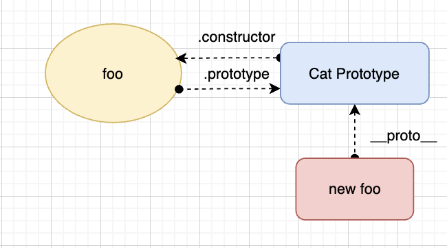

# [JS/Node]객체 지향 Javascript

Category: JavaScript
Visibility: Public
강의: CodeStates
블로깅: Yes
유형: LESSON
작성일시: 2021년 9월 4일 오후 1:36

# Prototype

### 1. Object Prototype

JavaScript는 Prototype 기반 언어(Prototype-based Language)이다. 모든 객체들이 Prototype 객체(Prototype Object)를 갖고있고, 이를 통해 메소드와 속성들을 상속 받는다. 공부를 하면서 제일 헷갈렸던 것은, prototype property, prototype, `__**proto**__` 이다.

- Prototype property : 모든 **함수 객체**의 **Constructor**는 Prototype 이라는 property(속성)을 갖고있다. prototype 속성은 객체가 생성될 당시 만들어지는 객체 자신의 원형이 " 될 " prototype 객체를 가리킨다. 즉, 자신을 만든 원형이 아닌 ! **자신을 통해 만들어질 객체들이 원형**으로 사용할 객체를 말한다. 자신을 원형으로 하여 만들어질 새로운 객체들 즉, **하위로 물려줄 연결에 대한 속성** 이다. 그리고 prototype 객체는 default로 빈 객체(empty object)를 가리킨다.
- Prototype Object (프로토타입 객체)
  JavaScript의 모든 객체는 생성과 동시에 자기자신이 생성될 당시의 정보를 취한 Prototype 객체를 복제하여 만들어낸다. Prototype이 객체를 만들어내기 위한 원형 이라면, Prototype 객체는 **자기 자신의 분신** 이며 **자신을 원형으로 만들어질 다른 객체가 참조할 Prototype**이다.
- `__proto__` **:** prototype \***\*link
  **상위에서 물려받은 객체의 프로토타입에 대한 정보\*\* 이다.



<**예제>**

```jsx
function foo(x){
    this.x=x;
};

let A=new foo('Hello!!');

console.log(A.x)
 > Hello!!

console.log(A.prototype.x)

> Uncaught TypeError: Cannot read properties of undefined (reading 'x')
    at <anonymous>:1:25
```

맨 마지막과 같이 애러가 나온 이유는 prototype property(속성)은 Constructor(생성자) 가 갖는 속성이고 함수 객체만 이 속성을 갖고 있다고 했다. 위의 코드에서 A객체는 함수객체가 아닌 foo 라는 원형을 이용하여 생성된 단일객체 이므로 prototype 속성을 갖고있지 않는다. 물론, foo.prototype.x는 가능하다.

1. Prototype Chain

   JavaScript에서 "상속"을 Prototype Chain을 사용하여 구현한다. 프로토타입 체인이란, **프로토타입을 상속해서 만들어지는 객체들관의 연관관계 이다.**

   `__**proto**__` 프로퍼티를 타고 가다보면 최종적으로 Object 객체의 Prototype 객체에 다다른다. (자바스크립트의 모든 객체는 Object 객체로부터 파생되어 나온 자식들 임을 알 수 있다)

   ```jsx
   class Animal {
     constructor(species, size) {
       this.species = species;
       this.size = size;
     }

     myspecies() {
       console.log(`나는 ${this.species} 이다`);
     }
   }

   class Cat extends Animal {
     constructor(species, size, name, age) {
       super(species, size);
       this.name = name;
       this.age = age;
     }

     hungry() {
       console.log(`${this.name} 에게 밥을내놔라`);
     }
   }

   let lion = new Animal("Lion", "big");
   let kakao = new Cat("Cat", "small", "kakao", 1);

   lion.myspecies();
   kakao.hungry();
   kakao.myspecies();

   /*
   나는 Lion 이다
   kakao 에게 밥을내놔라
   나는 Cat 이다
   */

   // 메소드 추가하기

   Animal.prototype.mysize = function () {
     console.log(`It's size is ${this.size} `);
   };

   kakao.mysize();
   lion.mysize();

   /*
   It's size is small 
   It's size is big
   */
   ```

   

---
