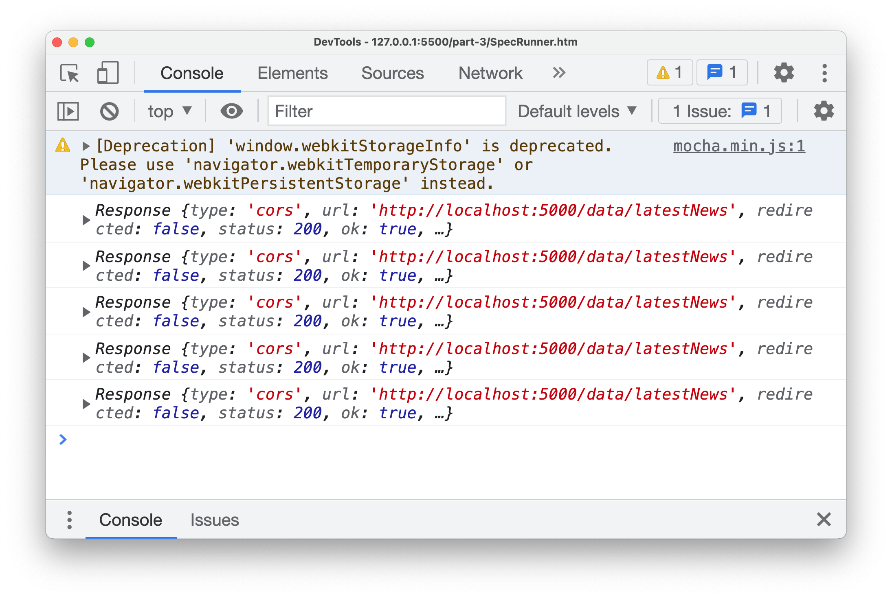

# [JS/Node] fetch API- How to use 기초

Category: JavaScript
Visibility: Public
강의: CodeStates
블로깅: Yes
유형: LESSON
작성일시: 2021년 10월 8일 오후 7:45

# Node.js - fetch API How to use 기초편

이번 포스팅에는 Node.js의 API중 하나인 fetch API에 대해 간단히 알아본 내용과 기본적인 사요법에 대한 내용을 정리하였다.

**참고 사이트들**

[MDN](https://developer.mozilla.org/en-US/docs/Web/API/fetch)

[How to Use Fetch with async/await](https://dmitripavlutin.com/javascript-fetch-async-await/)

Fetch API는 URL을 통해 network 요청을 해주는 API이다. Fetch API를 통해 network resource에 접근이 가능하고 HTTP 요청, 파일 다운로드 밎 업로드 등의 작업을 가능하게 해준다.

```jsx
// ! Syntax
const fetchResponsePromise = fetch(resource [, init])
```

- **Parameters**
  - resource : URL 또는 [Request object](https://developer.mozilla.org/en-US/docs/Web/API/Request)
  - options : request에 추가적으로 적용하고 싶은 custom setting 이 포함된 Object라고 한다.
    options로 들어가는 항목은 아래와 같다 - method : 사용할 메소드 ('GET', 'POST','PUT','DELETE') - headers : 헤더에 전달할 값 - body : 바디에 전달할 값 (JSON.stringfy(data)) - mpde : cprse, no-corse 등의 설정 - credentials : 자격 증명을 위한 옵션 설정 - cache : 케쉬 사용 여부
  - Return Value : Promise 객체를 반환한다.
    요청이 완료되면 promise가 Response 객체로 resolve 된다
    만약 Network 문제로 인해 요청이 실패하면 promise는 rejected 된다.

### [**fetch 사용법을 알아보자]\*\*

**1. fetch HTTP request**

```jsx
/* fetch를 사용하여 확이하는 방법들*/

const newsURL = "어떤 뉴스 url";
const weatherURL = "어떤 날씨 url";

fetch(newsURL).then(console.log);
```

fetch는 Response Object를 반환한다.

아래의 콘솔창 결과를 보면 Response 객체가 출력된 것을 볼 수 있다.




Response 객체는 body , header , type , url , redirected , status.. 등등 다양한 속성을 갖고있다.

이에 대한 자세한 정보는 [MDN](https://developer.mozilla.org/en-US/docs/Web/API/Response)을 확인해보자

**2. Fetching JSON : Responce.json()**

Returns a promise that resolves with the result of parsing the response body text as JSON.

response로부터 JSON 객체를 추출하고 promise형태로 return 한다.

```jsx
/* fetch를 사용하여 확이하는 방법들*/

fetch(newsURL) // json() 메소드르 사용하여 JSON 형태로 변형 후 출력해본다.
  .then((response) => response.json())
  .then(console.log);
```

아래의 콘솔창은 response를 JSON 으로 추출하고 console.log로 출력한 결과이다.


response.json() 이되에도 유용한 response method가 많다. 아직 써보지는 않았지만 공부겸 간단하게 정리하면 아래와 같다.

- response.text() : rwa text로 resolve된 promise를 반환한다
- response.formData() : [FormData](https://developer.mozilla.org/en-US/docs/Web/API/FormData)로 resolve된 promise를 반환한다.
- response.blob() : [Blob](https://developer.mozilla.org/en-US/docs/Web/API/Blob) 으로 resolve 된 promise 반환
- response.arrayBuffer() : [ArrayBuffer](https://developer.mozilla.org/en-US/docs/Web/JavaScript/Reference/Global_Objects/ArrayBuffer)로 resolve된 promise

3**. 변수로 받아서 출력**

변수로 받아오게 되면 promise가 (당연히) 할당이 되고 출력하면 아직 pending 상태인 promise가 출력된다.

```jsx
/* fetch를 사용하여 확이하는 방법들*/

// 3 변수로 weater 정보도 받아오고 출력을 해본다.
const news = fetch(newsURL) //
  .then((response) => response.json())
  .catch(console.log);

const weather = fetch(weatherURL) //
  .then((response) => response.json())
  .catch(console.log);

console.log(news);
console.log(weather);
```


**4. Handling fetch error**

fetch는 HTTP 요청이 false인 상태여도 error를 보내지않고 완료된 HTTP request로 간주한다.

fetch는 일반적으로 권한(Permission 또는 이와 유사한) 문제같은 경위의 네트워크 오류의 경우에만 reject를 한다. 이로인해 404와 같은 HTTP error도 완료왼 request로 간주된다. 이를 확인할 수 있는 방법은 response 속성 중 response.ok가 false인지 true인지를 통해 판별할 수 있다. response.ok는 오직 status가 200-299인 경우에만 true 값을 갖는다. mdn에 따르면 then() handler로 response.ok 또는 response.status 속성을 확인해야한다고 한다.

(참고문서의 예제를 참조하였다.\_

```jsx
async function fetchMoviesBadStatus() {
  const response = await fetch('/oops');
  if (!response.ok) {
    const message = `An error has occured: ${response.status}`;
    throw new Error(message);
  }
```

위의 코드와 같이 response.ok의 상태에 따라 error 처리를 해줄 수 있다.

```jsx
// GET Request
fetch('https://learn.codeit.kr/api/members')
.then((response)=>response.text())
.then(console.log)

Promise {<pending>}
[
  {
    "id": 1,
    "name": "Jason",
    "email": "jason@codeitmall.kr",
    "department": "engineering"
  },
  {
    "id": 2,
    "name": "Alice",
    "email": "alice@codeitmall.kr",
    "department": "engineering"
  },
  {
    "id": 3,
    "name": "Brian",
    "email": "brian@codeitmall.kr",
    "department": "marketing"
  },
  {
    "id": 4,
    "name": "Erica",
    "email": "erica@codeitmall.kr",
    "department": "marketing"
  },
  {
    "id": 5,
    "name": "Wilson",
    "email": "wilson@codeitmall.kr",
    "department": "sales"
  }
]

//!

// GET Request 특정 직원 정보 조회
fetch('https://learn.codeit.kr/api/members/3')
.then((response)=>response.text())
.then(console.log)

Promise {<pending>}
{
  "id": 3,
  "name": "Brian",
  "email": "brian@codeitmall.kr",
  "department": "marketing"
}

// ---------------------

// POST Request
// 직원의 정보를 Request body에 넣어줘야 한ek.
// fetch의 두 번째 method로 Option 객체를 넣는다.

const newMember={
  name:'Jerry',
  emait:'jerry@codeitmail.kr',
  department:'enginnering'
};

fetch('https://learn.codeit.kr/api/members',{
  method:'POST',
  body: JSON.stringify(newMember),
}) // OPTION 객체
.then((response)=>response.text())
.then(console.log)

/* Response
{
  "id": 6,   // ID 값으로 6을 설정 함
  "name": "Jerry",
  "department": "enginnering"
}

어떤 response를 줄지는 개발자에 따라 다음
*/

// PUT
// Alice의 부서를 enginnering 에서 marketing으로 옮김
const member={
  name:'Alice',
  emait:'alice@codeitmail.kr',
  department:'marketing'
};

fetch('https://learn.codeit.kr/api/members/2',{ // 직원 id를 path에 추가한다.
  method:'PUT',
  body: JSON.stringify(member),
}) // OPTION 객체
.then((response)=>response.text())
.then(console.log)

// DELETE : Alice가 퇴사하여 삭제할 떄

fetch('https://learn.codeit.kr/api/members/2',{
  method:'DELETE',
})
.then((response)=>response.text())
.then(console.log)
```
