# [Linux] - Linux 에서 문제를 찾아내는 방법 -cat, awk, sort, uniq, tail, head, greb

Chapter: Linux
강의: codestates
블로깅: No
유형: LESSON
작성일시: 2021년 12월 16일 오전 11:04

## Linux 에서 문제를 찾아내는 방법 : log를 잘 보는 방법에 대해 알아보자

### 1. LInux 기초

- 현재 위치 확인 : pwd , 폴더 이동 cd
- 폴더 생성, 조회, 삭제 : mkdir , ls , rm -r(f)
- 파일 / 폴더 이동,복사 관련 명령어 : mv , cp
- nano 사용법
- 우분투에서 패키지 설치 방법 : apt install pakagename

리눅스 CLI 잘 다루면

- 업무 자동화가 가능해진다 (설치, 배포 등의 자동화가 가능하다)
- Application의 배포 환경에서 문제를 찾아낼 수 있다.

---

- 아래의 사이트는 Linux 명령어 들을 쉽게 만화로 그린 사이트 종종 참고해보자.

### 2. Linux에서 Log 보기

log를 보는 것은 매우 중요하다. 어떤 Error나 문제가 발생했을 때 또는 MAU , CAU등의 정보를 알아내기 위해 log를 분석해야 할 경우 등의 작업을 처리하기 위해서는 CLI 상에서 수많은 log 중에서 원하는 log를 찾을 수 있어야 한다. 이를 위해 다음의 명령어들에 대해 알아보자.

- cat, awk, sort, uniq, head/tail, grep

\*\* 그림들을 아래의 사이트에서 퍼왔다. 만화로 설명을 해놓은 사이트이다. Julia Evans 사이트

[Saturday Morning Comics!](https://wizardzines.com/comics/)

### 1) cat


위의 설명대로 cat은 명령어 다음에 오는 파일의 내용을 보여준다.

- cat >file.txt를 하면 간단한 editor로도 사용을 할 수 있다.
- \*.txt는 해당 경로에 있는 모든 txt 파일들을 함께 보여준다.

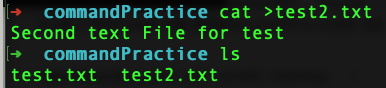

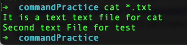

- cat -n을 사용하면 번호를 붙여서 내용을 보여준다. \*.txt을 했을 떄에는 각 파일마다 번호를 붙이는 것 같다.

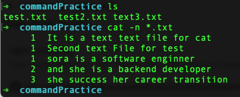

- zcat은 gzipped file 즉, 압축 파일의 contents를 볼 수 있게 해주는 명령어 이다. (압축을 풀지 않아도 볼 수 있다) 압출 파일을 표준 출력으로 학장하여 내용을 볼 수 있게 해준다.

- zcat < 압축파일명

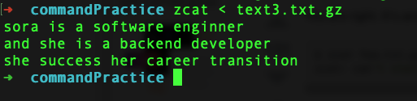

- 여러 압축 파일을 보고 싶다면 zcat < 압축파일1 < 압축파일2 ...< ..

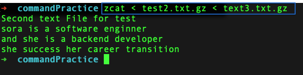

- tee : 표준입력(standart input)을 읽어서 표준 출력 (standart output)과 file에 쓰는 명령어 이다.
  표준 입출력에서 읽은 내용을 표준 출력에도 쓰이기 때문에 표준 입력에서 읽은 내용이 표시된다.
  아래의 명령여를 실행하면 outfile 이라는 파일이 생성되고 hello라는 문구가 표시된다. 또한 terminal에도 hello가 표시된다.

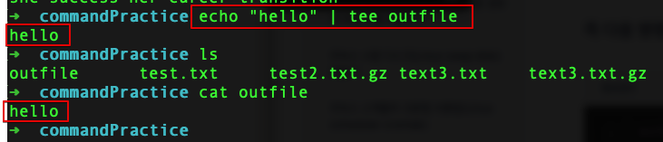

- 파일에 append 하는 방법
  echo "hello" >> filename
  echo "hello" | tee -a filename

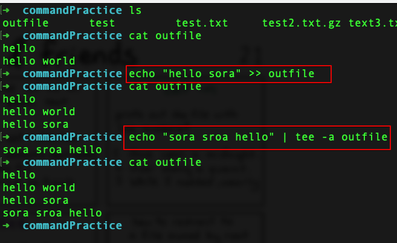

만약 표준 입출력에 출력되지 않게 하려면 tee의 맨 마지막에 널 디바이스인 /dev/null을 견결해주면 된다.

여기서 의아한 것이 굳이 tee을 사용하여 appen를 하는 이유는 무엇이 좋을까 ??

shell 에서 출력을 redirection (연산 결과를 임의로 다른 장치로 보내는 것) 할 경우 sudo를 해도 일반 사용자로 전환되므로 root 권한으로 파일에 쓰거나 내용을 추가한느 경우 제대로 동작하지 않는다. sudo echo로 root 소유인 파일에 시도를 하면 "permission denide" 라는 error가 나고 내용 추가에 실패한다.

tee는 shell script에서 root 권한으로 특정 파일을 쓰거나 appen할 떄 주로 사용되므로 이런 경우에는 echo를 받아서 sudo tee를 하면 정삭적으로 동작한다.

### 2) akw

참[고사이트](https://recipes4dev.tistory.com/171)


- awk는 akw programming language 라는 프로그래밍 언어로 작성된 프로그램을 실행한다. 파일로부터 record를 선택하고 선택된 record의 값을 조작하거나 데이터화 하는 것을 목적으로 사용하는 프로그램이다.

awk는 입력 데이터를 line 단위의 record로 인식한다. 각 record의 text들은 공백문자로 구분된 Filed들로 구분된다.


- awk의 명령어 옵션

  ```bash
  awk [option...] [awk program] [Argument...]

  [option]
  -F : 필드 구분 문자 지정
  -f : awk program 파일 경로 지정
  -v : awk program에서 사용될 특정 variable 값 지정

  [awk program]
  -f : 옵션이 사용되지 않은 경우 awk가 실행할 awk proaram 코드 지정.

  [Argument]
  입력 파일 지정 또는 Variable 값 지정
  ```

- awk program 구조

```bash
pattern { action }
# 아래와 같이 쓸 수 있다.
awk [OPTION...] 'CONDITION { action }' [ARGUMENT...]
```

- CONDITION을 생략할 경우와 action을 생략할 경우

  ```bash
  # CONDITION을 생략하면 모든 record에 적용된다.
  awk '{print }' ./file.txt  #file.txtg의 모든 record를 출력

  # acrion을 생략하면 print가 적용된다.
  awk '/p/' ./file.txt # file.txt에서 p를 포함하는 record를 출력

  # record의 길이가 10 이상인 경우 세 번째, 네 번째 필드를 출력하는 예제
  # CONDITION -> length($0)>80 action -> {print $3, $4]
  awk 'length($0) > 10 {print $3, $4}' ./file.txt

  # record의 길이가 80 이상인 record들을 출력
  awk 'length($0)>80 ./file.txt # action을 생략했으므로 print로 적용된다.
  ```

- BEING 과 END
  BEGIN은 입력 데이터에서 첫 번째 record를 처리하기 전에 BEGIN에 지정된 acrtion을 먼저 실행한다. END는 모든 records를 처리한 다음 END에 지정된 action을 실행한다.

  ```bash
  awk 'BEGIN {print "TITLE: Field value 1,2"} {print $1, $2} END{print "Finished"}' file.txt

  # 3번째 column의 모든 숫자를 더하려 출력
  awk '{s+=$3} END {print s}' ./file.txt
  ```

awk에 대한 개념과 기본적인 사용 법을 알아봤으니 실습을 해보자 !!

먼저 실습에 사용 할 log 파일을 얻어보자. 아래의 깃 주소에서 가져온다.

[nginx access log](https://gist.github.com/gotoweb/4560f348e03635560a651da67f03ad50)

wget을 Web Get의 약자로 웹 상의 파일을 다운로드 받을 때 사용하는 명령어 이다. HTTP, HTTPS, FTP 프로토콜을 지원한다. 위의 실습 자료를 wget으로 먼저 받아보면 아래와 같이 access.log가 받아지는 것을 확인할 수 있다.

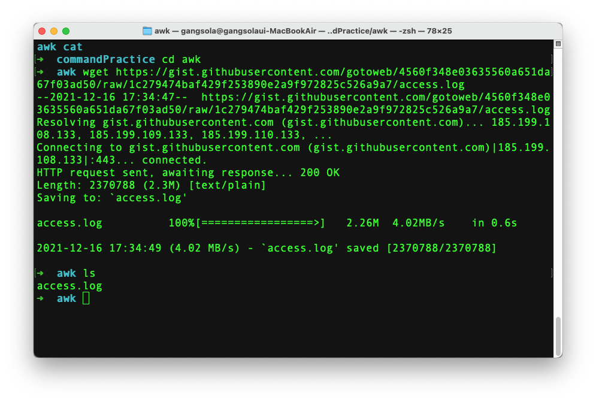

nano 또는 cat으로 확일해보면 어마어마하게 많은 log들을 볼 수 있다.

이 로그들은 아래와 같이 구분된다. IP , 날짜 , method , Endpoint , http version , status code, user agent

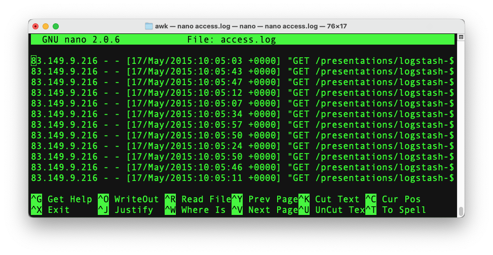

- awk '{print $1}' ./access.log → 모든 recoeds 에서 첫 번째 column만 출력한다. 아래 결과를 보면 맨 앞의 field만 출력된 것을 볼 수 있다.

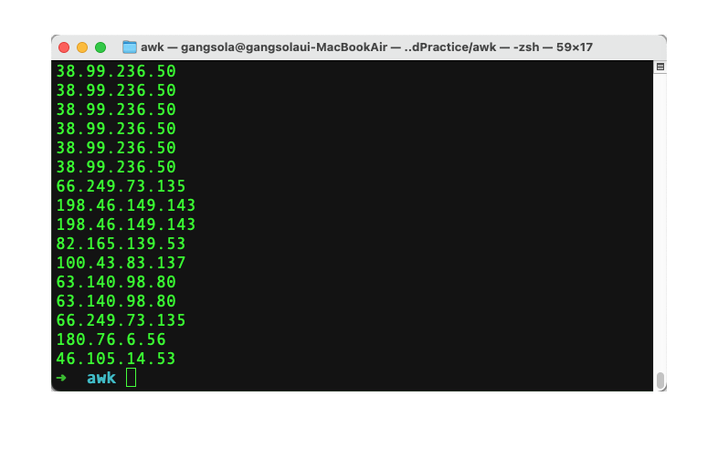

- 날짜에서 10:05:46 에 들어온 요청의 IP를 받아온다.

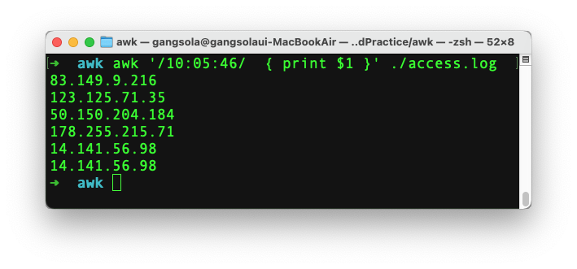

### 3) sort & uniq


- sort [참고사이트](https://www.lesstif.com/lpt/linux-sort-95879391.html)
  sort는 Input 내용을 정렬한다. 기본적으로 오름차순으로 (ascending) 정렬을 하고 -r 옵션을 사용하면 decending 방식으로 정렬을 한다.
  -f , —ignore-case 옵션은 대소문자 구분을 하지 않는다.
  -b, —ignore-leading-blanks 옵션은 공백을 무시하고 sort 한다.
  -t구분자 -k 정렬할 키: field를 기준으로 정렬한다.

  - sort -t: -k 4n /etc/password → 구분자는 ":" 이며 4n은 4번째 컬럼을 nuberic으로 비교한다는 의미.

  ```bash
  # 구분자는 ":" 이며 4n은 4번째 컬럼을 nuberic으로 비교한다는 의미.
  $ sort -t: -k 4n /etc/passwd

  halt:x:7:0:halt:/sbin:/sbin/halt
  operator:x:11:0:operator:/root:/sbin/nologin
  root:x:0:0:root:/root:/bin/bash
  shutdown:x:6:0:shutdown:/sbin:/sbin/shutdown
  sync:x:5:0:sync:/sbin:/bin/sync

  # 사용자의 홈 디렉터리를 기준으로 정렬
  $ sort -t: -k 6 /etc/passwd

  bin:x:1:1:bin:/bin:/sbin/nologin
  tss:x:59:59:Account used by the trousers package to sandbox the tcsd daemon:/dev/null:/sbin/nologin
  unbound:x:997:995:Unbound DNS resolver:/etc/unbound:/sbin/nologin
  ec2-user:x:1000:1000:Cloud User:/home/ec2-user:/bin/bash
  root:x:0:0:root:/root:/bin/bash
  ```

  -n : numberical sort 를 한다. 기본 sort는 alphabetic 정렬이므로 숫자를 오름차순으로 하려면 n을 붙여준다.

- uniq

uniq는 입력 내용 중 중복된 항복을 제거한다. 보통 sort로 정렬을 한 결과를 파이프로 uniq에 전달해서 중복 내용을 제거한다.

```bash
cat input.txt
bat
abc
apple
Abc
BALL
ABc
bat

# sort로 정렬을 한 후 중복을 제거한다. 중복되는 단어는 한 번만 표시된다.bat은 한 번만 표기
sort input.txt | uniq

abc
Abc
ABc
apple
BALL
bat
```

-u 옵션은 유일한 라인만 표시한다.

위의 경우 중복되는 bat을 제외하고 출력한다.

-d 옵션은 중복되는 라인만 표시한다. 위의 경우 중복되는 bat만 출력된다.

-c 옵션은 각 라인별로 중볻되는 횟수를 계산하여 표시간하. 위의 경우 bat으 2, 나머지는 1이 출력된다.

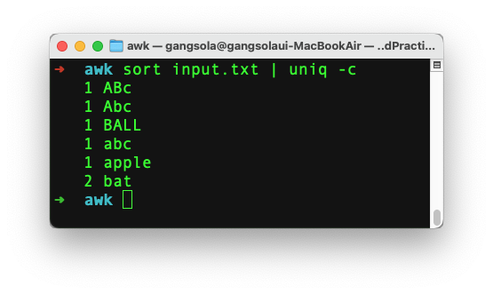

### 4) head & tail


- head : 파일의 앞 부분을 확인하는 명령어
- tail : 파일의 뒷 부분을 확인하는 명령어

**option**

-n num : num수만큼 출력해준다
num은 음수도 사용이 가능하다 head -5 file.txt 는 앞에 5개를 제외하고 출력한다 .

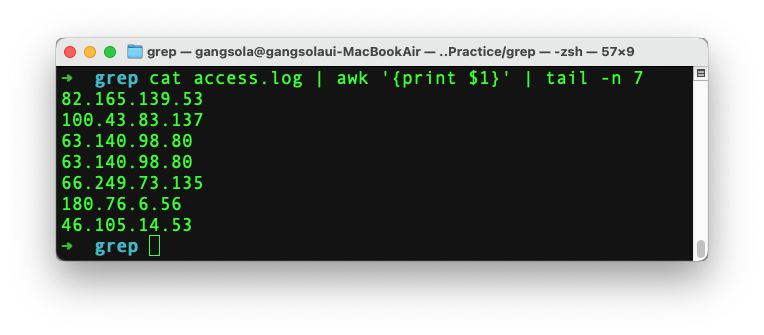

-c num : num byte만큼 출력해준다.

head -c 1k : 첫 1024 bytes만 출력해준다.

-q : 여러 개의 파일을 출력할 때 제목을 출력하지 않는다.

-f : 내용이 변경될 떄마다 실시간으로 출력해준다. 로그파일 모니터링 등에 활용된다. (tail만)

### 5) grep

[참고사이트](https://recipes4dev.tistory.com/157)

Regular Express적용 하는 것 연습 해보기

[https://www.cyberciti.biz/faq/grep-regular-expressions/](https://www.cyberciti.biz/faq/grep-regular-expressions/)


grep은 입력으로 전달된 파일의 내용에서 특정 문자열을 찾고자 할 때 사용하는 명령어 이다.

단순히 문자열 매칭이 아니라, 정규 표현식 (Regular Expression)의 pattern matching 방식을 사용한다. 정규 표현식에 대해서는 다음 기회에 조금 더 알아보도록 하고 지금은 간략하게 정리를 해본다.

| Meta Character | Description                            |                |
| -------------- | -------------------------------------- | -------------- |
| .              | 1개의 문자와 매칭                      |
| \*             | 앞 문자가 0회 이상 매칭                |
| {n}            | 앞 문자가 n회 매칭                     |
| {n,m}          | 앞 문자아 n회 이상 m회 이사 매칭       |
| []             | 대괄호에 포함된 문자 중 한 개과 매칭   |
| [^ ]           | 대괄호 내에서 ^뒤에 있는 문자들 제외   |
| [-]            | 대괄호 안 문자 범위에 있는 문자들 매칭 |
| 0              | 표현식을 그룹화                        |
| ^              | 문자열 라인의 처음                     |
| $              | 문자열 라인의 마지막                   |
| ?              | 앞 문자가 0회 또는 1회 매칭            |
| +              | 앞 문자가 1회이상 매칭                 |
|                |                                        | 표현식 논리 OR |

- grep 명령어 grep —help 를 terminal에 치면 아래와 같이 사용할 수 있는 옵션들이 나온다.

grep [Options] [pattern] [files...] 와 같은 형태이다.

```bash
grep grep --help

usage: grep [-abcDEFGHhIiJLlmnOoqRSsUVvwxZ] [-A num] [-B num] [-C[num]]
	[-e pattern] [-f file] [--binary-files=value] [--color=when]
	[--context[=num]] [--directories=action] [--label] [--line-buffered]
	[--null] [pattern] [file ...]
```

- option들을 아래를 참고하자 (사이트에서 퍼온 것)

```
grep [OPTION...] PATTERN [FILE...]

        -E        : PATTERN을 확장 정규 표현식(Extended RegEx)으로 해석.
        -F        : PATTERN을 정규 표현식(RegEx)이 아닌 일반 문자열로 해석.
        -G        : PATTERN을 기본 정규 표현식(Basic RegEx)으로 해석.
        -P        : PATTERN을 Perl 정규 표현식(Perl RegEx)으로 해석.
        -e        : 매칭을 위한 PATTERN 전달.
        -f        : 파일에 기록된 내용을 PATTERN으로 사용.
        -i        : 대/소문자 무시.
        -v        : 매칭되는 PATTERN이 존재하지 않는 라인 선택.
        -w        : 단어(word) 단위로 매칭.
        -x        : 라인(line) 단위로 매칭.
        -z        : 라인을 newline(\n)이 아닌 NULL(\0)로 구분.
        -m        : 최대 검색 결과 갯수 제한.
        -b        : 패턴이 매치된 각 라인(-o 사용 시 문자열)의 바이트 옵셋 출력.
        -n        : 검색 결과 출력 라인 앞에 라인 번호 출력.
        -H        : 검색 결과 출력 라인 앞에 파일 이름 표시.
        -h        : 검색 결과 출력 시, 파일 이름 무시.
        -o        : 매치되는 문자열만 표시.
        -q        : 검색 결과 출력하지 않음.
        -a        : 바이너리 파일을 텍스트 파일처럼 처리.
        -I        : 바이너리 파일은 검사하지 않음.
        -d        : 디렉토리 처리 방식 지정. (read, recurse, skip)
        -D        : 장치 파일 처리 방식 지정. (read, skip)
        -r        : 하위 디렉토리 탐색.
        -R        : 심볼릭 링크를 따라가며 모든 하위 디렉토리 탐색.
        -L        : PATTERN이 존재하지 않는 파일 이름만 표시.
        -l        : 패턴이 존재하는 파일 이름만 표시.
        -c        : 파일 당 패턴이 일치하는 라인의 갯수 출력.
```

- 실습을 해보자

  - log 에서 IP주소 130.237.218.86가 몇 번 접속했는지 확인
    - grep -c 130.237.218.86 ./access.log → 357
    - cat access.log | grep 130.237.218.86 | wc -l
      wc는 word count를 의미하며 바이트, 문자, 단어, 라인 수를 셀 수 있다.
  - 130.237.218.86 의 IP가 몇 번 접속했는지 확인
    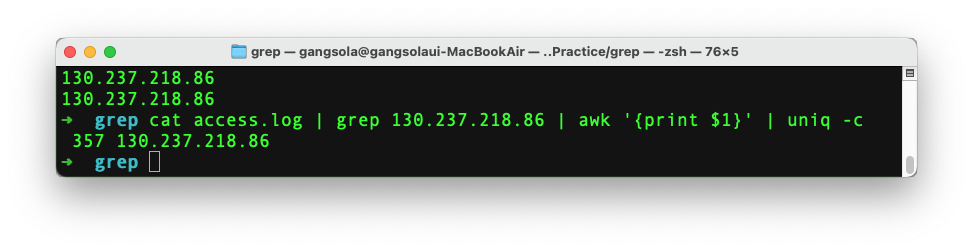

  - 130.237.218.86 IP가 중복 없이 몇 번 접속했는지
    → cat access.log | grep 130.237.218.86 | awk '{print $1}' | uniq -c
    357 130.237.218.86
    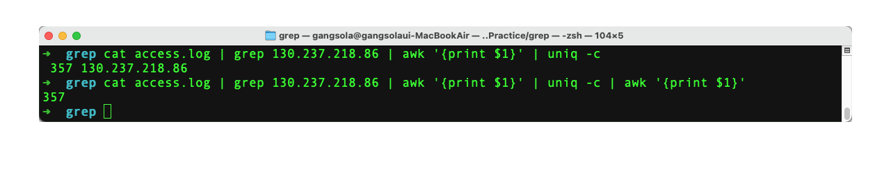

  - Endpoint 중에 중복 없애고 제일 많이 접속한 Endpoint를 많은 순서대로 10개를 출력
    → cat access.lo | awk '{print $7}' | uniq -c | sort -r | hread -n 10
    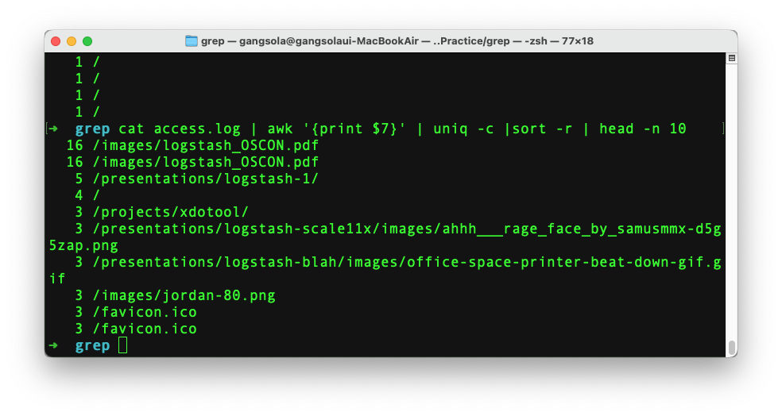

    오늘 거의 하루 종일 정리를 한 것 같다. 아직도 더 남았지만 오늘은 여기까지 하고 다른 공부를 진행해야겠다.
