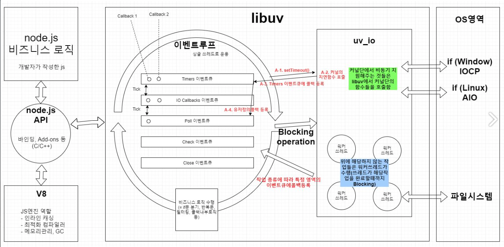
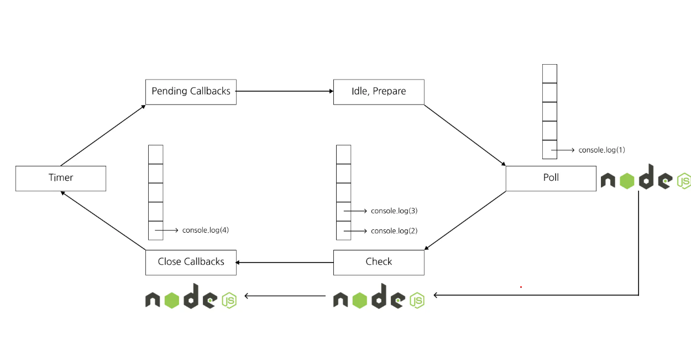
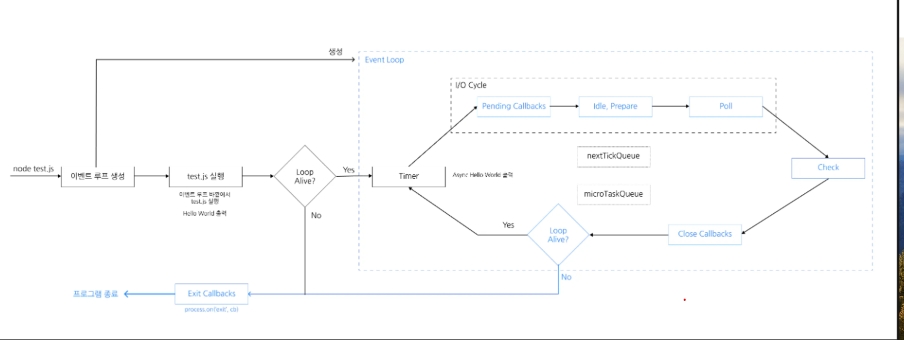

# Event loop

[참고 블로그](https://www.korecmblog.com/blog/node-js-event-loop)
[참고글](https://nodejs.org/en/learn/asynchronous-work/event-loop-timers-and-nexttick)

## 1. Node.JS의 구조


- Node.js는 c++로 작성된 런타임이다. 이 런타임은 V8 엔진과 libuv 라이브러리로 구성되어 있다.

## 2. libuv 라이브러리란?

- libuv는 c++로 작성된 **Node.js의 비동기 I/O 라이브러리**이다.
- 운영체제의 **커널**을 추상화한 Wapping 라이브리이다.
- libuv는 큐 구조의 phase를 갖고있으며 이 phase를 반복하는 것이 이벤트 루프이다.
  
  - 위의 그림을 보면 Node.js안에 libuv가 있고 libuv안에는 이벤트 루프가 있다.
  - libuv는 커널(윈도우 : IOCP, 리눅스: AIO)에서 어떤 비동기 작업들이 가능한이 알고 있다.
- 커널이 지원하는 비동기작업
  - libuv는 비동기 작업 요청이 오면 해당 작업을 커널이 지원하는지 확인하고 지원하면 커널에게 비동기적으로 요청한다.
- 커널이 지원하지 않는 비동기 작업
  

  - libuv는 내부에 기존적으로 4개의 스레드를 갖는 스레즈 풀을 생성한다.
    - 참고로 uv_threadpool 이라는 환경변수를 설정하여 최대 128개의 스레드 개수를 늘릴 수 있다고 한다.
  - libuv는 커널을 호출하는 대신 갖고있는 **쓰레드 풀**에 작업을 요청한다.

- libuv의 공식 홈페이지 설명

```
  libuv is cross-platform support library which was originally written for Node.js. It’s designed around the event-driven asynchronous I/O model.
```

## 3. Event loop란?



- Node.js는 I/O 작업을 메인 쓰레드가 아닌 다른 쓰레드에 위임을 함으로써 실글 쓰레드 논 블로킨 I/O를 구현한다.
- 이 I/O 작업을 libuv에 위임하고 libuv는 이벤트 루프를 통해 이를 처리한다.
- Event loop는 Node.js가 비동기 작업을 관리하기 귀한 구현체이다.
- Event loop는 총 6개의 phase로 구성되어있으며 한 phase에서 다른 phase로 넘어가는 것을 틱 이라고 한다.

  

  - 각 phase는 자신만의 큐를 갖고있다.
  - phase
    - Timer Phase : setTimeout, setInterval 에 의해 스케둘된 callback들이 수행된다.
    - Pending Callbacks Phase : 다음 loop로 미뤄진 callback들이 수행된다. (실행은 가능하지만 미뤄진 콜백들)
    - idele, prepare : 내부적으로 사용되는 phase
    - poll Phase : 새로운 I/O 이벤트를 가져와서 I/O와 관련된 callback 수행
    - check Phase : setImmediate()에 의해 스케쥴된 callback들이 수행된다.
    - close Callbacks Phase : socket.on('close') 뭐 이런 것들과 같이 callback이 수행된다.

- Node.js는 순서대로 phase를 방문하면서 큐에 쌓인 작업을 하나씩 실행시킨다.
- phase의 큐에 긴 작업을 모두 실행하거나 **시스템의 실행 한도**에 다다르면 Node.js는 다음 phase로 넘어간다.
- Event loop가 살아있늖 동안에는 Node.js는 종료되지 않는다. 즉, 각 phase에 큐가 빌 때까지 계속 실행된다.
- Node.js의 Event loop 코드에서는 반복문속에서 차례대로 phase를 실행하는 것을 볼 수 있다.

```c
int uv_run(uv_loop_t* loop, uv_run_mode mode) {
	// ...
  while (r != 0 && loop->stop_flag == 0) {
    uv__update_time(loop);
    uv__run_timers(loop);
    ran_pending = uv__run_pending(loop);
    uv__run_idle(loop);
    uv__run_prepare(loop);
    // ...
    uv__io_poll(loop, timeout);
	  // ...
    uv__run_check(loop);
    uv__run_closing_handles(loop);
	  // ...
    r = uv__loop_alive(loop);
    if (mode == UV_RUN_ONCE || mode == UV_RUN_NOWAIT)
      break;
  }
  return r;
}

```

- Node.js에 어떤 phase에 진입하여 작업 중 이전 새로운 작업이 큐에 추가될 수 있다.
- 만익 이런 경우가 반복되면 시스템의 실행 한도의 영향으로 Node.js는 다음 phase로 넘어가기때문에 하나의 phase에 영원히 갇리는 일은 없다.

## 4. NodeJS 를 실행시켰을 때의 흐름 wit event loop

- test.js 라는 파일을 실행시켰을 때의 흐름을 살펴보자.

```js
setTimeout(() => console.log("비동기 호출"), 1000);
console.log("Hello World");
```




1. node test.js를 실행하면 Node.js는 Event loop를 만든다.
2. Event loop 바깥에서 test.js를 처음부터 끝까지 실행한다.
3. test.js가 실행되면서 setTimeout이 호출되면서 Timer phase에 "비동기 호출" 이라는 문자열을 1초 되에 출력하는 콜백을 Timer phase에 등록한다.
4. Hello World 하는 문자열을 출력한다.
5. Event loop가 살아있는지 확인한다.
6. Timer phase에 등록한 작업이 있기 때문에 event loop에 진입한다.
7. Event loop의 timer phase에 진입한다. Node.js는 작업이 실행할 준비가 되어있는지 확인한다.
8. 만약 실행할 준비가 안되어잇다면 Node.js는 다음 phase로 이동한다.순서대로 panding -> idele -> prepare -=> pool -> check -> close callbacks phase를 차례대로 방문한다.
9. 다시 Event loop가 살아있는지 확인을 한다. 1초가 지나 실행할 수 있는 작업이 없지만 아직 실행하지 못한 작업이 있기 때문에 다시 Timer phase로 이동한다.
10. Node.js는 Timer phase가 관리하는 queue에서 콜백을 꺼내서 실행을 한다.
11. Event loop에 작업이 있다면 Node.js는 Event loop에 진입하여 반복하며 작업을 실행한다. 그 결과로 "비동기 호출"이 출력된다.
12. Timer에 더이상의 작업이 없으므로 다음 phase로 이동한다.
13. Event loop에 남은 작업이 없다면 Node.js는 process.on('exit') 이벤트를 발생시키고 종료된다.

## 5. Event loop의 Phase
