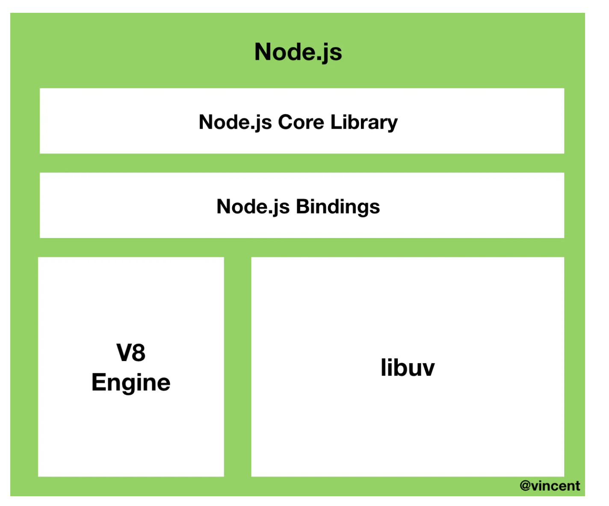
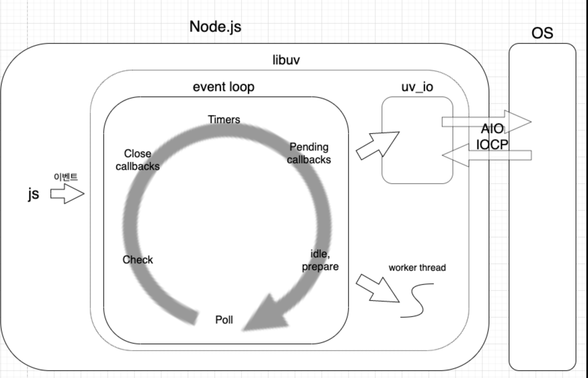
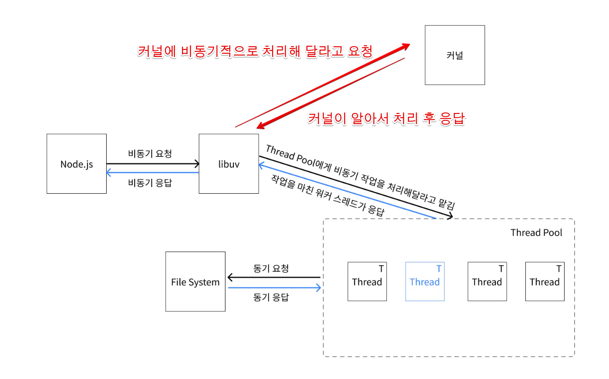

# Event loop

[참고 블로그](https://www.korecmblog.com/blog/node-js-event-loop)
[참고블로르2](https://nodejs.org/en/learn/asynchronous-work/event-loop-timers-and-nexttick)

## 1. Node.JS의 구조



- Node.js는 c++로 작성된 런타임이다. 이 런타임은 V8 엔진과 libuv 라이브러리로 구성되어 있다.

## 2. libuv 라이브러리란?

- libuv는 c++로 작성된 **Node.js의 비동기 I/O 라이브러리**이다.
- 운영체제의 **커널**을 추상화한 Wapping 라이브리이다.
- libuv는 큐 구조의 phase를 갖고있으며 이 phase를 반복하는 것이 이벤트 루프이다.
  
  - 위의 그림을 보면 Node.js안에 libuv가 있고 libuv안에는 이벤트 루프가 있다.
  - libuv는 커널(윈도우 : IOCP, 리눅스: AIO)에서 어떤 비동기 작업들이 가능한이 알고 있다.
- 커널이 지원하는 비동기작업
  - libuv는 비동기 작업 요청이 오면 해당 작업을 커널이 지원하는지 확인하고 지원하면 커널에게 비동기적으로 요청한다.
- 커널이 지원하지 않는 비동기 작업
  

  - libuv는 내부에 기존적으로 4개의 스레드를 갖는 스레즈 풀을 생성한다.
    - 참고로 uv_threadpool 이라는 환경변수를 설정하여 최대 128개의 스레드 개수를 늘릴 수 있다고 한다.
  - libuv는 커널을 호출하는 대신 갖고있는 **쓰레드 풀**에 작업을 요청한다.

- libuv의 공식 홈페이지 설명

```
  libuv is cross-platform support library which was originally written for Node.js. It’s designed around the event-driven asynchronous I/O model.
```

## 3. Event loop란?

- Node.js는 싱글 스레드 논 블로킹이다. 따라서 비동기적인 처리는 event loop 를 통해 블로킹 없이 처리한다.

## 4. NodeJS 의 실행

## 5. Event loop의 Phase
