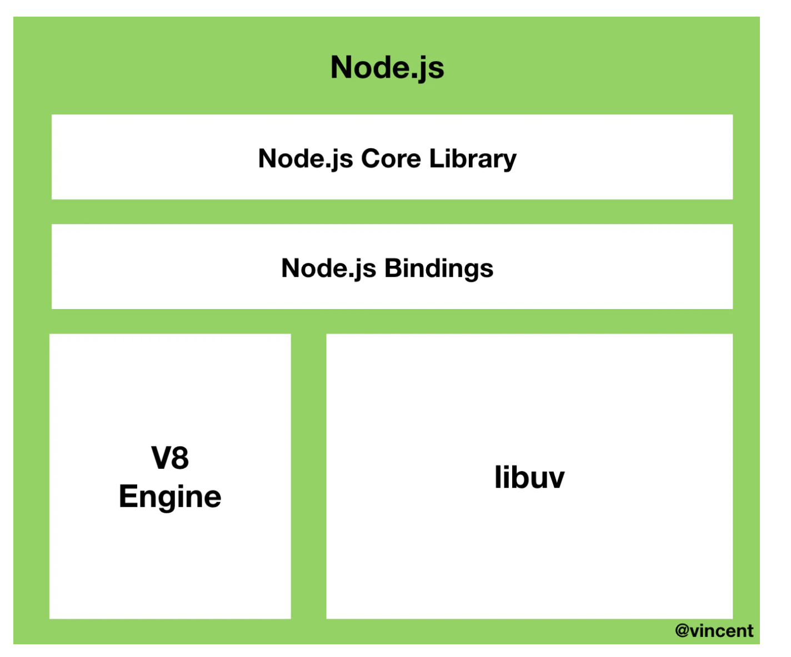
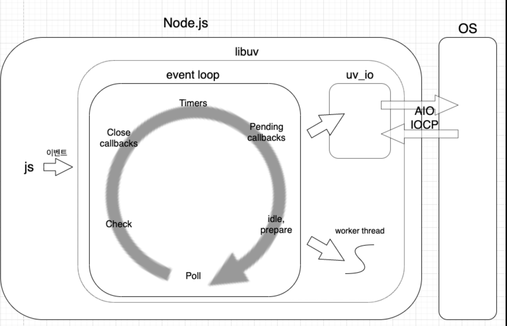
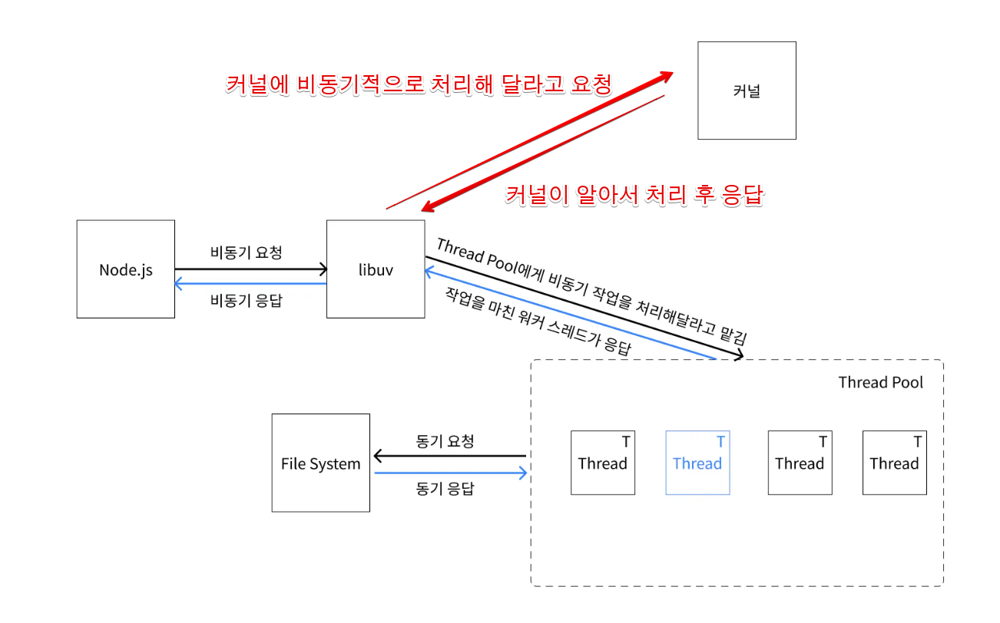
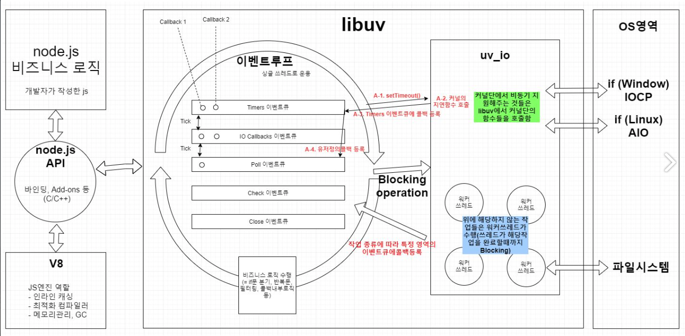
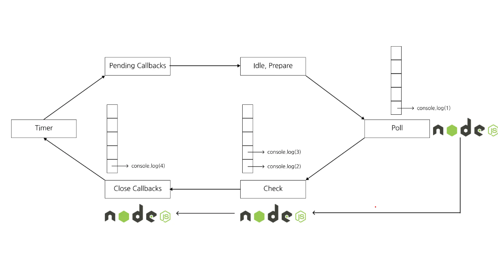
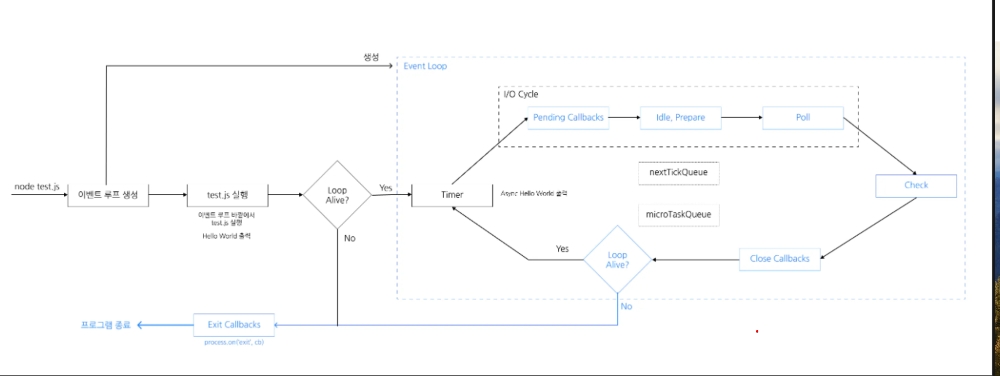
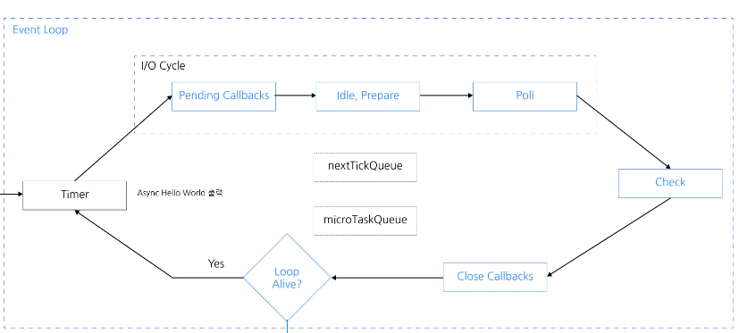

# Event loop

[참고 블로그](https://www.korecmblog.com/blog/node-js-event-loop)
[참고글](https://nodejs.org/en/learn/asynchronous-work/event-loop-timers-and-nexttick)
[libuv document](https://docs.libuv.org/en/v1.x/index.html)

## 1. Node.JS의 구조



- Node.js는 c++로 작성된 런타임이다. 이 런타임은 V8 엔진과 libuv 라이브러리로 구성되어 있다.

## 2. libuv 라이브러리란?

- libuv는 c++로 작성된 **Node.js의 비동기 I/O 라이브러리**이다.
- 운영체제의 **커널**을 추상화한 Wapping 라이브리이다.
- libuv는 큐 구조의 phase를 갖고있으며 이 phase를 반복하는 것이 이벤트 루프이다.
  
  - 위의 그림을 보면 Node.js안에 libuv가 있고 libuv안에는 이벤트 루프가 있다.
  - libuv는 커널(윈도우 : IOCP, 리눅스: AIO)에서 어떤 비동기 작업들이 가능한이 알고 있다.
- 커널이 지원하는 비동기작업
  - libuv는 비동기 작업 요청이 오면 해당 작업을 커널이 지원하는지 확인하고 지원하면 커널에게 비동기적으로 요청한다.
- 커널이 지원하지 않는 비동기 작업
  

  - libuv는 내부에 기존적으로 4개의 스레드를 갖는 스레즈 풀을 생성한다.
    - 참고로 uv_threadpool 이라는 환경변수를 설정하여 최대 128개의 스레드 개수를 늘릴 수 있다고 한다.
  - libuv는 커널을 호출하는 대신 갖고있는 **쓰레드 풀**에 작업을 요청한다.

- libuv의 공식 홈페이지 설명

```
  libuv is cross-platform support library which was originally written for Node.js. It’s designed around the event-driven asynchronous I/O model.
```

## 3. Event loop란?



- Node.js는 I/O 작업을 메인 쓰레드가 아닌 다른 쓰레드에 위임을 함으로써 싱글 쓰레드 논 블로킨 I/O를 구현한다.
- 이 I/O 작업을 libuv에 위임하고 libuv는 이벤트 루프를 통해 이를 처리한다.
- Event loop는 Node.js가 비동기 작업을 관리하기 귀한 구현체이다.
- Event loop는 총 6개의 phase로 구성되어있으며 한 phase에서 다른 phase로 넘어가는 것을 틱 이라고 한다.

  

  - 각 phase는 자신만의 큐를 갖고있다.
  - phase
    - Timer Phase : setTimeout, setInterval 에 의해 스케둘된 callback들이 수행된다.
    - Pending Callbacks Phase : 다음 loop로 미뤄진 callback들이 수행된다. (실행은 가능하지만 미뤄진 콜백들)
    - idele, prepare : 내부적으로 사용되는 phase
    - poll Phase : 새로운 I/O 이벤트를 가져와서 I/O와 관련된 callback 수행
    - check Phase : setImmediate()에 의해 스케쥴된 callback들이 수행된다.
    - close Callbacks Phase : socket.on('close') 뭐 이런 것들과 같이 callback이 수행된다.

- Node.js는 순서대로 phase를 방문하면서 큐에 쌓인 작업을 하나씩 실행시킨다.
- phase의 큐에 긴 작업을 모두 실행하거나 **시스템의 실행 한도**에 다다르면 Node.js는 다음 phase로 넘어간다.
- Event loop가 살아있늖 동안에는 Node.js는 종료되지 않는다. 즉, 각 phase에 큐가 빌 때까지 계속 실행된다.
- Node.js의 Event loop 코드에서는 반복문속에서 차례대로 phase를 실행하는 것을 볼 수 있다.

```c
int uv_run(uv_loop_t* loop, uv_run_mode mode) {
	// ...
  while (r != 0 && loop->stop_flag == 0) {
    uv__update_time(loop);
    uv__run_timers(loop);
    ran_pending = uv__run_pending(loop);
    uv__run_idle(loop);
    uv__run_prepare(loop);
    // ...
    uv__io_poll(loop, timeout);
	  // ...
    uv__run_check(loop);
    uv__run_closing_handles(loop);
	  // ...
    r = uv__loop_alive(loop);
    if (mode == UV_RUN_ONCE || mode == UV_RUN_NOWAIT)
      break;
  }
  return r;
}

```

- Node.js에 어떤 phase에 진입하여 작업 중 이전 새로운 작업이 큐에 추가될 수 있다.
- 만익 이런 경우가 반복되면 시스템의 실행 한도의 영향으로 Node.js는 다음 phase로 넘어가기때문에 하나의 phase에 영원히 갇리는 일은 없다.

## 4. NodeJS 를 실행시켰을 때의 흐름 with event loop

- test.js 라는 파일을 실행시켰을 때의 흐름을 살펴보자.

```js
setTimeout(() => console.log("비동기 호출"), 1000);
console.log("Hello World");
```



1. node test.js를 실행하면 Node.js는 Event loop를 만든다.
2. Event loop 바깥에서 test.js를 처음부터 끝까지 실행한다.
3. test.js가 실행되면서 setTimeout이 호출되면서 Timer phase에 "비동기 호출" 이라는 문자열을 1초 되에 출력하는 콜백을 Timer phase에 등록한다.
4. Hello World 하는 문자열을 출력한다.
5. Event loop가 살아있는지 확인한다.
6. Timer phase에 등록한 작업이 있기 때문에 event loop에 진입한다.
7. Event loop의 timer phase에 진입한다. Node.js는 작업이 실행할 준비가 되어있는지 확인한다.
8. 만약 실행할 준비가 안되어잇다면 Node.js는 다음 phase로 이동한다.순서대로 panding -> idele -> prepare -=> pool -> check -> close callbacks phase를 차례대로 방문한다.
9. 다시 Event loop가 살아있는지 확인을 한다. 1초가 지나 실행할 수 있는 작업이 없지만 아직 실행하지 못한 작업이 있기 때문에 다시 Timer phase로 이동한다.
10. Node.js는 Timer phase가 관리하는 queue에서 콜백을 꺼내서 실행을 한다.
11. Event loop에 작업이 있다면 Node.js는 Event loop에 진입하여 반복하며 작업을 실행한다. 그 결과로 "비동기 호출"이 출력된다.
12. Timer에 더이상의 작업이 없으므로 다음 phase로 이동한다.
13. Event loop에 남은 작업이 없다면 Node.js는 process.on('exit') 이벤트를 발생시키고 종료된다.

## 5. Event loop의 Phase



- 비동기 작업 종류마다 들어간느 phase가 달라지고 이에 따라 실행 순서 또한 달라진다.

### 1. Timer phase

- setTimeout, setInterval 과 같은 함수가 만들어내는 타이머를 다룸.
- 사실상 Time phase가 관리하는 queue에 callback을 직접 담는 것이 아니라 callback을 언제 실행할지에 대한 정보가 담긴 **타이머**를 Timer phase가 관리하는 min-heap에 넣는다.
  - min-heap은 가장 작은 값이 루트에 위치하는 이진트리이다.
  - 이를 이용햐여 실행 시간이 가장 이른 타이머를 효율적으로 찾아낼 수 있다.
- 타이머가 실행할 준비가 되면 (시간이 되면) **타이머가 가리키고 있는 callback을 호출한**다.
- setTimeout(fn, n )을설정해도 정확히 n ms 뒤에 실행되는 것을 보장하지 않는다. 다만 n초가 흐르기 전에 실행되지 않는 것을 보장한다. 즉, 최소 n ms 이후에 실행됨을 의미한다.
- queue에 있는 모든 작업을 실행하거나 시스템의 실행 한도에 다다르면 다음 페이즈인 panding callbacks phase로 넘어간다.

- Timer phase 코드

  - event loop의 시간을 업데이트 하는 코드

    ```c++
    UV_UNUSED(static void uv__update_time(uv_loop_t* loop)) {
      /* Use a fast time source if available.  We only need millisecond precision.
       */
      loop->time = uv__hrtime(UV_CLOCK_FAST)/1000000;
    }
    ```

  - time update 호출

    ```c++
    void uv__run_timers(uv_loop_t* loop) {
        struct heap_node* heap_node;
        uv_timer_t* handle;

        for (;;) {
            heap_node = heap_min(timer_heap(loop)); // 힙에서 타이머를 꺼낸다
            if (heap_node == NULL){
                break;
            }

            handle = container_of(heap_node, uv_timer_t, heap_node);
            if (handle->timeout > loop->time){ // 만약 타이머의 콜백을 호출할 시간이 안되었다면 Timer   Phase를 종료한다
              break;
            }
            uv_timer_stop(handle);
            uv_timer_again(handle);
            handle->timer_cb(handle); // 타이머의 콜백을 호출한다

        }
    }
    ```

- 위에서 주의해야할 사항은 event loop에서 현재 시간을 사용할 때 코드를 실행하는 시점의 시간을 사용하지 않고 loop->time 을 사용한다.

### 2. Pending Callbacks phase

    - panding_queue에 담기는 콜백들을 관리한다.
    - 이전 event loop 반복에서 실행을 미룬 I/O 콜백들이 여기에 단긴다.
      - 이전 페이즈에서 시스템 실행 한도로 인해 실행이 가능한 작업들을 실행하지 못했을 때 이전 작업들은 pending queue에 담긴다.
    - 에러 핸들러 또한 panding_quque로 들어온다.
    - uv_run_pending 코드

```c++
static int uv\_\_run_pending(uv_loop_t\* loop) {

        QUEUE* q;
        QUEUE pq;
        uv\_\_io_t* w;

        if (QUEUE_EMPTY(&loop->pending_queue)) // pending_queue가 비어있다면 바로 0을 리턴한다
            return 0; // pending_queue가 비어있다면 0을 리턴한다

        QUEUE_MOVE(&loop->pending_queue, &pq);

        while (!QUEUE_EMPTY(&pq)) { //
            q = QUEUE_HEAD(&pq);
            QUEUE_REMOVE(q);
            QUEUE_INIT(q);
            w = QUEUE_DATA(q, uv\_\_io_t, pending_queue);
            w->cb(loop, w, POLLOUT); // 큐에 담겨있던 콜백을 실행한다
        }

        return 1; // pending 되었던 작업을 실행했다는 의미로 1을 반환한다.
    }
```

- uv_run_pending 의 반환값은 Event loop의 mode가 UV_RUN_ONCE일 때 poll phase가 기다리는 시간을 결정 결정하는데 영향을 끼친다.
- event loop의 mode는 UV_RUN_DEFAULT, UV_RUN_ONCE, UV_RUN_NOWAIT가 있다. [공식문서](https://docs.libuv.org/en/v1.x/loop.html#c.uv_run)
  - UV_RUN_DEFAULT : event loop가 살아있는 동안에는 계속 실행한다. -> 대부분 이 모드이다.
  - UV_RUN_ONCE : event loop가 한번만 실행된다.
  - UV_RUN_NOWAIT : event loop가 실행되지 않는다.

### 3. Idel, Prepare phase

- Node.js의 내부적인 관리를 위한 phase이며 자바스크립트를 실행하지 않는다.
- 코드의 직접적인 실행에 영행을 미치지 않는다.

### 4. Poll phase

- 새로운 I/O 이벤트를 다루며 watcher_queue의 콜백들을 실행한다.
- watcher_queue에는 setTimeout, setImmediate, close 콜백 등을 제외한 모든 콜백이 여기서 실행된다.

  - 데이터베이스에 쿼리를 보낸 후 결과가 왔을 때 실행되는 콜백
  - HTTP 요청을 보낸 후 응답이 왔을 때 실행되는 콜백
  - 파일을 비동기로 읽고 다 읽었을 때 실행되는 콜백

- I/O 작업이 완료되어있는지 확인하고 완료되었으면 그 작업과 관련된 콜백을 실행한다.(watcher_queue의 콜백들을 실행한다)
- 타이머와 달리 큐에 담긴 순서대로 I/O 작업이 완되어 콜백이 차례대로 실행된다는 보장이 없다.(비동기 함수의 결과가 큐에 담긴 순서대로 오지 않을 수 있기 때문이다) 그럼 어떻게 확인을 하고 관련 콜백을 실행할까?
- 이를 위해 event loop는 FD와 watcher_queue를 이용하여 콜백을 관리한다.

  - watcher는 소켓과 메타 데이터를 갖고있고 FD(File Descriptor)를 갖고있다.
    - warcher는 watcher_queue에 담긴다.
  - 운영체제가 FD가 준비되었다고 알리면 Event loop는 이에 해당하는 watcher를 찾고 watcher가 맡고 있던 콜백을 실행할 수 있다.

- poll phase는 다른 Phase들 처럼 시스템 한도 이상에 다다르면 다른 phase로 넘어간다. 하지만 다른 phase들과는 다르게 queue가 비어있는 경우 또는 아직 실행을 할 수 있는 작업이 없는 경우 다음 phase로 넘어가는 것이 아니다.
- watcher_queue에서 현재 완효된 I/O작업이 없다면 결정된 대기시간(timeout) 만큼 기다리다가 다음 phase로 넘어간다.

  - 결정된 대기시간(timeout)
    - 이벤트 루프가 종료되었다면(uv_stop() 호출) 다음 phase로 넘어간다(timeout = 0)
    - Close callback phase, Pending callbacks phase에 작업이 남아있다면 다을 phase로 넘어간다.
    - Timer phase에 즉시 실행할 수 있는 타이머가 있다면 다음 phase로 넘어간다.
    - Timer phase에서 즉시 실행할 수 있는 타이머는 없지만 n초 후에 실행할 수 있는 타이머가 있다면 n초 기다린 후 다음 페이즈로 넘어간다. -> n초동안 event loop는 블로킹 됨을 의미한다.

- FD란 운영체제 내에서 파일이나 소켓 등의 I/O자원을 추상화한 것이다. FD는 숫자로 표현되며 프로그램이 파일이나 네트워크 소켓과 같은 자원에 접근할 때 이 숫자를 이용해 자원을 식별한다.
  - 파일 읽기,쓰기: 프로그램이 파일을 열면 OS는 해당 파일에 대한 FD를 반환한다. 프로그램은 이 FD를 사용하여 데이터를 읽거나 쓸 수 있다.
  - 네트워크 통신 : 네트워크 소켓도 FD를 사용해 관리된다. 클라나 서버는 FD를 통해 네트워크 연결을 관리하고 데이터를 전송수신한다.
  - 표준 파일 입/출력 : 표준 입력(stdin), 표준 출력(stdout), 표준 에러(stderr)도 각각 0,1,2의 FD를 갖는다.
    - 예시:
      - 파일 열기: open('file.txt', 'r')를 호출하면 운영 체제는 파일을 열고, 예를 들어 FD 3을 반환
      - 파일 읽기: read(3, buffer, size)를 호출하면 FD 3에 해당하는 파일에서 데이터를 읽는다.
      - 소켓 통신: socket()을 호출하면 새로운 소켓을 생성하고, FD를 반환합니다. 이 FD를 통해 데이터 송수신을 할 수 있다.

### 5. Check phase

- setImmediate의 콜백만을 위한 phase임.
- setImmediate가 호출되면 Check phase의 queue에 담기고 Node.js가 이 phase에 진입하면 차례대로 실행된다.
- setImmediate는 Node.js에서 비동기적으로 함수를 실행할 때 사용되는 함수이다.
  - Node.js에서 비동기 작업을 예약하는 강력한 도구이다.
  - 모든 타이머가 처리된 후롸 I/O 콜백이 완료된 후에 실행된다. 이를 통해 현재 루프 사이클이 완료되 후에 코드를 실행할 수 있다.
  - 현재 event loop 사이클이 완료된 후에 즉시 실행된다.

### 6. Close Callbacks phase

- socket.on('close',()=>{})와 같은 close 이벤트 타입의 핸들러를 처리하는 페이즈이다.
- uv_close()를 호출하면서 종료된 핸들러의 콜백들을 처리하는 패이즈이다.
- 실행한도를 초과할 떄까지 closing_handles에 담긴 작업을 순서대로 실행한다.
- close callbeck phase 코드

  ```c++
  static void uv__run_closing_handles(uv_loop_t* loop) {
    uv_handle_t* p;
    uv_handle_t* q;

    p = loop->closing_handles;
    loop->closing_handles = NULL;

    while (p) { // close queue에 담긴 콜백을 실행한다
      q = p->next_closing;
      uv__finish_close(p);
      p = q;
    }
  }

  ```

## 6. nextTickQueue와 microtaskQueue

### nextTiickQeue과 microtaskQueue

- nextTickQueue와 microtaskQueue는 libuv가 아니라 Node.js에 구현되어있다. 즉, event loop의 phase와는 상관 없이 동작한다.
- microTackQueue는 Resolve된 프로미스 콜밷을 갖고있다.
- nextTickQueue :
  - process.nextTick()의 콜백을 관리한다.
  - microTaskQueue보다 우선순위가 높다.
    ```js
    Promise.resolve().then(() => console.log("resolve"));
    process.nextTick(() => console.log("nexTick"));
    /*
    nexTick
    resolve
    */
    ```
- 위의 둘은 현재 phase와는 상관 없이 **지금 수행하고 있는 작업이 끝나면 즉시 바로** 실행한다.
- 시스템의 실행 한도에 영향을 받지 않는다 -> Node.js는 큐가 다 비워질 때까지 콜백들을 실행한다.

### nextTickQueue와 microtackQueue의 동작

- Node v11.00 이전과 이후에 실행 순서에 차이가 있다.

  - 이전 : 매 tick마다 nextTickQueue와 microtaskQueue를 검사했다.
  - 이후 : 현재 실행하고 있는 작업이 끝나면 즉시 실행하도록 변경

    - 아래의 예시의 경우 Timer phase에서 console.log(1) 을 실행하고 process.nextTick()과 promise.resolve가 실행되면서 nextTickQueue와 microtaskQueue에 담긴다. 현재 작업에 대한 실행이 끝났으므로 다름 timer phase의 작업을 먼저 보기전에 우선순위가 높은 nextTickQueue와 microtaskQueue를 실행한다.

  - 노드 버전 전, 후 실행 비교

    ```js
    setTimeout(() => {
      console.log(1);
      process.nextTick(() => {
        console.log(3);
      });
      Promise.resolve().then(() => console.log(4));
    }, 0);
    setTimeout(() => {
      console.log(2);
    }, 0);
    /*
    > npx -p node@10 node test.js
    1
    2
    3
    4
    ❯ npx -p node@11 node test.js
    1
    3
    4
    2
    */
    ```

##7. 그 외 정리사항

1. setTimeout과 setImmediate 비교

   - 두 함수 모두 비동기적으로 코드를 실행하지만 그 실행 시점에는 차이가 있다.
   - setTimmediate : 현재 event loop 사이클이 끝난 직후에 실행
   - setTimeout : 지정한 시간이 지난 후에 실행.그 다음 이벤트 루프 사이클에서 실행이 되기 때문에 시간이 정확하지는 않다.

2. check phase와 process.nextTick의 차이

   - process.ntextTick : 같은 phase에서 호출한 즉시 실행된다. -> 즉시 실행됨
   - setImmediate : 다음 틱에서 실행된다. Node.js가 틱을 거쳐서 check phase에 진입하면 실행된다. -> 다음 틱에 실행됨

3. process.nextTick()은 언제 쓰이나?
   - 비동기 작업의 콜백을 예약할 때 : 특정 비동기 작업이 완료된 후 즉시 콜백을 실행하고 싶을 때 사용.
     - 하나의 작업이 끝나면 우선순위에 따라 nextTickQueue를 확인하므로 가능하다.
   - 재귀적인 비동기 작업을 수행할 때 : 콜 스택이 너무 깊어지지 않도록 비동기 작업을 반복적으로 호출해야 할 때
   - I/O 작업 이후 처리할 때 : 작업이 완료된 후 추가 작업을 즉시 처리해야할 때
