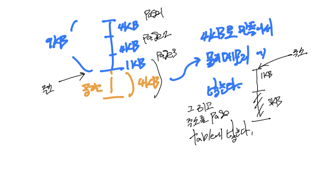

# Computer Science-제로베이스-Paging-System

Category: Computer Science
Chapter: Operating System
강의: Zerobase
블로깅: No
유형: LESSON
작성일시: 2022년 2월 26일 오후 2:41

제로베이스 컴퓨터 공학자 따라잡기 온라인 완주반 강의를 듣고 정리한 포스팅

이번 포스팅 에서는 paging system이 무엇이고 어떻게 작동을 하는지에 대해 정리를 하였다. 다음 포스팅에서 다중 단계 페이징을 정리할 예정이다.

# Paging System

참고사이트 : **[Virtual Memory, Paging, and Swapping](https://gabrieletolomei.wordpress.com/miscellanea/operating-systems/virtual-memory-paging-and-swapping/)**

[그림출처](https://stackoverflow.com/questions/33890445/can-someone-explain-this-diagram-on-paging-virtual-memory-to-me)

Virture Memory는 MMU라는 하드웨어와 Software(OS)를 사용하여 구현된 메모리 관리 기술이다. 여기서 paging system은 가상 메모리 system에서 가장 많이 쓰이는 메커니즘이다.

가상 메모리의 주소를 물리 메모리 주소로 변환을 해야 데이터를 가져올 수 있다. Paging System 메커니즘은 Page Table에 가상주소와 물리주소를 Mapping한 정보가 있으며, CPU는 이 Page Table을 사용하여 물리주소에 접근할 수 있다.

[그림출처](http://www.cs.uni.edu/~fienup/cs142f03/lectures/lec16_OS_virtual_memory.htm)

### 1. Paging System이란??

- 페이징 시스템은 이 “페이지”로 가상 주소 - 물리 주소 공간을 매칭하고 관리한다.
- page 번호를 기반으로 가상주소/물리주소 매핑 정보를 기록하고 사용한다.
- (Linux를 기준으로) 가상 주소 공간을 4KB인 Page 단위로 나눈다
- 하드웨어 자원이 필요하다 (예를 들어 intel x86 (32bit)에서는 4KB , 2MB, 1GB를 지원한다. (Page Size의 단위이다)
- Linux의 경우 process는 4GB의 크기를 갖는다. 프로세스의 상태가 저장되어있는 PCB에 Page Table 구조체를 가리키는 주소가 들어있다.

### Paging System의 구조

- Page는 고정된 크기의 Block이다.
  - 만약 마지막에 1kb만이 남아있어도 3kb의 공간을 더 추가하여 물리 메모리에 넣는다.
    
- 가상주소는 v=(p,d)로 표현하며 p=가상 메모리 페이지, d=변위(offset) ⇒ p안에서 참조하는 위치 이라고 한다
  
  - Page크기가 4KB라고 할 때, 가상주소의 0-11비트가 변위를 나타내로 12비트 이상이 페이지 번호가 될 수 있다.
- 변위란 , paee 번호의 base주소( 맨 위의 주소)에서 몇 KB만큰 떨어져 있음을 나타낸다. (d가 10kb인 경우 baes주소 + 10kb에 matching 되어있는 정보가 있다는 의미)

- Page Table : 가상 주소에 있는 page 번호와 해당 페이지의 첫 물리주소 정보를 매핑한 표이다.

### Paging System 동작

CPU에서 가상추소 요청 시 진행되는 전반적인 Paging System의 동작은 아래와 같이 간략하게 나타낼 수 있다.

1. CPU에서 가상주소를 요청한다.
2. 가상주소를 통해 Page 번호를 확인한다.(page가 많기 때문에 맨 위의 주소만을 저장해 놓는다)
3. PCB에 있는 Page Table에 해당 가상 주소가 포함된 페이지 번호가 있는지 확인한다
4. Mapping되는 물리 주소의 첫 번째 주소를 찾는다
5. Offset 정보를 이용하여 정확한 주소를 찾는다.

Page Table의 valid,invalid 부분은 물리주소가 있는지 없는지를 나타내는 비트정보이다. 메모리에 모든 데이터가 들어갈 필요가 없으므로 표시를 해두는 정보이다.

### MMU (Memory management Unit)

- CPU는 가상 주소를 다룬다. 가상주소를 물리 주소로 변환 시 MMU 하드웨어를 통해 물리 메모리에 접근한다.

[그림참조](https://upload.wikimedia.org/wikipedia/commons/8/89/MMU_principle.png)

- Page Table은 Default로 물이 메모리에 적재되어있다.
- Process를 구동할 때 Page Table을 물리 메모리에 적재함과 동시에, 해당되는 page table base 주소가 별도의 레지스터에 저장된다(CR3)
- CPU가 가상주소에 접근할 때 MMU가 CR3 레지스터를 가져와서 페이지 테이블 base주소를 접근하여 물리주소를 가져온다.

이번 포스팅은 정리하는데 조금 까다로웠다. 강의를 듣긴 했지만, 조금 오래 전에 들었던 강의 이기도 했고 머릿속에서 정리가 되지 않았기 때문이다. 그래도 구글링을 통해 여러 참고 자료들을 읽어보고 나서야 좀 더 명확하게 이해를 할 수 있었다.

정리를 해보자면, CPU는 가상메모리를 다루고 MMU를 통해 가상 주소를 물리 메모리로 변환하여 접근한다. 그리고 이런 작업의 단위는 (리눅스 기준)4GB를 4KB로 분할한 Page라는 단위로 진행된다. Page의 주소는 page 번호와 offset 정보가 있으며 PCB에 있는page table을 통해서 Mapping된 물리주소를 찾는다.
