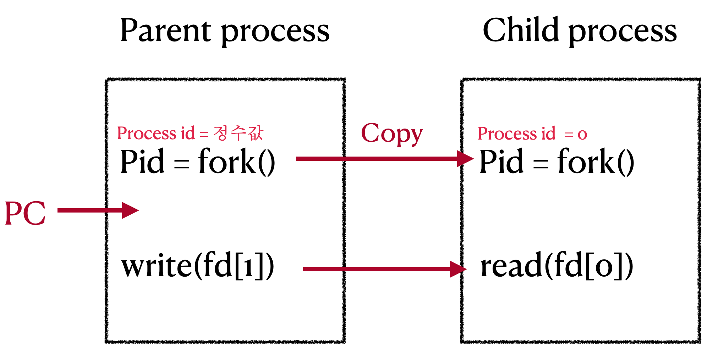

# Computer Science-제로베이스-IPC기법들

Category: Computer Science
Chapter: Operating System
강의: Zerobase
블로깅: No
유형: LESSON
작성일시: 2022년 1월 9일 오후 12:18

제로베이스 컴퓨터 공학자 따라잡기 온라인 완주반 강의를 듣고 정리한 포스팅

주요 IPC 기법인 pipe , message queue , shared memory 에 대해 알아보자.

IPC 기법들은 System programming에서 직접 실습을 해야 하는 부분이기 때문에 간단하게 개념에 대해서만 정리를 하였다.

## 1. pipe(파이프)


- pipe는 하 나의 process의 output이 다른 process로 들어간다. 이를 단방향 통신이고 한다.
- fork()로 자식 프로세스를 만들었을 때 부모와 자식 간 통신할 때 사용된다.

- 파이프 IPC는 기본적으로 아래와 같이 진행된다.(그림 참고)
  1. pipe로 fd[0]과 fd[1]을 먼저 생성하고 주소값을 넣는다.(이 부분은 아래의 코드를 통해 더 이해해보자)
  2. 부모에서 fd[1]을 갖고 write이라는 시스템콜로 데이터를 쓸 수 있다.
  3. 자식에서는 read 시스템콜로 fd[0]주소값을 활용하여 부모에서 씉 것을 읿을 수 있다.
  4. 단방향 통신이므로 부모는 fd[0] 사용이 불가능하고 자식은 fd[1]을 사용할 수 없다.

### 파이프 코드 예제

```c
char*msg="Hello Child Process";
int main()
{
	char buf[255];
	int fd[2], pid, nbytes;

// fd는 길이가 2여야 한다. pipe(fd)가 성공이면 특정 주소값을 2개 return 하는데 fd[0], fd[1]에 각가 할당.
	if(pipe(fd)<0) // pipe(fd)로 파이프를 생서한다.
		exit(1);   // pipe가 실패이면 종료

	pid=fork(); // fork() 함수 실행 이후부터 부모/자식 프로세스로 나누어진다.
	if(pid>0) { // 부모 프로세스는 pid에 실제 프로세스 ID가 들어간다.
			write(fd[1],msg,MSGSIZE); // fd[1]에 쓴다.write 라는 시스템콜은 fd[1]을 써야한다.
			exit(0);
	}
	else { // 자식 프로세스는 pid가 0이 들어가기 때문에 else문을 실행하게 된다.
			// buf 라는 변수에 MSGSIZE만큼 부모에서 쓰여진 msg값이 엄어온다. ==> 통신 !!
			nbytes=read(fd[0],buf,MSGSIZE); // fd[0]으로 읽는다.
			exit();
	}
	return 0;
}
```

- 위의 코드에서 fork()를 실행하면 porcess를 그대로 복사한다 이를 Child process라고 한다 (아래 그림 참고)
- PC(Program counter)가 다른 line을 가리키게된다. 부모의 pid는 실제 process id를 갖게되고 child의 pid는 0이다.
- 따라서 위의 if else문에서 pid > 0 면 부모 프로세스가 실행을 하고 아니면 자식 프로세스가 실행을 하게 된다.
- 부모프로세스의 코드는 아래와 같다.
  ```c
  if(pid>0) { // 부모 프로세스는 pid에 실제 프로세스 ID가 들어간다.
  			write(fd[1],msg,MSGSIZE); // fd[1]에 쓴다.write 라는 시스템콜은 fd[1]을 써야한다.
  			exit(0);
  	}
  ```
  write 이라는 System call은 file descripter (fd) 에 쓰는 시스템콜이다. [참고](https://man7.org/linux/man-pages/man2/write.2.html)</br>
  `ssize_t write(int fd, const void *buf, size_t count);`</br>
  buf 부터 시작되는 버퍼를 size만큼 fd가 참조하는 file에 쓴다. (fd[1] 을 사용해야한다)
  즉, 위위 코드는 부모 프로세스에서 쓰는 코드이다.
- 자식 프로세스의 코드는 아래와 같다.
  ```c
  else { // 자식 프로세스는 pid가 0이 들어가기 때문에 else문을 실행하게 된다.
  			// buf 라는 변수에 MSGSIZE만큼 부모에서 쓰여진 msg값이 엄어온다. ==> 통신 !!
  			nbytes=read(fd[0],buf,MSGSIZE); // fd[0]으로 읽는다.
  			exit();
  	}
  ```
  read system call은 fd로부터 읽어오는 함수이다. [참고](https://man7.org/linux/man-pages/man2/read.2.html) </br>
  `ssize_t read(int fd, void *buf, size_t count);`
  </br>
  buf 부터 시작되는 버퍼를 fd로부터 size만큼 읽어온다. 성공 시 read란 byte의 수가 반환된다.
  즉, 위의 코드는 부모 프로세스에서 쓴 것을 읽어오는 역할을 한다.

**위의 과정은 부모에서 씉 것을 자식이 읽을 수 있다는 것으로 부모-자식 프로세스간 통신이라고 할 수 있다**



## 2. Message Queue

[참고자료](https://www.tutorialspoint.com/inter_process_communication/inter_process_communication_message_queues.htm)


- QUEUE는 기본적으로 FIFO(First in First out)으로 데이터를 전송한다.
- 장점으로는 부모 - 자식이 아니라 어느 프로세스간에라도 데이터 송-수신이 가능하며 key 값만 명확하게 알고있으면 된다.
- message queue를 두 개 만들면 양방향 통신이 가능하다. (이 방법이 일반적임)

### Message queue 코드 예제

- A Process
  ```c
  msqid = msgget(key, msgflg) // key는 1234, msgflg는 옵션
  msgsend(msqid, %sbuf, buf_length, IPC_NOWAIT)
  ```
  - 특별한 key값을 부여해서 message queue를 한개 만든다. msgget은 메세지 큐에대한 id를 반환한다.
  - 해당 id에 sbuf에다 데이터를 미리 넣어놓고 msgsend라는 함수를 호출하면 데이터가 메세지 큐에 한 개씩 들어간다.
- B Process

  ```c
  msqid=msgget(key, msgflg) // key는 동일하게 1234로 해야 해당 큐의 msgid를 얻을 수 있다.
  msgrcv(msqid, &rbuf, MSGX, 1, 0)
  ```

  - 동인한 Key를 갖고 해당 message queue의 id를 반환받는다.
  - msgrcv라는 함수를 통해 rbuf에 sbuf의 데이터가 들어가게 된다.
  - rbuf는 0으로 채워진 배열변수이다.

  - msgget 시스템콜은</br>
    **`int msgget(key_t key, int msgflg);`**</br>

    **msgflg에 IPC_CREAT를 사용하면 새로운 메시지 큐를 생성한다. [참고](https://man7.org/linux/man-pages/man2/msgget.2.html)**

  - msgsend 시스템콜은 [참고](https://man7.org/linux/man-pages/man2/msgop.2.html)</br>
    `int msgsnd(int msqid, const void *msgp, size_t msgsz, int msgflg);`</br>
    message queue에 message를 전송할 때 사용된다. 호출한 프로세스는 보내기 전에 write permssion을 보내야한다.
  - mesrcv 시스템콜은 message queue로부터 message를 읽어올 때 사용된다.

## Kernal mode & Pipe, Message queue

pipe, message queue의 공통점은 두 방법 모두 Kernal space를 사용한다는 점이다.

(이 개념에 대해서는 가상메모리 부문에서 더욱 다룰 예정)


kernal 공간을 활용하여 프로세스간 데이터를 공유한다.

두 기법의 차이점은 아래와 같다.

- pipe는 부모/자식간의 통신만 가능하나는 것 / message queye는 다른 프로세스와도 통신이 가능하다는 것.
- pipe는 단방향 통신만 가능하다는 건 / message queue는 양방향이 가능하다는 것

## 3. 공유 메모리 (Shared Momory)


kernal space에 메모리 공간을 만들고 해당 공간을 변수처럼 접근하는 방식이다. 해당 메모리 주소를 변수처럼 접근하는 방식으로, 공유 메모리 keyf를 통해 여러 프로세스가 접근 가능하다.

[참고자료](https://www.softprayog.in/programming/interprocess-communication-using-system-v-shared-memory-in-linux)

### Shared Momory 코드 예제

1. 공유 메모리를 생성하고 공유 메모리 주소를 얻는다.

```c
// 1. 공유 메모리를 생성하고 공유 메모리 주소를 얻을 수 있다.
shmid = shmget((key_t)1234, SIZE, IPC_CREATE|0666)) // 공간을 만든다.
shmaddr = shmat(shmid, (void *)0,0)

// 2. 공유 메모리에 쓰기 가능하다
strcpy((char*)shmaddr,"Linux Programming")

// 3. 공유 메모리에서 읽기 가능
printf("%s\n",(char*)shmaddr)
```

- shmget 함수를 사용하여 key값을 넣고 SIZE 만큼의 공간을 만든다. id를 return 한다.
- shmat 함수를 사용하여 id값에 해당하는 주소를 반환한다.
- 주소값을 마치 변수처럼 사용하여 바로 쓰거나 읽기가 가능하다.

## 정리

1. 주요 IPC 기법은 pipe , message queue, shared memory 가 있다.
2. 모두 커널 공간을 활용하여 프로세스간 데이터를 공유하는 방법이다.
