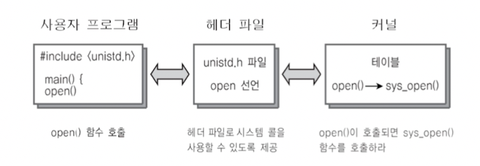

# Computer Science-제로베이스-Process 정리

Category: Computer Science
Chapter: Operating System
강의: Zerobase
블로깅: No
유형: LESSON
작성일시: 2022년 1월 25일 오전 12:02

제로베이스 컴퓨터 공학자 따라잡기 온라인 완주반 강의를 듣고 정리한 포스팅

지금까지 배웠던 내용을 토대로 아래의 코드를 실행한다고 할 때 내부적으로 어떻게 진행이 되는지 알아보자.

```c
#include <unistd.h>
#include <sys/types.h>
#include <sys/sta.h>
#include <fcntl.h>

int main()
{
	int fd;
	df=open('data.txt'.O_RDONLY);
	if(fd == -1)
	{
			printf("Error: can not open filr\n");
			return 1;
	}
	else
	{
			printf("File opned and now close_\n");
			close(fd);
			return ();
	}
}
```

전체적인 흐름은 아래와 같다.

- **컴파일 → 실행파일이 만들어진다 → 실행파일을 실행하기 위해서 일반 사용자는 쉘 interface를 사용하여 (CLI / GUI) → OS에 실행을 요청한다.**

그런다면, 컴파일하여 생성된 실행파일은 운영체제에서 어떻게 실행을 할까 ??

실행을 하면 프로세스가 만들어지고 그 구조는 아래와 같이 구성이된다.


실행파일 구조가 만들어지면 프로세스 구조상 위의 코드들은 모두 Text 영역에 들어가있다. 하지만 이렇게 프로세스가 바로 실행이 되는 것은 아니다.


현재의 상태는 위의 프로세스 상태에서 (1) new : 실행파일 구조가 만들어지고 → (2) ready 상태에 들어간 상태이다. 어떤 시점에서 running 상태로 바뀌게 되는데, 어떤 스케줄러 방식을 사용하는지에 따라 달라진다.

만약 선점형 스케줄러라고 가정을 해보자 선점형 프로세스는 일정 시간마다 running 상태의 프로세스를 바꿘주는 정책을 사용한다. 아래와 같이 가정을 해보자.

- 약 50ms === 0.05초 마다 Context Switching을 하는 선점형 스케줄러를 사용한다.
- HW가 갖고있는 타이머중에 0.01s마다 OS에 Timer interrupt를 주는 인터업트가 있다고 가정한다.
- 인터럽트가 발생하면 운영체제는 다음과 같은 작업을 진행한다.

  1.  CPU: 사용자 모드를 Kernal mode로 바꾼다.
  2.  IDT(Internal Descriptor Table)에서 0x80에 해당하는 주소(함수)를 찾아서 실행한다.

      1.  IDT는 timer interrupt에 해당하는 번호에 매칭이 되는 커널 함수의 주소를 확인하고 실행한다.
      2.  함수가 다음과 같다고 해보자

          아래의 함수로 인해 인터럽트가 5번 실행이 되어서 위의 함수가 길행이 되면 reddy → running 상태로 변하게된다.(Context-Switching)

          ```c
          // sys-timer
          sys_timer(){
          	count++;
          	if(count<4){
          		call scheduller // Context-Switching
          	}
          }
          ```

      3.  Context Switching을 간단하게 정리하면 아래와 같이 진행된다.

                [이곳에 더 정리를 해놓았다](https://sora9z.tistory.com/109)

                [https://img1.daumcdn.net/thumb/R1280x0/?scode=mtistory2&fname=http%3A%2F%2Fcfile22.uf.tistory.com%2Fimage%2F994590345BB1B4DB2F7E5C](https://img1.daumcdn.net/thumb/R1280x0/?scode=mtistory2&fname=http%3A%2F%2Fcfile22.uf.tistory.com%2Fimage%2F994590345BB1B4DB2F7E5C)

                1. 기존의 프로세스1의 PCB정보를 메인메모리에 저장 후 Process1은 ready로 바꿔준다.
                2. new Or ready상태인 프로세스2의 PCB정보(PC나 SP같은)를 메인메모리에 로드하고 이 프로세스의 code를 실행한다.

          여기까지 정리는 하자면,
          **컴파일 → 실행프로그램 → Process new → Process ready → Process running**
          위의 단계를 거치고 나서 비로소 맨 코드를 실행하게 된다. 다시 실행 할 코드를 가져와서 아래에 써보면 아래와 같다.

  ```c
  #include <unistd.h>
  #include <sys/types.h>
  #include <sys/sta.h>
  #include <fcntl.h>

  int main()
  {
  	int fd;
  	df=open('data.txt'.O_RDONLY);
  	if(fd == -1)
  	{
  			printf("Error: can not open filr\n");
  			return 1;
  	}
  	else
  	{
  			printf("File opned and now close_\n");
  			close(fd);
  			return ();
  	}
  }
  ```

- 코드를 실행하면 차례대로 stack에 main이 들어가고, 지역변수인 fd가 들어간다. 그리고 open이라는 함수를 만나게 된다.
- open 함수 : 시스템콜 함수
  
  open 함수는 unistd.h 헤더파일에 선언이 되어있는데, 이 내부는 아래와 같은 코드가 들어가있다.

  ```c
  mov eax, 1  // 시스템콜의 번호가 들어감
  mov ebx, 0  // 시스템콜 인자 (open(인자,인자))
  int 0x80 // 소프르퉤어 인터럽트 명령어이다.
  ```

  - 위의 코드에서 int는 정수형이 아니고 CPU가 제공하는 opcode이고 0x80은 인터럽트 번호이다.
  - int라는 명령은 (인터럽트)
    - 사용자 → 커널모드로 변경을 하고
    - IDT를 찾아간다.(IDT는 부팅시 만들어지고 번호마다 실행커널함수 주소가 있다. 리눅스의 시스템콜 함수는 0x80을 쓰게 되므로 int 0x80는 System_call()이라는 함수를 호출되게 한다.
  - System_call() 함수는 eax의 번호를 확인하고 해당 시스템콜 번호를 찾아서 해당 번호에 맞는 시스템콜 함수로 이동한다. (open의 경우 sys_open())

    - sys_open()이란 함수는 커널함수이고 실행을 하게 되면 아래와 같이 진행이 된다.

      - CPU → DMA에 저장매체에 file처리를 요청→System Bus를 통해 요철 file을 open한다.
      - 이런 저장매체를 처리하는 것은 registor 처리와는 달리 매우 시간이 오래 걸린다 (아래 그림 참고)

        

  - sys_open의 작업은 상대적으로 오래 걸리기 때문에 process는 running → wating으로 상태가 변경된다.(blocking)
  - DMA가 처리를 완료하면 CPU에 완료했다는 인터럽트가 발생한다. 이 인터럽트는 위의 과정과 똑같이 IDT에서 해당 주소게 맞는 함수를 실행한다. 이 함수의 역할은 waiting → ready로 바꿔주는 것이다.
  - 그 다름 Process 정책에 따라서 ready → running 상태가 된다
  - 다시 해당 프로세스 다음 코드를 진행하게 된다.

- 사용자 → 커널모드 변경은 상당히 많이 일어난다 → 수많은 인터럽트 처리와 시스템콜 호출
- IO관령 처리는 수많은 인터럽트, 시스템콜, 스케줄러, 하드웨어필요하다 → 빈번한 IO처리는 시간증가를 발생 → 최대한 한 번에 메모리에 저장하도록 하는 것이 좋다.

---
