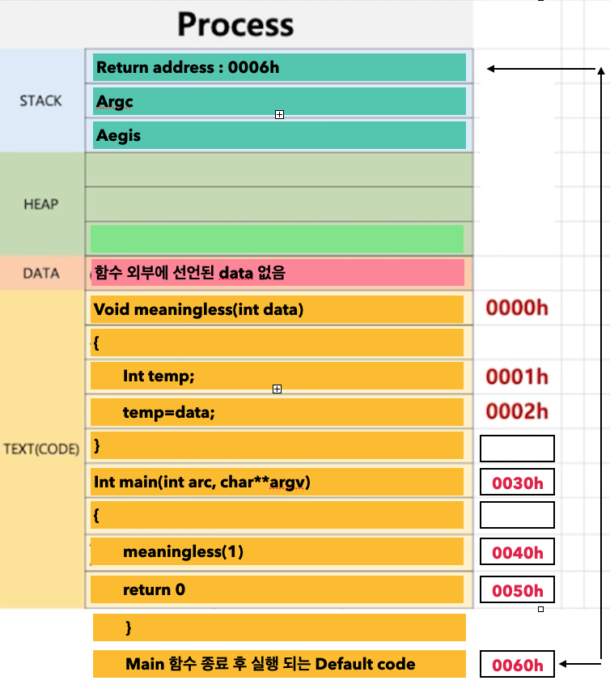
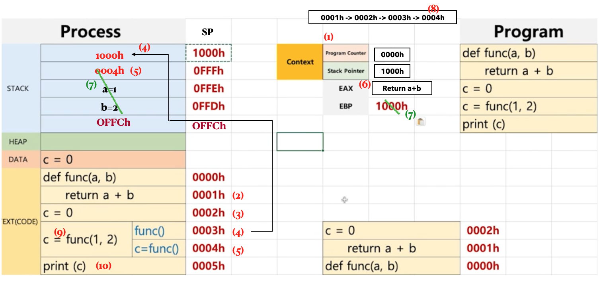
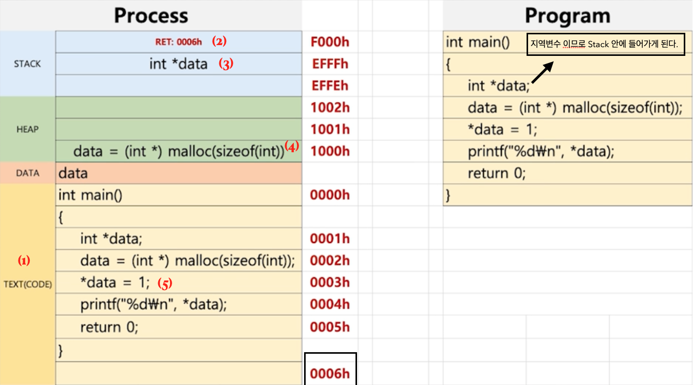
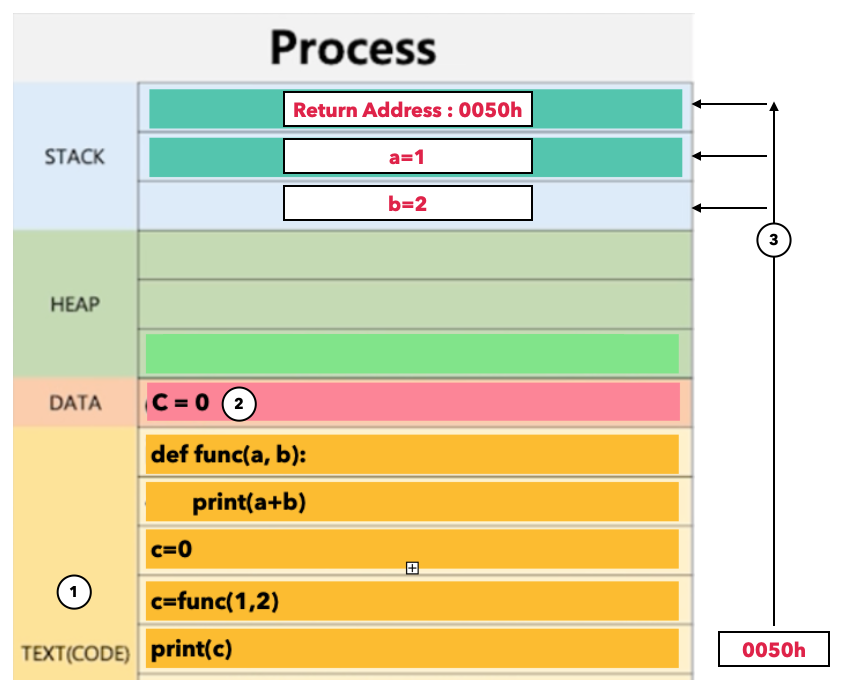

# [Computer Science][제로베이스 ]-운영체제 - 프로세스 구조

Category: Computer Science
Chapter: Operating System
강의: Zerobase
블로깅: Yes
유형: LESSON
작성일시: 2021년 12월 12일 오후 12:04

제로베이스 컴퓨터 공학자 따라잡기 온라인 완주반 강의를 듣고 정리한 포스팅

# 프로세스와 컨텍스트 스위칭

Context Switching 이란 간단하게 말하면, Process A 실행 중 Process B로 바꿔주는데, 이 바꿔주는 메커니즘을 Context Switching이라고 한다. Context Switch는 Process와 매우 밀접하게 관련이 있으며 이 **Contetxt Switching 메커니즘에 대해 조금 더 이해하기 위해 Process 구조를 알 필요가 있다. 즉, 실제 프로그램의 구조를 알아야 한다.**

### 1. Process의 구조 Deep Dive !

- Process의 구조


Process는 사용자 입장에서 크게 Text, Data, Head, Stack이라는 네 가지 영역으로 구분된다.

- text (Code) : 기계어로 컴파일 된 Code, 코드 자체를 구성하는 메모리 영역이다. Hex 또는 Bin 파일 메모리.
- data : 변수 또는 초기화된 데이터. 전역 변수가 해당된다. 초기화 되징낳은 데이터는 BSS(Block Stated Symbo)영역에 저장된다.
- heap : code에서 동적으로 만들어지는 데이터. 메모리 주소 값에 의해서만 참조되고 사용된다.
- stack

  - 임시 데이터 (함수 호출, 로컬 변수 등). 지역변수, 인자, 함수의 리턴 주소를 갖는다. 함수 호출시에 생성되었다가 함수가 끝나면 반환된다. Stack의 사이즈는 각 process마다 할당이 되지만 process가 로드될 때 사이즈가 고정되어 런타임시에 Stack 사이즈는 바꿀 수 없다.
  - 사실상 Stack Frame 이라고 하며 Stack이라는 자료구조를 이용하여 함수를 실행할 수 있는 구조로 만든 것.

- Process 의 실행

  - Python code 예시

  ```python
  1. def func(a,b):
  2. 	print(a+b)

  3. c=0
  4. c=func(1,2)
  5. print(c)
  ```

Python Code는 Interpreter 언어 이므로 원래 Compile 되지 않는다. 이해를 돕기 위해 Python code가 Compile 된다고 가정해 본다.



1. 위의 Python Code를 컴파일 한 Binary Code가 Text에 저장된다.

2. 전역 변수인 C=0 이 Data 영역에 저장된다.

3. 함수 실행문인 func(1,2)가 실행

- 함수의 살행이 종료되면 함수는 반환된다. 함수에 선언된 지역변수 또한 함수가 끝나면 사라지므로 함수의 실행은 동적으로 처리를 하기 때문에 data가 아닌 Stack에 들어간다.
- 함수 실행문을 만나면 return address가 먼저 Stack에 할당이 된다. 여기서, Return address는 함수가 끝나는 다음 code의 주소 값이다.
- 그 후 a=1 , b= 2의 인자가 차례로 Stack에 들어가게 된다.
- func(1,2) 실행이 끝나면 Stack의 2, 1 은 차례로 제거되고 Return Address로 돌아가고난 후 Stack에 있는 Return Address는 제거된다.

Heap은 동적으로 메모리 공간이 할당되어야 할 때 사용된다. 예를 들거 C언어에서 동적으로 특정 메모리에 공간을 생성하는 malloc() 함수를 사용할 때 Heap에 저장된다.

- C Code 예시

```c
 void meaningless(int data)
{
	int temp;
	temp=data;
}

int main(int argc,char **argv)
{
	meaningless(1)
	return 0
}
```

c 언어 에서는 main 또한 함수이다. 위의 code는 함수 안에 함수가 실행되는 구조로 되어있으며, 함수 외부에 선언된 전역 변수는 없다.

함수가 실행이 되면 함수 다음에 실행 될 코드의 주소 값이 return address로 Stack에 저장이 되었다. main 함수가 끝나면 실질적으로 뒤에 처리하는 Default Code 들이 있다. 이 main의 return address를 0006h 라고 가정한다.

Python code 예제보다 조금 더 나아가서 PC (Pogram Counter) 라는 개념을 추가하여 Process 진행 과정을 보면 아래와 같다.

```python
1. def func(a,b):
2. 	print(a+b)

3. c=0
4. c=func(1,2)
5. print(c)
```



1.  프로그램이 실행되면 process의 text 영역에 컴파일 된 코드가 전달된다.

2.  PC(Program Counter)가 코드가 존재하는 주소 (각 Code 옆에 적혀있는 메모리 주소)를 하나 하나 가리키면서 실행이 된다.

\***\* PC(Program Counter) : Code를 한 줄 한 줄 가리키는 주로 registor \*\***

- main 함수의 return address인 0006h가 Stack에 저장이 되고 차례로 매개변수인 argc, argv가 Stack에 저장이 된다.
- main 함수 내부에 있는 meaningless(1)이 실행이 되면 이 함수의 return address인 0005h가 Stack에 저장이 되고 차례로 data=1 ., temp = data = 1 이 저장 된다.
- meaningless 함수가 끝나면 PC는 Stack에 저장되어 있던 return address 0005h를 가리키고 Stack에서 삭제한다.
- 0005h의 코드가 실행이 되고 main 함수가 끝나면 Stack에 있는 argc와 argv가 stack에서 제거된가.
- PC는 Stack에 있는 main 함수의 return address인 0006h를 가리키게 되고 0006h는 Stack에서 삭제된다.
- Default Code를 실행한다.

return address를 Stack에 저장하는 이유는, 함수 내부에 다른 함수가 존재하는 경우 return address를 지정하여 실행되는 함수가 종료 되었을 때 다음 code로 돌아가 작업이 계속 이어지도록 하기 위함이다.

### 2. Context Switch?


([이 사이트](https://linuxtut.com/en/90efd15a1983c61551a6/) 참고) **Context Switch**는 현재 실행중인 process 또는 Registor의 값 (Context)을 저장하고 새로운 process 또는 Registor 값(Context) 으로 변경하여 **CPU가 다음 process를 실행하는 것**을 말한다.

< 용어 정리 >

**\* **Context** ? Operating System 에서 Context는 CPU가 해당 process를 실행하기 위하 process의 information이다. 이 Context는 Process의 PCB (Process Control Block)에 저장되고 Contex Swirching(loading) 중에 PCB information을 읽어서 CPU가 이전 peocess가 하던 작업을 계속 할 수 있다. \***

\*\* **Program State** : Getneration , Preparation, Execute, Waiting, Cancelled

** Context Switching 중에는 CPU는 어느 작업도 할 수 없다. 만약 Context Swiching이 빈번하면 Overhead가 발생하고 성능 효율 또한 떨어진다. **

** 그렇다면 Context Switching 을 언제 발행될까? **

- I/O request
- Time Slice expored (CPU 사용기간 만료)
- Fork a child (자식 process 를 생성할 떄)
- Interrupt를 대기를 처리할 떄

### 3. Process & Context Swiching

컴퓨터 구조에서 중요란 Registor인 PC(Program Counter)와 SP(Stack Pointer)가 프로세스 구조에서 어떻게 작동되는지 적용해 보자.

<예시에서 나오는 용어를 정리>

\***\* PC(Program Counter) : Code를 한 줄 한 줄 가리키는 주로 registor**

\***\* SP(STack Poionter) : Stack Frame의 최상당 주소를 가리키는 registor**

\*\* EAX :

\*\* EBP : 함수를 Tracking 할 때 쓰인다. 이 레지스터에는 현재의 Stack Pointer의 최상단을 가리키는 주소가 들어가있고, 그 주소가 Stack에 먼저 담긴다. 만약 어떤 함수에서 문제가 생겼을 때, EBP registor를 확인하면 문제가 생긴 함수의 최상단 SP를 갖고있게 된다. SP의 다음 주소는 할상 Return address를 갖고 있고, Return Arddress의 윗 줄이 해당 함수의 실행문 이라는 것 또한 알 수 있으므로 어디서 문제가 발생했는지 알 수 있다. 이러첨 EBP는 문제가 생겼을 때 함수를 빠르게 Tracking 하는 기능을 제공한다.

만약, 함수 안에 또 다른 함수가 있다면, EBP Registor에 OFFCh 가 들어가게 되고 Stack에도 OFFChr값이 들어가게 된다

1. Python Code 예시



- 위의 Python code와 같이 code가 text 영역에 컴파일 되어 저장되고 전역 변수인 C=0은 data 영역에 저장된다.
- PC가 주소를 한 줄씩 가리키면서 Code를 실행한다.

1. 처음 PC = 0000h , SP = 100h (아직 아무것도 없기 때문에)

2. pc는 1씩 늘어난다. 두 번째 pc는 0001h 이지만 함수의 선언 이기 때문에 아무 일도 일어나지 않는다.

3. PC = 0002h (data에 이미 들어가있기 대문에 특별히 실행할 것이 없다)

4. Pc = 0003h이 실행이 되면 EBP에 초기 SP의 값이1000h 쓰여있는데, 이 값이 지금 가리키고있는 SP 위에 들어간다.

5. 0003h가 실행이 되면 첫 번째,두 번째 인자가 Stack에 들어가기 전에 return address를 Stack에 넣어줘야 하므로 0004h가 들어가게 된다.

6. 그 후 함수의 인자가 들어간다. Return a+b 의 값은 EAX Registor에 들어간다.

7. 함수가 끝나고 Stack에 있는 인자값은 삭제되고 0004h라는 return address를 만나게 되면 return address ,EBP registor의 값도 삭제가 된다.

8. 그 후 PC는 0004h로 변환한다.

9. pc =  0004h  : c의 값음 EAX registor에 있는 값이다. 이를 결과값으로 받는다.

10. pc = 0005h : c를 출력하고 끝난다.

11. C Code 예시

Process의 구조는 크게 4가지의 구성요소를 갖는다. 그 중 Heap은 동적으로 생성되는 메모리이다. 이 Heap 메모리가 어떻게 동작을 하는지 아래의 C Code 예시로 알아본다.

아래의 Code는 main 함수 안에 malloc()으로 동적으로 공간을 할당하고 있다. 미리 컴파일 하여 전역변수 등의 공간을 미리 만들어서 저장하는 Data와는 달리 malloc은 실행코드 안에서 어떻게 실행이 될 지 모르기 깨문에 정적으로 알 수 없으므로 Heap이라는 동적으로 생성되는 공간에 저장한다.

```c
int main()
{
	int *data;
	data=(int *) malloc(sizeof(int)); // int -> 32 bit 크기의 공간을 생성하여 int 형 pointer인 data가 가리키게 한다.
	*data=1; // heap에 할당된 메모리에 1을 할당
	print("%d\n",*data);
	return 0;
}
```



1. code 가 data 영역에 저장된다

2. main 함수의 return address가 Stack에 저장된다

3. 지역변수 data가 Stack에 저장된다.

4. 32 bit (sizeof(int)를 갖는 공간을 malloc으로 할당하고 pointer인 data가 가리킨다. 이 때, data는 heap에 저장된 메모리를 참조한다. ( heap의 주소값 1000h가 data에 들어가게 된다. data=1000h)

5. data가 가리키는 heap 공간에 1을 저장한다.</br>

</br>
- 위에서 main 함수의 return address에 대해 조금 더 알아보자.
Compiler가 미리 작성해 놓은 함수인 start() 를 갖고있는 라이브러리가 있다. 
    
  ```bash
    start()
    {
    	main() 
      # 내부에서 main이라는 함수를 호출한다. main 내부는 우리가 만든 c 프로그램을 실행한다.
    	
    	process 종료() 
      # main 함수의 return address는 process를 종료하는 처리를 하는 함수를 가리킨다.
    }
  ```


위의 code 전체가 실행파일이 된다.

[참고사이트](https://iredays.tistory.com/118#:~:text=%ED%94%84%EB%A1%9C%EC%84%B8%EC%8A%A4%EB%8A%94%20%EB%8F%99%EC%9E%91%EC%A4%91%EC%9D%B8%20%ED%94%84%EB%A1%9C%EA%B7%B8%EB%9E%A8,%EC%98%81%EC%97%AD%EC%9C%BC%EB%A1%9C%20%EA%B5%AC%EB%B6%84%ED%95%A0%20%EC%88%98%20%EC%9E%88%EB%8B%A4.)
