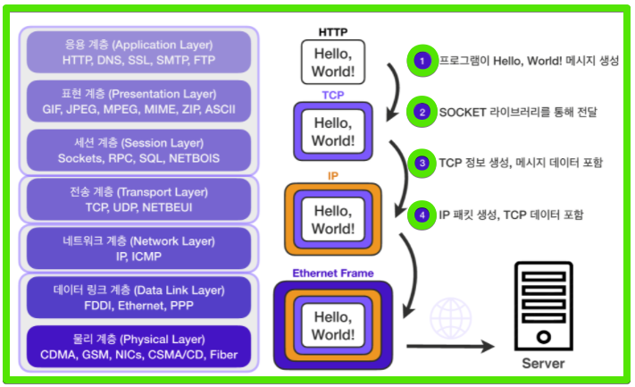

# Codestates-Network-InternetProtocol

강의: codestates
블로깅: No
유형: LESSON
작성일시: 2022년 2월 11일 오후 1:24

# Codestates-Network-Internet protocol

## 0. Achievement Goals

- HTTP 기반 네트워크 흐름을 이해한다.
- TCP/IP 기반 네트워크 흐름에 대해 이해한다
  - TCP IP 패킷이 왜 필요한지 이해한다.
  - TCP 와 UDP의 차이에 대해 이해한다.

네트워크 계층은 OSI 7계층와 TCP/IP 4걔층에 따라 층을 나눌 수있다.

OSI는 인터넷 계층을 7개의 계층으로 나눴고 TCP / IP 모델은 네트워크 계층을 4개의 층으로 분류했다. 이에 대해서는 다음 포스팅에서 자세히 다룰 예정이다. 지금은 아래의 그림처럼 나뉜다는 것만 소개한다.


## 1. IP와 IP Packet

### Packet이란?

\***\*[IP packets Khan Academy](https://www.khanacademy.org/computing/computers-and-internet/xcae6f4a7ff015e7d:the-internet/xcae6f4a7ff015e7d:routing-with-redundancy/a/ip-packets)\*\***

- IP는 지정한 IP주소에 Packet이하는 통신 단위로 데이터를 전달한다.
- IP packet은 header와 data를 포함하고 있다.
  
  - Header에는 Source IP address , Destination IP address 등의 packet의 전송에 필요한 정보가 들어있다.
  - Data에는 우편의 편지와 같이 실제 전송할 webpage와 같은 content가 들어있다.
- Packet은 아래와 같이 편지 봉투와 편지로 비유될 수 있는데 Header가 routing 정보가 들어있는 편지 봉투라면 data는 수신자만이 볼 수 있는 편지로 비유될 수 있다.
  

### IP Packet - Client Packet 전달

\***\*[Internet routing protocol Khan Academy](https://www.notion.so/Codestates-Network-InternetProtocol-b5c9a656b00e4d2194e9a83826b2e8a2)\*\***


- Internrt protocol은 packet으로 쪼개진 message를 Node들 (router)들을 통해 도착 server에 전달한다. 그 과정은 아래와 같다. (router는 컴퓨터 네크워크에 사용되며 패킷을 이동하는데 도움이 되는 장치이다)

  1. Packet을 가까운 router로 보낸다.

     

  1. Router가 Packet을 받고 Header의 destinaion IP를 확인한다.

  1. Router가 패킷을 다른 router에게 전달한다.

     

     packet을 전송해야 할 router는 최종 목적지와 가까운 router에 packet을 전달해야 한다.

     Router는 아래와 같이 다음 전송할 router를 선택할 수 있는 Forwarding table을 갖고있다.

     | IP address prefix | path |
     | ----------------- | ---- |
     | 91.112            | #1   |
     | 91.198            | #2   |
     | 192.92            | #3   |

     이 테이블은 전체 IP 주소가 아니라 IP 주소의 prefix만을 갖고있다. prefix가 동일하다면 두 개의 IP는 매우 대규모의 네트워크에 있다는 것을 의미한다.

     router가 이 테이블에서 최종 IP address에 대해 가장 구체적인 router location을 찾으면 그 router로 전송한다.

     1. 마지막 Router에서 도착 address로 메시지를 전송한다.

        

        | IP address prefix | path   |
        | ----------------- | ------ |
        | 91.112            | #1     |
        | 91.198.174.192    | Direct |
        | 192.92            | #3     |

## IP Protocol의 한계

\***\*[The problems with packets](https://www.khanacademy.org/computing/computers-and-internet/xcae6f4a7ff015e7d:the-internet/xcae6f4a7ff015e7d:transporting-packets/a/the-problems-with-packets)\*\***

IP 는 단지 message를 IP Packet으로 분할하고 Router를 통해 packet을 전송하는 방법을 설명할 뿐 packet의 모든 결과를 다루지 않는다.

packet을 전송할 때 일어날 수 있는 문제들은 아래와 같이 예를 들 수 있다.

- client가 여러 message를 보냈을 때 destination은 어떤 packet이 어떤 message의 packet인지 구분해야 한다.
- Packet은 각자 다른 경로를 통해 도착할 수 있으므로 어떤 순서로 도착하는지 보장할 수 없다.
- Packet이 손상되어 수신된 데이터가 원래의 데이터와 일치하지 않을 수 있다.
- Packet은 물리계층 또는 라우터의 Forwarding table의 문제로 소실될 수 있다. packet의 message가 소실되어도 Client가 이를 파악하기 힘들다.
- 동일한 패킷의 재전송으로 인해 패킷이 중복될 수 있다.

이런 문제들은 좀 더 높은 level의 프로토콜을 통해 다룰 수 있다. TCP (Transmission Control Protocol)는 IP 위에서 일반적으로 사용하는 data transport protocol이다. UDP (User Datagram Protocol) 은 몇 가지의 문제만을 해결하지만 빠른 데이터 전송을 보장한다. TCP와 UDP에 대해 알아보자.

### 1. UDP

\***\*[User Datagram Protocol (UDP) Khan Academy](https://www.khanacademy.org/computing/computers-and-internet/xcae6f4a7ff015e7d:the-internet/xcae6f4a7ff015e7d:transporting-packets/a/user-datagram-protocol-udp)\*\***

- User Datagram Protocol의 약자로 사용자 데이터그램 프로토콜이다
- IP의 위에서 작동하는 경량 전송 프로토콜이다.
- UDP는 IP 프로토콜에 PORT, 체크섬(checksum) 필드 정보만 추가된 단순한 프로토콜이다.
- checksum은 중복 검사의 한 형태로 오류 정정을 통해 공간(전자 통신), 시간(기억 장치) 속에서 송신된 자료의 무결성을 보호하는 단순한 방법이다.
- TCP에 비해 신뢰성은 낮지만 3-way-handshake를 사용하지 않기 때문에 TCP에 비해 빠른 속도를 보장한다.
- HTTP3은 UDP를 사용하기때문에 이미 기능이 구현된 TCP 보다 커스터마이징이 가능하다는 장점이 있다.
- 특징
  - 손상된 데이터를 감지하는 메커니즘을 제공한다.
  - 순서를 보장하지 않는다
  - 비 연결지향 (3 way handshak x )
  - 데이터 전달 보증 x
  - 데이터 전달과 순서가 보장되지는 않지만 단순하고 빠르다는 장점이 있다.
  - 신뢰성 보다는 연속성이 중요한 서비스에 자주 사용된다(실시간 동영상 스트리밍..)

### Packet format


UDP segment는 8-bytes의 header와 가변 길이의 data 영역을 갖고있다.

### Port numbers

첫 4bytes는 출발, 도착 port number가 적혀있다.

port 번호로 다른 타입의 network traffic을 구별할 수 있다.

sudo lsof -i -n -P | grep UDP를 terminal에 치면 현재 내 컴퓨터에서 사용하고 있는 UDP ports를 확인할 수 있다. 맨 처음의 글자는 이 포트를 사용하는 process name이고 마지막은 protocol과 port number를 나타낸다.

```bash

launchd       1             UDP *:137
launchd       1             UDP *:138
syslogd     311             UDP *:53446
systemsta   320             UDP *:*
configd     322             UDP *:*
configd     322             UDP *:*
```

### Segmant Length

그 다음 UDP header의 2 bytes는 header를 포함한 segment의 길이를 저장한다.

2bytes는 16bits이고 10진수로 2^16-1 = 65,535 bytes로 최대 길이를 갖는다.

### Checksum

UDP Header의 마지막 header의 2byte는 checksum으로 송,수신 쪽에서 data의 손상을 확일하기 위해 사용된다.

- 송신측
  1. 송신측에서 segment를 보내기 전에 segment의 data를 기반으로 checksum을 계산한다.
  2. 계산 후 결과를 checksum field에 저장한다.
- 수신측

  1. 수신한 segmant를 기반으로 checksum을 계산한다.
  2. Checksym을 서로 비교하고 같지 않으면 데이터가 손상됨을 알 수 있다

- Checksum은 아래와 같이 계산된다. Hola라는 데이터의 checksum을 계산해보자.

  1. Hola를 2진수로 encoding 한다. [ASCII/UTF-8 encoding](https://www.khanacademy.org/computing/ap-computer-science-principles/x2d2f703b37b450a3:digital-information/x2d2f703b37b450a3:storing-text-in-binary/a/storing-text-in-binary) → 4바이트의 결과를 준다

     H : 01001000

     o : 01101111

     l : 01101100

     a : 01100001

  2. 송신측은 바이트들을 이진수로 분할한다.(16 bit씩)

     0100100001101111

     0110110001100001

  3. Checksum을 계산하기 위해 송신측은 16bits의 두 number를 더한다.

     0100100001101111

     -

     0110110001100001

     =

     1011010011010000
     이런 과정으로 Hola는 1011010011010000 으로 인코딩된다.
     전체적인 UDP segments는 아래와 같이 보인다.

     | Field                   | Value                               |
     | ----------------------- | ----------------------------------- |
     | Source port number      | 00010101 00001001                   |
     | Destination port number | 0001010 100001001                   |
     | Length                  | 00000000 00000100                   |
     | Checksum                | 10110100 11010000                   |
     | Data                    | 01001000 01101111 01101100 01100001 |

만약 Data가 Hola가 아닌 Mola로 손상이 되었다면 Checksum은 1011100111010000 로 계산될 것이다.

→ 수신된 checksym : 10110100 11010000

→ 수신측에서 계산한 chechsum : 1011100111010000

이 두 값이 다르므로 소실됨을 알 수 있다.

### 2. TCP


TCP는 Tansmission Control Protocol) 의 약자로 IP 프로토콜로다 더 높은 계층에 존재한다. 이를 통해 IP 프로토콜의 한계를 보완할 수 있다. TCP 는 신뢰성있는 packet의 전송을 보장한다.

packet-based message로부터 발생되는 packet의 손실, packt의 순서 , 중복되는 packet, 손상된 packet등의 문데 대부분을 해결해준다.

### TCP의 통신



- HTTP 메시지가 생성되면 Socket 라이브러리를 통해 전달된다.
- 네트워크 Socket이란 “프로그램이 네트워크 환경에 연결할 수 있게 만들어진 연결부” 이다.
- IP packet을 생성하기 전에 TCP 세그먼트를 생성한다.
- 생성된 TCP / IP 패킷은 LAN 카드와 같은 물리적 계층을 지나기 위해 Ethernet 프레임워크에 포함되어 서버로 전송된다.

### TCP / IP packet 정보

TCP 세그멘트에는 IP packet의 출발지 IP와 도착지 IP를 보완할 수 있는 PORT, 전송제어, 숭서, 검증 정보 등을 포함한다.


조금더 자세한 그림은 아래와 같이 나타낼 수 있다.


각 TCP segment는 header와 data 영역이 있다. TCP header는 UDP보다 더욱 많은 field를 포함하고 있으며 size는 20 - 60 bytes의 범위를 갖는다.

### TCP 특징

TCP는 Transmission Control Protocol , 전송 제어 프로토콜이다. TCP의 특징은 아래와 같이 나타낼 수 있다.

- 연결 지향 - TCP 3 way handshake (가상 연결)
- 데이터 전달 보증
- 순서 보장
- 신뢰할 수 있는 프로토콜

- TCP 프로토콜을 통신을 하는 과정을 통해 특징을 알아보자
  ### Step 1. Establish connection : three-way-handshake
  
  - TCP는 장치들 사이에 논리적인 접속을 하기 위해 3 way handshake를 사용하는 연결 지향형 프로토콜이다. Three-way-handshake 에서 주고 받는 packet에는 data가 포함될 필요는 없다.
    1. 첫 번째 Computer는 SYN bit가 1로 설정된 packet을 전송한다. (SYN : Synchronize)
    2. 두 번째 Computer는 bit가 1로 설정된 ACK (Acknowlege) 와 SYN를 같이 packet으로 전송한다.
    3. 이를 받은 첫 번재 컴퓨터는 ACK로 답변한다.
       SYN 와 AKC비트는 아래와 같이 TCP header에 포함되어있다.
       
       이 단계가 끝다면 실제 data를 포함한 packet을 주고 받는다.
  ### Step 2. Send packets of data : packet의 연결성 보완
  
  Packet data가 TCP를 통해 전송되면 수신자는 항상 무엇을 수신했는지에 대한 ACK로 응답한다.
  
  만약 첫 번째 컴퓨터가 data와 sequence number를 포함하는 packet을 보내면, 두 번째 Computer는 ACK bit을 설정하여 보낸다. 이떄, 전송받은 data의 길이만큼 acknowledgement number를 증가키며서 전송한다.
  참고로 sequence number와 acknowlegement number는 TCP header의 부분중 하나이다.
  이 두 숫자는 data가 성공적으로 보내졌는지 , 이 데이터가 소실 되었는지, 그리고 데이터가 우발적으로 중복되해서 보내졌는지 추척할 수 있게 돕는다.
  ### Step 3. Close the connection
  
  connection을 끊을 때에는다음과 같은 과정을 거친다.
  1. 연결을 끊을 컴퓨터는 1 bit의 FIN (finish) 을 보낸다.
  2. 상대 컴퓨터는 ACK와 함께 다른 FIN을 전송하여 응답을 한다.
  3. 마지막으로 연결을 해지하려는 컴퓨터가 ACK를 보내면 연결은 close됭다.
  ### Detacting lost packet
  
  lost packet은 timeout을 사용하여 찾을 수 있다.
  Packet을 보내면, 송신 컴퓨터는 timer를 시작하고 packet을 재전송 queue에 넣는다. timer가 다 되고 송신 컴퓨터가 아직 수신 컴퓨터로부터 ACK를 받지 못했다면 다시 packet을 보낸다.
  만약 먼저 보낸 packet이 정말로 느려서 도착하는게 늦어서 재전송 데이터가 중복 데이터라면 수신 컴퓨터는 이 중복된 데이터를 버릴 수 있다.
  ### Handling out of order packets
  
  TCP 연결은 sequence number와 acknowledgr number를 사용하여 packet의 순서가 잘못된 packet을 감지할 수 있다.
  위의 그림에서처럼 지금까지 받은 Ack보다 높은 Seq (#73)를 받았다면 이 사이에서 적어도 한개의 packet이 소실되었다는 것을 인지할 수 있다.
  그리고 수신자는 예상되는 sequence number로 설정된 packet을 전송하여 송신 컴퓨터에게 잘못됨을 알린다.

### 3. TCP VS UDP

| TCP                           | UDP                                |
| ----------------------------- | ---------------------------------- |
| 연결 지향형 프로토콜          | 비 연결 지향형 프로토콜            |
| 전송 순서 보장                | 전송 순서를 보장하지 않는다        |
| 데이터 수신 여부 확인         | 데이터 수신 여부를 확인하지 않는다 |
| 신회성은 높지만 속도는 느리다 | 신뢰성은 낮지만 속도는 빠르다      |
