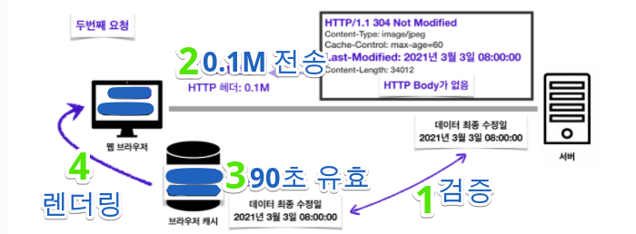

# Codestates-Network-HTTP-Cache

강의: codestates
블로깅: No
유형: LESSON
작성일시: 2022년 2월 12일 오후 8:18

# Codestates-Network-HTTP-Header

## 0. Achievement Goals

- 캐시가 왜 필요한지 이해한다.
  - 브라우저 캐시, 프록시 캐시에 대해 이해한다.
  - 조건부 요청, 캐시 무효화 방법 등을 사용할 수 있다.

# 1. Web-Cache란?

**[HTTP caching](https://developer.mozilla.org/ko/docs/Web/HTTP/Caching)**

## 1. Cache의 기본 원리와 적용

- Cache가 없다면

  - 데이터가 변경되지 않아도 계속 네트워크를 통해 데이터를 다운로드 받아야 한다.
  - 인터넷 네트워크는 매우 느리고 비싸다
  - 브라우저 로딩 속도가 느리다
  - 느린 사용자 경험을 제공환다.

- Cache는 데이터나 값을 미리 복사해 놓는 임시 저장소로, 재 요청시 데이터를 제공해준다.
- 캐시의 접근 시간에 비해 원래 데이터를 접근하는 시간이 오래 걸리는 경우 or 값을 다시 계산하는 시간을 절약하고 싶은 경우에 사용한다.
- 케시에 데이터를 미리 복사해 놓으면 계산이나 접근 시간 없이 더 빠른 속도로 데이터에 접근할 수 있다.
- cache-control 속성을 이용하면 cache가 유효한 시간을 지정할 수 있다.
  - 아래의 그림에서 cache-control의 max-age를 100으로 설정하였다.
  - 두 번째 요청에서 cache를 우선 조회하게 되고 cache가 존재하고 아직 100초가 지나지 않아 유효하다면 해당 cache에서 데이터를 가져오게 된다 → 이 유효기간동안은 네트워크를 사용하지 않아도 되고 빡른 사용자 경검을 제공하게 된다.
  - 만약 max-age가 지난다면 다시 서버에 요청을 하게 된다.
    - 응답 결과를 브라우저가 렌더링 하면 브라우저 캐시는 기존 캐시를 지우고 새 캐시로 데이터를 업데이트 한다. 이 과정에서 유효기간이 다시 초기화 된다.

- 하지만 모등 resource가 동일하게 유지되지 않으므로 cache기능을 올바르게 구성해야 한다.

## 2. Types of caches

Cashe에는 두 가지 유형으로 그룹화 할 수 있다.

1. Shared cache(**[Shared proxy caches](https://developer.mozilla.org/en-US/docs/Web/HTTP/Caching#shared_proxy_caches))**
   - 둘 이상의 사용자가 재사용 활 수 있도록 응답을 저장하는 캐시
   - 얘를 들어 ISP(Internet Service Provider) 또는 회사에서 web proxy를 local network의 인프라의 일부로 설정하여 인기있는 자원을 여러 번 재사용하여 network의 traffic과 시간을 줄일 수 있게 한다.
2. Local(Private) cache (**[Private browser caches](https://developer.mozilla.org/en-US/docs/Web/HTTP/Caching#private_browser_caches))**
   - 단일 사용자를 위한 캐시
   - 브라우저에 이미 setting 되어있는 cache
   - 브라우저 cache는 user가 HTTP 를 통해 받은 모든 document를 보유한다.
   - 이 캐시는 방문한 문서를 서버로의 추가 이동 없이 뒤로가기,앞으로 가기 등의 탐색, 저장, 소스로 보기 등에 사용할 수 있도록 하는데 사용된다.
   - 캐시된 컨텐츠의 오프라인 브라우징 또한 향상된다

# 2. Caching operation

## 1. Targets of caching operations

- HTTP cache는 GET 요청으로만 제한되어있고 다름 method는 거절한다.
- 기본 cache key는 request method와 URI로 구성된다(일반적으로 GET만 caching 대상이기 때문에 URI만 사용된다)

## 2. Contgrolling caching

Cashe와 관련된 header들 정리

- Cache-Control
  - Cache-Control : max-age : 캐시 유효시간. 초단위
  - Cache-Control : no-cache : 데이터는 캐시해도 되지만, 항상 Origin 서버에 검증하고 사용
  - Cache-Control : no-store : 데이터에 민감한 정보가 있으므로 저장하면 안됨 (메모리에서 사용하고 최대한 빨리 삭제)
  - Cache-Control : private : 응답은 단일 유저를 위한 것이며 공유 캐시에 저장되어서는 안된다는 것을 나타낸다.
  - Cache-Control : public : response는 어느 cache로든 cashing될 수 있다.
- Expires
  - 캐시 만료일 지정 (화위 호황)
  - Expires:Mon,01,Jan 1990 00:00:00 GMT
  - 캐시 만료일을 날짜로 지정한다.
  - HTTP 1.0 부터 사용
  - 지금은 Cache-Control:max-age를 권장한다.
  - 위의 헤더와 같이 사용화면 Expires는 무시된다.

## 3. **[Cache validation](https://developer.mozilla.org/en-US/docs/Web/HTTP/Caching#cache_validation)**

- 만약 케시 유효시간이 초과해도 서버 데이터가 변경되지 않는 경우, 굳이 또 다운로드 받지 않고 이를 검증하고 사용하는 방법이 있다.

### 1. Last Modified - If-Modified-Since

- 약힌 유효성 validator로 사용할 수 있다. 1초의 resolution만 갖고있으므로 약한 것으로 간주한다.
- 검증 헤더인 Last Modified를 이용하여 cache의 수정시간을 알 수 있다.
- Last Modified는 데이터가 마지막으로 수정된 시간 정보를 헤더에 포함한다
- Last Modified - If-Modified-Since 작동 방식은 아래와 같다.
  
  1. Client에서 자원을 요청하면, Server에서 Last Modified header에 최종 수정일을 포함하여 응답한다.
  2. Client는 응답 결과를 캐시에 저장할 때 최종 수정일도 저장한다.
  3. 만약 캐시의 유효시간이 초과한다면, 요청에서 header에 If-Modified-Since 요청 header를 발행하여 문서의 유효성 검사를 한다.
  4. 최종 수정일과 비교해서 데이터가 수정이 되지 않았다면 response에 이를 담아서 알려준다.
     1. HTTP body에는 응답이 없으며 status code는 304 Not Modified로 변경된 것이 없다는 뜻을 보낸다. 바디가 빠진 0.1M만 전송된다.
  5. Client에서는 해당 응답을 받으면 캐시를 갱신하고 다시 일정 시간동안 유효하게 된다.
- 결과적으로 Network 요청이 발생 하지만 용량이 적은 헤더 정보만 다운로드 하게된다.
- 단점
  - 1초 미만 당위로 케시 조정이 불가능하다
  - 날짜 기반의 로직을 사용
  - 데이터를 수정해서 날짜가 닥르디만 같은 데이터를 수정해서 결과가 똑같은 경우
  - 서버에서 별도의 캐시 로직을 관리하고 싶은 경우 (크게 영향이 없는 변경에서 캐시를 유지하고 싪은 경우)

### 2. ETag - If-None-Math 검증 헤더

- 강한 유효성 validator이다.
- 서버에서 완전히 캐시를 컨트롤 하고 싶은 결루 ETag를 사용활 수 있다.
- 캐시용 데이터에 임의의 고유한 버전 이름을 담아준다.
- 데이터가 변경되면 이 이름을 바꾸어서 변경한다 (Hash를 다시 변경)
- 단순하게 ETag만 보내서 같으면 유지하고 다르면 다시 받는 방식이다.
- Browser or User는 이 string이 무엇을 표현하고 무슨 값을 갖는지 모른다.
- response header에 ETag가 포함되어있다면, Client는 If-None-Math를 header에 발행하여 cache된 자원의 유효성을 요청할 수 있다.
- ETag의 작동 방식은 아래와 같다
  
  1. Server에서 ETag를 작성하여 응답한다.
  2. Client의 Cache에 해당 ETag 값을 저장한다.
  3. 만약 캐시 시간이 초과되어서 다시 요청을 해야하는 경우 If-None-Match를 요청 헤더에 작성하여 보낸다.
  4. 서버에서 데이터가 변경되지 않은 경우 ETag는 동일하기 때문에 If-None-Match는 False가 된다.
  5. 서버는 304 Not Modified를 응답한다 (body는 없다)
  6. Browser Cache에서는 응답 결과를 재사용하고 데이터를 갱신한다.
- 이 방법에서 Client는 단순이 ETag 값을 서버에 제공하고 캐시 메커니즘은 모르며 온전회 Server에서 관리한다.

# 3. Proxy Cache

### About Proxy Cache

[참고](https://github.com/kamranahmedse/kamranahmedse.github.io/blob/master/blog/_posts/2017-03-14-quick-guide-to-http-caching.md)

[https://camo.githubusercontent.com/618a16233d171f07d634a7fa7c991295986c6c02a28ebdacfee46f3fe33d68d6/687474703a2f2f692e696d6775722e636f6d2f456734437275332e706e67](https://camo.githubusercontent.com/618a16233d171f07d634a7fa7c991295986c6c02a28ebdacfee46f3fe33d68d6/687474703a2f2f692e696d6775722e636f6d2f456734437275332e706e67)

- Proxy란 Client와 Server사이에 대리로 통신을 수행하는 것을 가리킨다.
- 중계 기능을 하는 서버를 프록시 서버라고 한다.
- Client가 다른 network의 서비스에 간접적으로 접속할 수 있게 하는 컴퓨터 시스템이나 응용 프로그램을 의미한다.
- 만약 한국의 다수의 Client가 미국에 있는 서버에 데이터를 요청할 경우, 한국에 public 캐시 서버인 proxy server를 통한다면 더 빨리 자료를 가져올 수 있다.
- 여러 사람이 찾는 자료일수록 이미 캐시에 등록되어 있으므로 빠른 속도로 가져올 수 있다.

### Proxy Cache와 관련된 header

- Cache-Control
  - Cache-Control : public 응답이 public 케시에 저장되어도 됨
  - Cache-Control : private 응답이 해당 사용자만을 위한 것이다. private 캐시에 저장해야 한다.
  - Cache-Control : s-maxage 프록시 캐시에만 적용되는 max-age
  - age : 60(HTTP 헤더) 오리진 서버에서 응답 후 프록시 캐시 내에 머문 시간
  - Cache를 무효화 할 수 있는 헤더
    - Cache-Control : no-cache 데이터는 캐시해도 되지만 항상 원 서버에 검증을 하고 사용한다
    - Cache-Control : no-store 데이터에 민감한 정보다 있으므로 저장하면 안됨
    - Cache-Control : must-revalidate
      - 캐시 만료 후 최초 조회 시 원 서버에 검증해야 한다.
      - 원 서버에 접근 실패 시 반드시 오류가 발생해야 한다 - 504 (Gateway Timeout)
      - must-revalidate는 캐시 유효 시간이라면 캐시를 사용환다.
    - Pragma : no-cache
    - 확실히 무효화 하기 위해서는 위의 캐시 지시어를 모두 넣는다.
      - Cache-Control : no-cache, no-store, must-revalidate
      - Pragma : no-cache
- no-cache VS must-revalidate
  - no-cache
  
  검증을 위해 원 서버에 요청을 하고 , 원 서버에서 검증 푸 304 응답을 한다.
  만약 proxy server와 원 서버의 network 연결이 단절이 된 경우 응답으로 오래된 데이터라도 응답으로 보여준다 (200 ok)
  
  - must-revalidate
    
    must-revalidate의 경우 서버에 접근이 불가능할 경우 [504 오류](https://www.notion.so/Codestates-Network-HTTP-Cache-d2ec8bd3d7124087ad597952d8b0e84c)를 보낸다.
