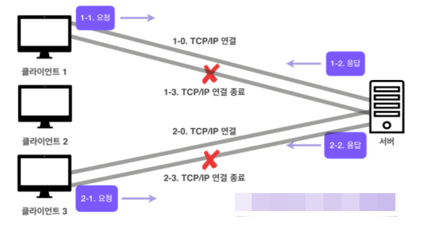

# Codestates-Network-HTTP

강의: codestates
블로깅: No
유형: LESSON
작성일시: 2022년 2월 11일 오후 7:56

# Codestates-Network-HTTP

[추후 정리해야 할 자료 - HTTP2 vsd HTTP 3](https://labs.tadigital.com/index.php/2019/11/28/http-2-vs-http-3/)

## 0. Achievement Goals

- HTTP 기본 동작과 특징에 대해 이해한다.
  - Stateful 과 Stateless의 개념에 대해 이해한다.
  - HTTP 메시지 구성에 대해 이해한다.

HTTP/1.1와 HTTP/2는 TCP 기반이며 HTTP/3은 UDP 기반의 프로토콜이다.

HTTP특징

- Client - Server 구조
  - Request - Rresponse 구조
  - Client는 Server에 요청을 보내고 응답을 대기한다.
  - Server가 요청에 대한 결과를 만들어 응답한다.
- Stateless
  - 서버가 클라이언트의 상태를 보존하지 않는다
    - 서버 확장성은 높지만 클라이언트가 추가 데이터를 전송해야하는 단점이 있다.
    - 무상태는 응답 서버를 쉽게 바꿀 수 있다 (무한 서버 증설이 가능하다)
    - Client가 상태응 기억하고 있다면 이미 필요한 데이터를 담아서 보내기때문에 아무 사버나 호출해도 된다.
    - 서버에 장애가 생겨도 다른 서버에서 응답을 전달하면 되기 때문에 클라이언트는 다시 요청활 필요가 없다.
  - 무상태의 한계
    - 모든 것을 무상태로 설계할 수 있는 경우와 없는 경우가 있다.
    - 로그인의 경우 상태를 유지해야한다. 이런 경우 브라우저에 쿠키, 서버, 세션, 토큰 등을 이용해서 상태를 유지해야한다.
- Connectionless (비 연결성)
  
  - TCP/IP의 경우 기본적으로 연결을 유지한다. 클라이언트가 요청을 보내지 않아도 계속 연결을 유지하기 때문에 서버 자원을 계속 소모하게 된다.
  - HTTP는 비연결성을 갖기 때문에 실제로 요청을 주고 받을 때에만 연결을 유지하고 응답을 주고나면 TCP/IP 연결을 끊는다. 이를 통해 최소한의 자원으로 서버 유지를 가능하게 한다.
  - HTTP는 기본이 연결을 유지하지 않는다.
  - 트래픽이 많지 않고 빠른 응답을 제공할 수 있는 경우 비연결성의 특징은 효율적이다.
  - 1시간동안 수천명이 이용을 해도 실제 서버에서 동시에 처리하는 요청은 수십개 이하로 매우 작다
  - 하지만 트래픽이 많고 큰 규모의 서비스를 운영할 때에는 비연결성에는 한계가 있다.
- Connectionless의 한계
  - 비 연결성은 자원들(HTML, CSS, JS..)을 보낸 떄마다 연결을 끊고 다시 연결하고를 반복해야 하기 때문에 비효율적이다.
  - TCP / IP 연결을 새로 해야하기 때문에 3-way handshake 시간이 추가된다.
  - HTTP 지속 연결(Persistent Connections)로 문제를 해결한다.
  - HTTP/2 , 3에서는 더 많은 최적화가 되어있다.
- HTTP 초기 - 연결,종료 낭비
  HTTP 초기에는 각 자원을 다운로드 하기 위해 연결과 종료를 반복해야했다.
  
  하지만 HTTP 지속 연결은 각 자원들을 요청하고 모든 자원에 대한 응답이 돌아온 후 연결을 종료한다.
  
